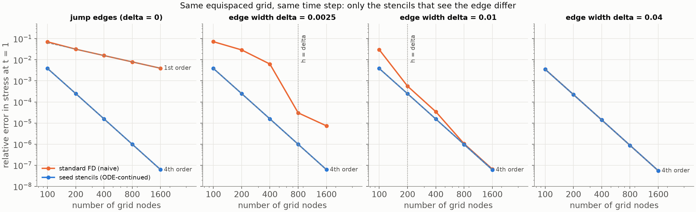
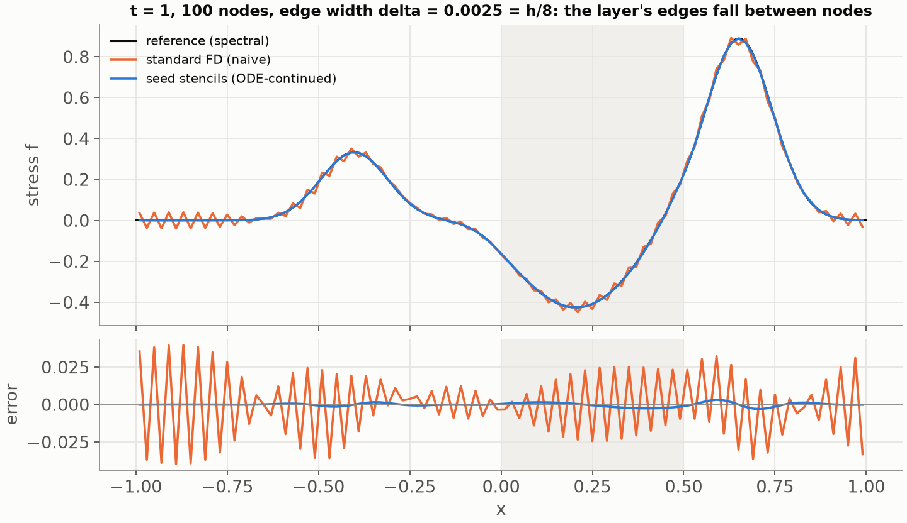
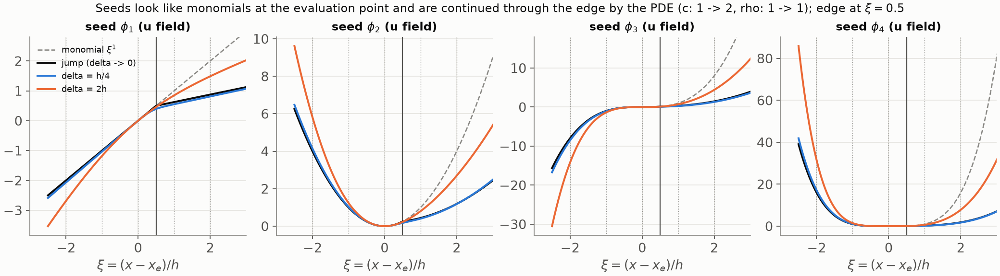

# Stiff smooth edges: seed stencils (Part 3, issue #27)

Exploration started 2026-09-19, after the talk's material was frozen. Not
part of the presentation. Brad's question from a research-group session
twelve or thirteen years ago, explored once in 1-D and then lost: between
a smoothly varying material and a jump there is a "twilight zone" where the
material is technically smooth but changes over a distance far smaller than
the grid spacing. Can stencils on the *same equispaced grid* handle such an
edge at full order, the way the dissertation's interface-aware stencils
handle a jump, by replacing the monomials of the stencil's basis with
functions obtained from ODEs?

Short answer, from the experiment in section 2: yes, and the construction
is the dissertation's interface construction with the jump replaced by the
edge profile. Code: `src/pdes_demo/wave1d/stiff.py` (the seeds and the
weights), `spectral.py` (the reference solution), `domain.py`
(`LayeredMedium(edge_width=...)`), `scripts/wave1d_stiff.py` (the figures),
`tests/test_wave1d_stiff.py`. The 2-D proof of concept (#36–#42, flat
first) is under way: `LayeredMedium2D(edge_width=...)` and the
normal-incidence reference `wave2d/exact.py: spectral_plane_wave` from #36,
tested in `tests/test_wave2d_smooth_edges.py`; results go into section 5
as they land.

## 1. Formulation (#28)

### 1.1 Setting

The 1-D problem of Part 2 in the repo's variables, u = particle velocity,
f = stress, K = ρc²:

    ρ u_t = f_x,        f_t = K u_x.

The layer `[0, 0.5)` has (c, ρ) = (2, 1) inside and (1, 1) outside. With
`edge_width = δ > 0` the two edges are tanh transitions,

    s(x) = Σ_m ½ [tanh((x - x₁ + 2m)/δ) - tanh((x - x₂ + 2m)/δ)],
    c(x) = c_bg + (c_layer - c_bg) s(x),    ρ likewise,

summed over periodic images so the profile is smooth and periodic to
rounding; δ = 0 is the jump of Part 2, bit for bit. A standard FD4 stencil
samples c and ρ at its nodes. When δ ≪ h it sees a jump and treats it as if
the coefficients were smooth between nodes, which is the first-order
failure of Part 2; when δ ≫ h it sees a smooth function and is fine. In
between is the case of interest.

### 1.2 Seeds as the profiles of solutions polynomial in time

Eliminating one field gives a second-order operator per field:

    u_tt = L_u u,   L_u = (1/ρ) ∂ₓ K ∂ₓ;        f_tt = L_f f,   L_f = K ∂ₓ (1/ρ) ∂ₓ.

Look for solutions polynomial in time, u(x, t) = Σ_j tʲ g_j(x). Then
(j+2)(j+1) g_{j+2} = L_u g_j, so the two top coefficients are in ker L_u and
the t = 0 profile g₀ satisfies L_uᵐ g₀ = 0 for some m. The profiles of such
solutions are the functions that play the role of polynomials for this
operator: with constant coefficients L_u = c² ∂ₓ², and ker ∂ₓ²ᵐ is exactly
the polynomials of degree < 2m.

Brad's bullets in #27 (with the correction ∂ₜᵏu = C rather than 0) are this
construction, read one seed at a time. Anchored at the stencil's evaluation
point x_e:

- **φ₀ = 1.** The solution u ≡ C.
- **φ₁, the x-like seed.** A solution linear in time, u = g₀ + t g₁ with
  u_t = g₁ = C, forces L_u g₀ = 0, i.e. K g₀' = const. Normalised to slope 1
  at x_e: `K φ₁' = K(x_e)`, φ₁(x) = K(x_e) ∫ₓₑˣ dξ / K(ξ). Through the other
  field this says f_t = K u_x is constant in x: the flux is what stays
  smooth, not the slope.
- **φ₂, the x²-like seed.** u = g₀ + t g₁ + ½ C t² with u_tt = C forces
  L_u g₀ = C. With C = 2 c_e² (c_e = c(x_e)) and g₀(x_e) = g₀'(x_e) = 0 this
  is (x − x_e)² when the coefficients are constant. This is where C ≠ 0
  matters: C = 0 would give back ker L_u.
- **φ₃, the x³-like seed.** u_ttt = C fixes the profile of u_t (L_u g₁ = C),
  not of u; the cubic seed is the profile whose second time derivative is
  x-like, L_u φ₃ = 6 c_e² φ₁. Through the other field, f_ttt = K (u_tt)_x =
  6 c_e² K(x_e) is constant, so the odd seeds are "∂ₜᵏ f = C" and the even
  ones "∂ₜᵏ u = C". That is the same even/odd field swap as
  `operators.continuity_matrices` ("even k relate a field to itself, odd k
  route through the other field").

In general, for k ≥ 2,

    L φ_k = k (k−1) c_e² φ_{k−2},      φ_k(x_e) = φ_k'(x_e) = 0,

with L = L_u for the u stencil and L_f for the f stencil. Constant
coefficients give φ_k = (x − x_e)ᵏ by induction.

**Numerics.** The chain is integrated as a first-order system that never
differentiates the coefficients: for u, (φ, ψ = K φ') with φ' = ψ/K and
ψ' = ρ k(k−1) c_e² φ_{k−2}; for f, (φ, ψ = φ'/ρ) with φ' = ρ ψ and
ψ' = k(k−1) c_e² φ_{k−2} / K. In the stencil coordinate ξ = (x − x_e)/h_s,
h_s the stencil half-width, the same equations hold and φ_k ≈ ξᵏ, so the
interpolation matrix A[k, j] = φ_k(ξ_j) is a small perturbed Vandermonde
matrix (condition number 20 to 60 for δ from 10⁻⁵ to 1). One DOP853 march
per stencil from ξ = 0 outward to each side, with segment boundaries at the
edge centres and at ±10δ from them so the adaptive step never has to
discover the edge in the middle of a long step. The weights solve
A w̃ = e₁, since only φ₁ has a non-zero derivative at x_e, and w = w̃ / h_s.
`stiff_weights` returns (w_u, w_f) with the same contract as
`interface_weights`; `build_operators(mode="aware")` uses it in every
stencil whose nodes see different material values (for a tanh edge, out to
about 19δ + 2h, where the tails round away), and Fornberg weights
elsewhere. About 5 to 15 ms per stencil; 2.3 s for the n = 1600 operator at
δ = 0.01.

### 1.3 Nested kernels, and the jump as the δ → 0 limit

Only the span of the seeds matters for the weights, and the spans are
canonical: span{φ₀..φ_k} is the chain

    {1} ⊂ ker L ⊂ {f : L f = const} ⊂ ker L² ⊂ {f : L² f = const} ⊂ …

because L sends each seed two steps down the chain. Different anchors or
normalisations change the basis, not the space.

For a jump, read L in the weak sense: φ and the flux K φ' continuous
across it. Then ker L_u is spanned by 1 and a piecewise-linear function
whose slope ratio is K_left / K_right, which is the dissertation's
translated x (`test_translated_basis_keeps_rho_c2_u_x_continuous` checks
exactly that ρc² u_x stays continuous); L_u φ₂ = 2 c_e² gives φ₂'' = 2 c_e²/c²
on each side, which is u_tt continuous, and so on. The chain for a jump is
the translated Taylor basis of `piecewise_bases`. One construction with two
implementations: algebra for a jump, an ODE march for a smooth edge.
`test_jump_limit_recovers_the_interface_weights_at_first_order` checks
the limit numerically: for a stencil of half-width 0.02 straddling an edge,
the seed weights differ from `interface_weights` by 22%, 10%, 0.98% and
0.098% of the largest weight at δ = 10⁻², 10⁻³, 10⁻⁴, 10⁻⁵, i.e. first
order in δ, for both fields and also for a stencil straddling both edges of
a layer thinner than itself (the double-cross).

### 1.4 Well-posedness: the seeds form an extended complete Chebyshev system

Each space in the chain is the kernel of an operator in Pólya form, a
product of ∂ₓ and multiplications by positive functions:

    ρ L_uᵐ = ∂ₓ K ∂ₓ (1/ρ) ∂ₓ K ∂ₓ ⋯ ∂ₓ K ∂ₓ      (2m derivatives),
    ∂ₓ L_uᵐ  = ∂ₓ (1/ρ) ∂ₓ K ∂ₓ ⋯ ∂ₓ K ∂ₓ          (2m + 1 derivatives),

and likewise for L_f with K and 1/ρ swapped. Pólya (1922) showed that such
an operator is disconjugate on any interval where the weights are positive,
and its kernel is an *extended complete Chebyshev (ECT) system*: with
weights w₀, w₁, …, a nested basis u₀ = w₀, u₁ = w₀ ∫ w₁, u₂ = w₀ ∫ w₁ ∫ w₂, …
(the structure theorem as stated in Zalik's note, citing Karlin & Studden,
*Tchebycheff Systems*, 1966, pp. 376–380; Coppel, *Disconjugacy*, 1971, for
the disconjugacy side; references in section 3). An ECT system has the Haar
property: interpolation on any distinct nodes is uniquely solvable. So the
per-stencil solve A w̃ = e₁ is nonsingular for every edge width, including
δ → 0 where the seeds have kinks, and the condition numbers above are what
one expects from a Vandermonde matrix on five nodes in [−1, 1].

Interpolation in an ECT system also has a Newton-form remainder with the
operator M_k that annihilates the space in place of the (k+1)-th derivative
(generalised divided differences, Mühlbach 1973). For the five-point stencil
the annihilator of span{φ₀..φ₄} is ∂ₓ L², so the truncation error of the
seed stencil on a function g is O(h⁴ ∂ₓ L² g). For a *solution* of the wave
equation L u = u_tt, hence ∂ₓ L² u = ∂ₓ u_tttt: the x-derivative of another
solution, bounded independently of δ (u_x changes by O(1) across the edge
whatever its width; it is the flux K u_x that is smooth). Standard FD4 has
error O(h⁴ u⁽⁵⁾) with u⁽⁵⁾ ∼ δ⁻⁴ inside the edge. Hence the prediction:
**standard FD4 converges at fourth order only once h ≲ δ and looks
low-order above that, with a knee at h ≈ δ; the seed stencils converge at
fourth order with a constant that does not depend on δ.**

### 1.5 Why the Taylor route does not reach a stiff edge

`Material.taylor(p)` in `domain.py` was written so that the dissertation's
continuity-matrix construction (eq. 11–12, multiplication matrices from the
Taylor coefficients of 1/ρ and K about the interface) could take smoothly
varying coefficients. For a stiff edge that route cannot work: tanh(x/δ)
has poles at ±iπδ/2, so its Taylor series about the edge converges only
within πδ/2, far less than the stencil's reach of 2h when δ ≪ h. Polynomial
quasi-Trefftz spaces (section 3) are this Taylor route; the ODE march is
what a sub-grid edge needs. For a resolved edge (δ ≫ h) the seed weights
still differ from Fornberg's at first order in h/δ (17% at δ = 8h for the
default contrast), because the seeds are exact for a different
five-dimensional space; both stencils are fourth-order on solutions there
and the experiment finds them indistinguishable end to end.

## 2. Results (#32, `scripts/wave1d_stiff.py`, 2026-09-19)

Setup: the default layer `[0, 0.5)` with c: 1 → 2, ρ: 1 → 1, edges of
width δ; a right-going Gaussian stress pulse with sharpness 60 (about 7
nodes across at n = 100, so the pulse itself is resolved on every grid and
the edge is the only thing under test) started at x = −0.6 (far enough
that the ray sum's tail check passes); FD4 in space, RK4 at CFL 0.4, t = 1.
Errors are relative l2 errors in stress f at t = 1 against the exact ray
sum for δ = 0 and against a pseudo-spectral reference (1024 to 8192 nodes,
dt = 5·10⁻⁵, accurate to about 10⁻¹⁰) for δ > 0. "Seeds" is
`mode="aware"`, which for δ = 0 is the dissertation's interface-aware
stencil and for δ > 0 the ODE-continued seeds; "naive" is FD4 with the
coefficients sampled at the nodes. Runtime 50 s for everything, 30 s with
the cached references.

| δ | scheme | n = 100 | 200 | 400 | 800 | 1600 | rates |
| --- | --- | --- | --- | --- | --- | --- | --- |
| 0 (jump) | naive | 7.1e-2 | 3.2e-2 | 1.6e-2 | 7.9e-3 | 4.0e-3 | 1.2, 1.0, 1.0, 1.0 |
| 0 (jump) | interface-aware | 3.9e-3 | 2.5e-4 | 1.6e-5 | 9.9e-7 | 6.2e-8 | 4.0, 4.0, 4.0, 4.0 |
| 0.0025 | naive | 7.2e-2 | 2.9e-2 | 6.3e-3 | 3.0e-5 | 7.4e-6 | 1.3, 2.2, **7.7**, 2.0 |
| 0.0025 | seeds | 3.9e-3 | 2.5e-4 | 1.6e-5 | 9.9e-7 | 6.2e-8 | 4.0, 4.0, 4.0, 4.0 |
| 0.01 | naive | 3.0e-2 | 5.6e-4 | 3.5e-5 | 1.1e-6 | 6.5e-8 | 5.7, 4.0, 5.0, 4.0 |
| 0.01 | seeds | 3.9e-3 | 2.5e-4 | 1.6e-5 | 9.7e-7 | 6.1e-8 | 4.0, 4.0, 4.0, 4.0 |
| 0.04 | naive | 3.5e-3 | 2.2e-4 | 1.4e-5 | 8.8e-7 | 5.5e-8 | 4.0, 4.0, 4.0, 4.0 |
| 0.04 | seeds | 3.5e-3 | 2.2e-4 | 1.4e-5 | 8.8e-7 | 5.5e-8 | 4.0, 4.0, 4.0, 4.0 |

h/δ runs from 8 to 0.5 for δ = 0.0025, from 2 to 0.125 for δ = 0.01, and
from 0.5 down for δ = 0.04.

**Verdict on the hypothesis of #27: confirmed on both counts.**

- *Standard FD4 looks low-order through an unresolved edge and recovers
  fourth order once the grid resolves it.* At δ = 0.0025 the naive error
  falls at rates 1.3 and 2.2 while h > δ, drops by a factor 200 between
  n = 400 and 800 (h = 2δ to h = δ, the knee), and is fourth-order-ish
  after. At δ = 0.01 the knee sits between n = 100 and 200, again at h ≈ δ.
  The pre-knee rates are not as cleanly first order as for the jump (1.0)
  because the nodes sample the tanh at grid-dependent positions, so the
  effective jump the naive stencil sees moves with n.
- *Seed stencils keep fourth order on the same equispaced grid at every
  resolution, with a constant independent of δ.* The seed errors at
  δ = 0.0025 and 0.01 agree with the jump case's interface-aware errors to
  three digits at every n (3.9e-3 down to 6.2e-8). At h = 8δ the seeds are
  18× more accurate than naive, at h = 2δ 400×. At δ = 0.04, where every
  grid resolves the edge, seeds and naive coincide to three digits although
  their weights differ (section 1.5): both are fourth-order on solutions.

Local truncation error tells the same story without the time stepping. On
the reference solution's profile at t = 1 (dissertation pulse, sharpness
600), the maximum error in u_x over the rebuilt rows, relative to
max |u_x|, at δ = 0.0025 for n = 100, 200, 400, 800, 1600:

| stencil | h = 8δ | 4δ | 2δ | δ | δ/2 |
| --- | --- | --- | --- | --- | --- |
| naive | 1.5e-2 | 2.8e-3 | 3.9e-3 | 1.9e-3 | 2.2e-4 |
| seeds | 9.9e-3 | 1.2e-3 | 9.1e-5 | 5.8e-6 | 3.6e-7 |

Seeds: ratios 8.5, 13, 16, 16, i.e. fourth order from h = 8δ on. The same
run at δ = 0.01 gives seed errors 2.2e-2, 1.8e-3, 8.0e-5, 4.5e-6, 2.3e-7:
the constant is the same. (`test_seed_stencils_are_fourth_order_on_the_true_solution`
keeps a small version of this as a regression test.)

The snapshot is the coarse-grid picture: 100 nodes, δ = 0.0025 = h/8, so
both layer edges fall between nodes. Naive FD4 trails a grid-scale
sawtooth of 4% of the pulse height everywhere (the highest FD4 modes have
negative group velocity, so the noise born at the edges outruns the
pulses); the seed stencils sit on the reference with a maximum error of
0.3%, which is the interior FD4 dispersion error of the pulse.

The seeds themselves, for the u field, on a stencil whose evaluation point
is h/2 left of an edge: the jump seeds (which are the dissertation's
translated Taylor basis: slope ratio K_left/K_right = 1/4 for φ₁, a
parabola of curvature ratio c_left²/c_right² = 1/4 for φ₂) and the δ = h/4
seeds are indistinguishable, the δ = 2h seeds bend over the whole stencil,
and all of them leave the monomials at the edge.

**Caveats.** One ODE march per stencil that sees the edge, about 5 to 15 ms
each, so the operator costs seconds rather than milliseconds to build;
fine for a study, not tuned. The aware region reaches 19δ + 2h from each
edge (where the tanh tails round to the far-field value), so at δ = 0.04
every row is rebuilt; a relative tolerance in `varies_over` would trim
that. The seeds converge to the jump construction at first order in δ, so
δ below about 10⁻⁵ h is better served by `interface_weights` directly. The
spectrum of the semi-discrete operator has max real part 8·10⁻⁸ at
δ = 0.005 (n = 400) and about 10⁻¹³ otherwise; RK4 at CFL 0.4 is stable
in every run here. Nothing was tried for sharper contrasts, layers thinner
than 19δ, or higher orders than FD4; the construction does not change for
any of them.

## 3. Related work (#33)

Brad's question: the construction came from intuition about these
problems around 2013; are similar approaches known? An afternoon's scan on
2026-09-19, every entry checked against a page that was actually opened
(publisher or repository page where reachable; SIAM, IEEE, AMS and
Springer block automated fetching, so for those the Crossref record of the
DOI was read instead, which is publisher-deposited metadata). Not a survey.

**Same mechanism for steady problems: basis functions from local
solutions of the operator.**

- A. N. Tikhonov and A. A. Samarskii, "Homogeneous difference schemes",
  Zh. Vychisl. Mat. Mat. Fiz. 1:1 (1961) 5–63; USSR Comput. Math. Math.
  Phys. 1:1 (1962) 5–67, [doi:10.1016/0041-5553(62)90005-8](https://doi.org/10.1016/0041-5553(62)90005-8),
  [mathnet.ru/eng/zvmmf7977](http://www.mathnet.ru/eng/zvmmf7977).
  Difference schemes for Sturm–Liouville operators with smooth and
  discontinuous coefficients. Their conservative scheme's cell coefficient
  is the harmonic mean h / ∫ dx/k over the cell, which is the two-point
  version of φ₁ (constant flux). Textbook form: Samarskii, *The Theory of
  Difference Schemes*, Marcel Dekker 2001.
- The "exact three-point schemes" line descending from it, e.g.
  [Adv. Cont. Discrete Models 2020](https://link.springer.com/article/10.1186/s13662-020-02957-7):
  stencils exact on the local solutions of a second-order ODE. Elliptic
  boundary-value problems, not waves.
- I. Babuška and J. E. Osborn, "Generalized finite element methods: their
  performance and their relation to mixed methods", SIAM J. Numer. Anal.
  20 (1983) 510–536, [doi:10.1137/0720034](https://doi.org/10.1137/0720034);
  I. Babuška, G. Caloz and J. E. Osborn, "Special finite element methods
  for a class of second order elliptic problems with rough coefficients",
  SIAM J. Numer. Anal. 31 (1994) 945–981,
  [doi:10.1137/0731051](https://doi.org/10.1137/0731051). Finite elements
  whose shape functions solve (a u')' = 0 locally: the FEM version of φ₁.
- T. Y. Hou and X.-H. Wu, "A multiscale finite element method for
  elliptic problems in composite materials and porous media", J. Comput.
  Phys. 134 (1997) 169–189,
  [doi:10.1006/jcph.1997.5682](https://doi.org/10.1006/jcph.1997.5682).
  Basis functions from local cell problems of the operator, in 2-D.
- H. Owhadi and L. Zhang, "Metric-based upscaling", Comm. Pure Appl. Math.
  60 (2007) 675–723, [arXiv:math/0505223](https://arxiv.org/abs/math/0505223):
  solutions of divergence-form elliptic equations are C^{1,α} as functions
  of the *harmonic coordinates* F, ∇·(a ∇F) = 0 with F ≈ x, which is the
  2-D x-like seed. Their follow-up, "Numerical homogenization of the
  acoustic wave equations with a continuum of scales", Comput. Methods
  Appl. Mech. Engrg. 198 (2008) 397–406,
  [Caltech repository](https://authors.library.caltech.edu/records/y53sh-pjq83),
  uses precomputed harmonic coordinates for the wave equation without
  scale separation. The closest 2-D relative of this construction.

**Fitted operators for singularly perturbed problems.** D. N. de G. Allen
and R. V. Southwell, Q. J. Mech. Appl. Math. 8 (1955) 129–145,
[doi:10.1093/qjmam/8.2.129](https://doi.org/10.1093/qjmam/8.2.129);
A. M. Il'in, Math. Notes 6 (1969) 596–602,
[mathnet.ru/eng/mzm6928](http://www.mathnet.ru/eng/mzm6928); D. L.
Scharfetter and H. K. Gummel, IEEE Trans. Electron Devices 16 (1969)
64–77, [doi:10.1109/T-ED.1969.16566](https://doi.org/10.1109/T-ED.1969.16566).
Stencil coefficients from the local exponential solutions of
convection–diffusion, so that the scheme is uniformly accurate in the
small parameter. Surveyed as "operator-fitted methods" in H.-G. Roos,
M. Stynes and L. Tobiska, *Robust Numerical Methods for Singularly
Perturbed Differential Equations*, 2nd ed., Springer 2008, §3.5.1
([PDF at Charles University](https://www.karlin.mff.cuni.cz/~knobloch/FILES/Roos-Stynes-Tobiska.pdf)).
Same mechanism, different regime: steady boundary layers, not a
propagating wave through an internal layer.

**Trefftz and quasi-Trefftz methods: basis functions that are (nearly)
local solutions of the time-dependent equation.**

- F. Kretzschmar, A. Moiola, I. Perugia and S. M. Schnepp, "A priori
  error analysis of space–time Trefftz discontinuous Galerkin methods for
  wave problems", IMA J. Numer. Anal. 36 (2016) 1599–1635,
  [doi:10.1093/imanum/drv064](https://doi.org/10.1093/imanum/drv064);
  L. Banjai, E. H. Georgoulis and O. Lijoka, "A Trefftz polynomial
  space-time discontinuous Galerkin method for the second order wave
  equation", SIAM J. Numer. Anal. 55 (2017) 63–86,
  [doi:10.1137/16M1065744](https://doi.org/10.1137/16M1065744): space-time
  polynomial solutions of the constant-coefficient wave equation as DG
  basis. The seeds of section 1.2 are the t = 0 traces of such solutions.
- L.-M. Imbert-Gérard, A. Moiola and P. Stocker, "A space–time
  quasi-Trefftz DG method for the wave equation with piecewise-smooth
  coefficients", Math. Comp. 92 (2023) 1211–1249,
  [arXiv:2011.04617](https://arxiv.org/abs/2011.04617), and "Polynomial
  quasi-Trefftz DG for PDEs with smooth coefficients: elliptic problems",
  [arXiv:2408.00392](https://arxiv.org/abs/2408.00392). Polynomial basis
  functions that satisfy the variable-coefficient wave equation to Taylor
  order at a point, with an algorithm to build them. The closest published
  relative of "seeds from time-polynomial solutions", and exactly the
  Taylor route of section 1.5: it needs the coefficients resolved by the
  polynomial degree, which a sub-grid edge is not.

**Chebyshev systems, the well-posedness side.** G. Pólya, "On the
mean-value theorem corresponding to a given linear homogeneous
differential equation", Trans. Amer. Math. Soc. 24 (1922) 312–324,
[doi:10.1090/S0002-9947-1922-1501228-5](https://doi.org/10.1090/S0002-9947-1922-1501228-5)
(the factorisation / disconjugacy result; the AMS PDF could not be
fetched, so its open-access status is unverified); S. Karlin and W. J.
Studden, *Tchebycheff Systems: With Applications in Analysis and
Statistics*, Interscience 1966 ([archive.org record](https://archive.org/details/tchebycheffsyste0000karl));
W. A. Coppel, *Disconjugacy*, Lecture Notes in Math. 220, Springer 1971,
[doi:10.1007/BFb0058618](https://doi.org/10.1007/BFb0058618); R. A. Zalik,
"Another look at Chebyshev systems",
[webhome.auburn.edu/~zalikri/fv/t.pdf](http://webhome.auburn.edu/~zalikri/fv/t.pdf),
which states the ECT structure theorem used in section 1.4 with the page
references into Karlin & Studden. G. Mühlbach, "A recurrence formula for
generalized divided differences and some applications", J. Approx. Theory
9 (1973) 165–172, [doi:10.1016/0021-9045(73)90104-4](https://doi.org/10.1016/0021-9045(73)90104-4):
a Neville–Aitken recurrence for Chebyshev systems, i.e. the analogue of
Fornberg's algorithm for the seeds, should one ever want to avoid the
dense solve. M. H. Schultz and R. S. Varga, "L-splines", Numer. Math. 10
(1967) 345–369, [doi:10.1007/BF02162033](https://doi.org/10.1007/BF02162033):
splines whose pieces lie in ker L.

**The jump case, for contrast.** R. J. LeVeque and Z. Li, "The immersed
interface method for elliptic equations with discontinuous coefficients
and singular sources", SIAM J. Numer. Anal. 31 (1994) 1019–1044,
[doi:10.1137/0731054](https://doi.org/10.1137/0731054) (erratum 32 (1995)
1704): jump conditions folded into modified stencils. B. Martin,
B. Fornberg and A. St-Cyr, "Seismic modeling with
radial-basis-function-generated finite differences", Geophysics 80 (2015)
T137–T146, [doi:10.1190/geo2014-0492.1](https://doi.org/10.1190/geo2014-0492.1);
B. Martin and B. Fornberg, "Seismic modeling with radial basis
function-generated finite differences (RBF-FD): a simplified treatment of
interfaces", J. Comput. Phys. 335 (2017) 828–845,
[doi:10.1016/j.jcp.2017.01.065](https://doi.org/10.1016/j.jcp.2017.01.065):
the dissertation's construction, which section 1.3 shows to be the δ → 0
limit of the seeds. The practical competitor in seismic FD codes is
equivalent-medium parametrisation (averaging the coefficients over the
cell rather than changing the basis), e.g. Geophys. J. Int. 239 (2024)
675, [academic.oup.com/gji/article/239/1/675/7733912](https://academic.oup.com/gji/article/239/1/675/7733912).

**What Brad's intuition coincides with, and what looks unwritten.** The
x-like seed, constant flux through the feature, is the harmonic mean of
Tikhonov–Samarskii, the special elements of Babuška–Osborn and the
harmonic coordinates of Owhadi–Zhang; basis functions from local
solutions are the fitted operators of the 1950s–60s; basis functions that
are time-polynomial solutions are the polynomial Trefftz spaces of the
2010s. Not found in this form: an ordinary equispaced finite-difference
stencil for the time-domain wave equation whose basis is the t = 0 profile
of time-polynomial solutions *integrated through a sub-grid smooth
feature*, with everything else in the scheme left standard, and the
observation that this is one construction from the jump (algebra) to the
resolved edge (Fornberg) with the ODE march in between. That is a
statement about a few hours of searching, not a claim of novelty.

## 4. Two dimensions: what the seeds become (#34)

A design note, answering the three questions in #27; no 2-D code was
written. The 2-D acoustic operator L = (1/ρ) ∇·(K ∇) is the first target;
the elastic system of `wave2d` adds bookkeeping, not ideas.

**The chain survives, the choice of seeds does not come for free.** The
recursion L φ = (lower seeds) and the nested spaces {1} ⊂ ker L ⊂
{L f = const} ⊂ ker L² ⊂ … are dimension-free. What changes is that ker L
is infinite-dimensional in 2-D, so "polynomial-like of degree ≤ d", a
space of dimension (d+1)(d+2)/2 that reduces to the polynomials P_d for
constant coefficients, needs a rule for which L-harmonic functions play
the role of 1, x, y, x² − y², xy, …: the 2d + 1 harmonic polynomials of
degree ≤ d each need an L-harmonic continuation through the feature that
looks like them away from it. Given those, the chain generates the rest
(x² + y², for instance, is the φ with L φ = 4 c_e², anchored like φ₂).

**Straight feature: ODEs in the normal coordinate only.** If the material
depends on the normal coordinate n alone (locally true for any smooth
feature, exactly true for a flat edge), write the seed for the monomial
nᵃ sᵇ (s tangential) as φ = Σ_j g_j(n) sʲ, a polynomial in s. Then

    L (g(n) sʲ) = sʲ L_n g + j (j−1) (K/ρ) g s^{j−2},   L_n = (1/ρ) ∂ₙ K ∂ₙ,

so the coefficient functions solve a triangular chain of 1-D ODEs in n:
the top coefficient g_b satisfies the 1-D seed equation, g_{b−2} picks up
the source j(j−1)(K/ρ) g_b, and so on down. Every seed of a straight
feature is a short list of 1-D marches of exactly the kind `stiff.py` does,
with more right-hand sides. So the answer to "PDEs for each dimension of
each stencil's support" is no: for a straight feature, ODEs in one
coordinate.

**Curved feature: a local problem per stencil, three ways.** In the
feature's own coordinates (n, s) the operator picks up curvature terms
(κ ∂ₙ and the metric factors of the tangential derivative), and the
s-polynomial ansatz no longer closes. Three routes, in increasing
faithfulness and cost: (a) treat the curvature perturbatively, κh ≪ 1 for
a stencil, and add an O(κ) correction to the straight-feature seeds from
one more ODE chain (the same spirit as the "curvature terms are a possible
refinement" note in `wave2d/interface.py`, JCP 2017 Fig. 10); (b) solve a
small boundary-value problem L φ = (lower seed) on a patch around the
stencil on a fine local grid, with the harmonic polynomial as boundary
data, which is the multiscale-FEM / oversampling construction (Hou–Wu) and
the honest "PDE per stencil"; (c) compute the harmonic coordinates F once
globally (Owhadi–Zhang), use polynomials in F as the degree-one seeds and
the chain for the rest. For an edge whose curvature radius is many h,
(a) should be enough; (b) is the robust fallback.

**Characteristics away from the interface?** No. Away from the feature
the material is constant, the seeds are the monomials, and nothing
changes; the seeds only differ from monomials on stencils whose nodes see
a varying material, and what "starts" them is the anchor at the
evaluation point, not characteristics. Characteristics would enter only if
one built seeds for the first-order system directly; here each field's
second-order operator defines its seeds, as in 1-D, and the odd seeds
carry the other field's information (f_ttt = C for the u-field's φ₃) the
way `continuity_matrices` routes odd time derivatives through the other
field.

**The elastic system and the "not full rank" subspace.** The existing
interface-aware 2-D stencils (`wave2d/interface.py`, dissertation §3.3)
work in a local tangent/normal frame, replace the polynomial augmentation
of the RBF-FD saddle-point system by piecewise polynomials translated
across the interface with the elastic continuity conditions, generate the
stress basis from the velocity basis through the PDE operator, truncate to
degree p, and solve coupled systems across fields (27 basis functions for
p = 3). The seeds slot into exactly that place: the piecewise-polynomial
values at the stencil nodes become ODE-marched values, the same coupled
saddle-point solve follows, and the Gaussian RBF part stays as it is. The
nested-kernel chain answers the subspace question: "degree ≤ d" means
{f : Lᵐ f ∈ seeds of degree ≤ d − 2m}, and the stress seeds follow from the
velocity seeds by applying the constitutive rows of the operator, as
`interface_basis` already does with polynomials. L is then the 2 × 2
matrix operator of linear elasticity acting on (u, v); the straight-feature
reduction still holds because the isotropic operator keeps its form under
the rotation into the feature's frame.

**Estimate.** A straight-edge prototype on `wave2d`: rotate into the
feature frame (exists), march the seed chains in n for the (d+1)(d+2)/2
monomials with the elastic 2 × 2 operator (new, a few hundred lines
generalising `stiff.py`), swap them into the augmentation of the
interface-aware weights (small), and validate against a reference. The
reference is the hard part: the flat-edge case separates into a 1-D
problem per tangential wavenumber, so a 1-D spectral solve per Fourier
mode of the initial pulse gives a reference of the same quality as
section 2's. One to two days. A curved feature by route (b) is a
week-scale project. Neither is scheduled; follow-up issue if wanted.
