# Stiff smooth edges: seed stencils (Part 3, issue #27)

Exploration started 2026-09-19, after the talk's material was frozen. Not
part of the presentation. Brad's question from a research-group session
twelve or thirteen years ago, explored once in 1-D and then lost: between
a smoothly varying material and a jump there is a "twilight zone" where the
material is technically smooth but changes over a distance far smaller than
the grid spacing. Can stencils on the *same equispaced grid* handle such an
edge at full order, the way the dissertation's interface-aware stencils
handle a jump, by replacing the monomials of the stencil's basis with
functions obtained from ODEs?

Short answer, from the experiment in section 2: yes, and the construction
is the dissertation's interface construction with the jump replaced by the
edge profile. Code: `src/rbf_hyperbolic_interfaces/wave1d/stiff.py` (the seeds and the
weights), `spectral.py` (the reference solution), `domain.py`
(`LayeredMedium(edge_width=...)`), `scripts/wave1d_stiff.py` (the figures),
`tests/test_wave1d_stiff.py`. The 2-D proof of concept (#36–#42, flat
first) is under way: `LayeredMedium2D(edge_width=...)` and the
normal-incidence reference `wave2d/exact.py: spectral_plane_wave` from #36,
tested in `tests/test_wave2d_smooth_edges.py`; the elastic seeds of a
straight edge, `wave2d/seeds.py` from #38, derived in section 4.2 and
tested in `tests/test_wave2d_seeds.py`; results go into section 5 as they
land.

## 1. Formulation (#28)

### 1.1 Setting

The 1-D problem of Part 2 in the repo's variables, u = particle velocity,
f = stress, K = ρc²:

    ρ u_t = f_x,        f_t = K u_x.

The layer `[0, 0.5)` has (c, ρ) = (2, 1) inside and (1, 1) outside. With
`edge_width = δ > 0` the two edges are tanh transitions,

    s(x) = Σ_m ½ [tanh((x - x₁ + 2m)/δ) - tanh((x - x₂ + 2m)/δ)],
    c(x) = c_bg + (c_layer - c_bg) s(x),    ρ likewise,

summed over periodic images so the profile is smooth and periodic to
rounding; δ = 0 is the jump of Part 2, bit for bit. A standard FD4 stencil
samples c and ρ at its nodes. When δ ≪ h it sees a jump and treats it as if
the coefficients were smooth between nodes, which is the first-order
failure of Part 2; when δ ≫ h it sees a smooth function and is fine. In
between is the case of interest.

### 1.2 Seeds as the profiles of solutions polynomial in time

Eliminating one field gives a second-order operator per field:

    u_tt = L_u u,   L_u = (1/ρ) ∂ₓ K ∂ₓ;        f_tt = L_f f,   L_f = K ∂ₓ (1/ρ) ∂ₓ.

Look for solutions polynomial in time, u(x, t) = Σ_j tʲ g_j(x). Then
(j+2)(j+1) g_{j+2} = L_u g_j, so the two top coefficients are in ker L_u and
the t = 0 profile g₀ satisfies L_uᵐ g₀ = 0 for some m. The profiles of such
solutions are the functions that play the role of polynomials for this
operator: with constant coefficients L_u = c² ∂ₓ², and ker ∂ₓ²ᵐ is exactly
the polynomials of degree < 2m.

Brad's bullets in #27 (with the correction ∂ₜᵏu = C rather than 0) are this
construction, read one seed at a time. Anchored at the stencil's evaluation
point x_e:

- **φ₀ = 1.** The solution u ≡ C.
- **φ₁, the x-like seed.** A solution linear in time, u = g₀ + t g₁ with
  u_t = g₁ = C, forces L_u g₀ = 0, i.e. K g₀' = const. Normalised to slope 1
  at x_e: `K φ₁' = K(x_e)`, φ₁(x) = K(x_e) ∫ₓₑˣ dξ / K(ξ). Through the other
  field this says f_t = K u_x is constant in x: the flux is what stays
  smooth, not the slope.
- **φ₂, the x²-like seed.** u = g₀ + t g₁ + ½ C t² with u_tt = C forces
  L_u g₀ = C. With C = 2 c_e² (c_e = c(x_e)) and g₀(x_e) = g₀'(x_e) = 0 this
  is (x − x_e)² when the coefficients are constant. This is where C ≠ 0
  matters: C = 0 would give back ker L_u.
- **φ₃, the x³-like seed.** u_ttt = C fixes the profile of u_t (L_u g₁ = C),
  not of u; the cubic seed is the profile whose second time derivative is
  x-like, L_u φ₃ = 6 c_e² φ₁. Through the other field, f_ttt = K (u_tt)_x =
  6 c_e² K(x_e) is constant, so the odd seeds are "∂ₜᵏ f = C" and the even
  ones "∂ₜᵏ u = C". That is the same even/odd field swap as
  `operators.continuity_matrices` ("even k relate a field to itself, odd k
  route through the other field").

In general, for k ≥ 2,

    L φ_k = k (k−1) c_e² φ_{k−2},      φ_k(x_e) = φ_k'(x_e) = 0,

with L = L_u for the u stencil and L_f for the f stencil. Constant
coefficients give φ_k = (x − x_e)ᵏ by induction.

**Numerics.** The chain is integrated as a first-order system that never
differentiates the coefficients: for u, (φ, ψ = K φ') with φ' = ψ/K and
ψ' = ρ k(k−1) c_e² φ_{k−2}; for f, (φ, ψ = φ'/ρ) with φ' = ρ ψ and
ψ' = k(k−1) c_e² φ_{k−2} / K. In the stencil coordinate ξ = (x − x_e)/h_s,
h_s the stencil half-width, the same equations hold and φ_k ≈ ξᵏ, so the
interpolation matrix A[k, j] = φ_k(ξ_j) is a small perturbed Vandermonde
matrix (condition number 20 to 60 for δ from 10⁻⁵ to 1). One DOP853 march
per stencil from ξ = 0 outward to each side, with segment boundaries at the
edge centres and at ±10δ from them so the adaptive step never has to
discover the edge in the middle of a long step. The weights solve
A w̃ = e₁, since only φ₁ has a non-zero derivative at x_e, and w = w̃ / h_s.
`stiff_weights` returns (w_u, w_f) with the same contract as
`interface_weights`; `build_operators(mode="aware")` uses it in every
stencil whose nodes see different material values (for a tanh edge, out to
about 19δ + 2h, where the tails round away), and Fornberg weights
elsewhere. About 5 to 15 ms per stencil; 2.3 s for the n = 1600 operator at
δ = 0.01.

### 1.3 Nested kernels, and the jump as the δ → 0 limit

Only the span of the seeds matters for the weights, and the spans are
canonical: span{φ₀..φ_k} is the chain

    {1} ⊂ ker L ⊂ {f : L f = const} ⊂ ker L² ⊂ {f : L² f = const} ⊂ …

because L sends each seed two steps down the chain. Different anchors or
normalisations change the basis, not the space.

For a jump, read L in the weak sense: φ and the flux K φ' continuous
across it. Then ker L_u is spanned by 1 and a piecewise-linear function
whose slope ratio is K_left / K_right, which is the dissertation's
translated x (`test_translated_basis_keeps_rho_c2_u_x_continuous` checks
exactly that ρc² u_x stays continuous); L_u φ₂ = 2 c_e² gives φ₂'' = 2 c_e²/c²
on each side, which is u_tt continuous, and so on. The chain for a jump is
the translated Taylor basis of `piecewise_bases`. One construction with two
implementations: algebra for a jump, an ODE march for a smooth edge.
`test_jump_limit_recovers_the_interface_weights_at_first_order` checks
the limit numerically: for a stencil of half-width 0.02 straddling an edge,
the seed weights differ from `interface_weights` by 22%, 10%, 0.98% and
0.098% of the largest weight at δ = 10⁻², 10⁻³, 10⁻⁴, 10⁻⁵, i.e. first
order in δ, for both fields and also for a stencil straddling both edges of
a layer thinner than itself (the double-cross).

### 1.4 Well-posedness: the seeds form an extended complete Chebyshev system

Each space in the chain is the kernel of an operator in Pólya form, a
product of ∂ₓ and multiplications by positive functions:

    ρ L_uᵐ = ∂ₓ K ∂ₓ (1/ρ) ∂ₓ K ∂ₓ ⋯ ∂ₓ K ∂ₓ      (2m derivatives),
    ∂ₓ L_uᵐ  = ∂ₓ (1/ρ) ∂ₓ K ∂ₓ ⋯ ∂ₓ K ∂ₓ          (2m + 1 derivatives),

and likewise for L_f with K and 1/ρ swapped. Pólya (1922) showed that such
an operator is disconjugate on any interval where the weights are positive,
and its kernel is an *extended complete Chebyshev (ECT) system*: with
weights w₀, w₁, …, a nested basis u₀ = w₀, u₁ = w₀ ∫ w₁, u₂ = w₀ ∫ w₁ ∫ w₂, …
(the structure theorem as stated in Zalik's note, citing Karlin & Studden,
*Tchebycheff Systems*, 1966, pp. 376–380; Coppel, *Disconjugacy*, 1971, for
the disconjugacy side; references in section 3). An ECT system has the Haar
property: interpolation on any distinct nodes is uniquely solvable. So the
per-stencil solve A w̃ = e₁ is nonsingular for every edge width, including
δ → 0 where the seeds have kinks, and the condition numbers above are what
one expects from a Vandermonde matrix on five nodes in [−1, 1].

Interpolation in an ECT system also has a Newton-form remainder with the
operator M_k that annihilates the space in place of the (k+1)-th derivative
(generalised divided differences, Mühlbach 1973). For the five-point stencil
the annihilator of span{φ₀..φ₄} is ∂ₓ L², so the truncation error of the
seed stencil on a function g is O(h⁴ ∂ₓ L² g). For a *solution* of the wave
equation L u = u_tt, hence ∂ₓ L² u = ∂ₓ u_tttt: the x-derivative of another
solution, bounded independently of δ (u_x changes by O(1) across the edge
whatever its width; it is the flux K u_x that is smooth). Standard FD4 has
error O(h⁴ u⁽⁵⁾) with u⁽⁵⁾ ∼ δ⁻⁴ inside the edge. Hence the prediction:
**standard FD4 converges at fourth order only once h ≲ δ and looks
low-order above that, with a knee at h ≈ δ; the seed stencils converge at
fourth order with a constant that does not depend on δ.**

### 1.5 Why the Taylor route does not reach a stiff edge

`Material.taylor(p)` in `domain.py` was written so that the dissertation's
continuity-matrix construction (eq. 11–12, multiplication matrices from the
Taylor coefficients of 1/ρ and K about the interface) could take smoothly
varying coefficients. For a stiff edge that route cannot work: tanh(x/δ)
has poles at ±iπδ/2, so its Taylor series about the edge converges only
within πδ/2, far less than the stencil's reach of 2h when δ ≪ h. Polynomial
quasi-Trefftz spaces (section 3) are this Taylor route; the ODE march is
what a sub-grid edge needs. For a resolved edge (δ ≫ h) the seed weights
still differ from Fornberg's at first order in h/δ (17% at δ = 8h for the
default contrast), because the seeds are exact for a different
five-dimensional space; both stencils are fourth-order on solutions there
and the experiment finds them indistinguishable end to end.

## 2. Results (#32, `scripts/wave1d_stiff.py`, 2026-09-19)

Setup: the default layer `[0, 0.5)` with c: 1 → 2, ρ: 1 → 1, edges of
width δ; a right-going Gaussian stress pulse with sharpness 60 (about 7
nodes across at n = 100, so the pulse itself is resolved on every grid and
the edge is the only thing under test) started at x = −0.6 (far enough
that the ray sum's tail check passes); FD4 in space, RK4 at CFL 0.4, t = 1.
Errors are relative l2 errors in stress f at t = 1 against the exact ray
sum for δ = 0 and against a pseudo-spectral reference (1024 to 8192 nodes,
dt = 5·10⁻⁵, accurate to about 10⁻¹⁰) for δ > 0. "Seeds" is
`mode="aware"`, which for δ = 0 is the dissertation's interface-aware
stencil and for δ > 0 the ODE-continued seeds; "naive" is FD4 with the
coefficients sampled at the nodes. Runtime 50 s for everything, 30 s with
the cached references.

| δ | scheme | n = 100 | 200 | 400 | 800 | 1600 | rates |
| --- | --- | --- | --- | --- | --- | --- | --- |
| 0 (jump) | naive | 7.1e-2 | 3.2e-2 | 1.6e-2 | 7.9e-3 | 4.0e-3 | 1.2, 1.0, 1.0, 1.0 |
| 0 (jump) | interface-aware | 3.9e-3 | 2.5e-4 | 1.6e-5 | 9.9e-7 | 6.2e-8 | 4.0, 4.0, 4.0, 4.0 |
| 0.0025 | naive | 7.2e-2 | 2.9e-2 | 6.3e-3 | 3.0e-5 | 7.4e-6 | 1.3, 2.2, **7.7**, 2.0 |
| 0.0025 | seeds | 3.9e-3 | 2.5e-4 | 1.6e-5 | 9.9e-7 | 6.2e-8 | 4.0, 4.0, 4.0, 4.0 |
| 0.01 | naive | 3.0e-2 | 5.6e-4 | 3.5e-5 | 1.1e-6 | 6.5e-8 | 5.7, 4.0, 5.0, 4.0 |
| 0.01 | seeds | 3.9e-3 | 2.5e-4 | 1.6e-5 | 9.7e-7 | 6.1e-8 | 4.0, 4.0, 4.0, 4.0 |
| 0.04 | naive | 3.5e-3 | 2.2e-4 | 1.4e-5 | 8.8e-7 | 5.5e-8 | 4.0, 4.0, 4.0, 4.0 |
| 0.04 | seeds | 3.5e-3 | 2.2e-4 | 1.4e-5 | 8.8e-7 | 5.5e-8 | 4.0, 4.0, 4.0, 4.0 |

h/δ runs from 8 to 0.5 for δ = 0.0025, from 2 to 0.125 for δ = 0.01, and
from 0.5 down for δ = 0.04.

**Verdict on the hypothesis of #27: confirmed on both counts.**

- *Standard FD4 looks low-order through an unresolved edge and recovers
  fourth order once the grid resolves it.* At δ = 0.0025 the naive error
  falls at rates 1.3 and 2.2 while h > δ, drops by a factor 200 between
  n = 400 and 800 (h = 2δ to h = δ, the knee), and is fourth-order-ish
  after. At δ = 0.01 the knee sits between n = 100 and 200, again at h ≈ δ.
  The pre-knee rates are not as cleanly first order as for the jump (1.0)
  because the nodes sample the tanh at grid-dependent positions, so the
  effective jump the naive stencil sees moves with n.
- *Seed stencils keep fourth order on the same equispaced grid at every
  resolution, with a constant independent of δ.* The seed errors at
  δ = 0.0025 and 0.01 agree with the jump case's interface-aware errors to
  three digits at every n (3.9e-3 down to 6.2e-8). At h = 8δ the seeds are
  18× more accurate than naive, at h = 2δ 400×. At δ = 0.04, where every
  grid resolves the edge, seeds and naive coincide to three digits although
  their weights differ (section 1.5): both are fourth-order on solutions.

Local truncation error tells the same story without the time stepping. On
the reference solution's profile at t = 1 (dissertation pulse, sharpness
600), the maximum error in u_x over the rebuilt rows, relative to
max |u_x|, at δ = 0.0025 for n = 100, 200, 400, 800, 1600:

| stencil | h = 8δ | 4δ | 2δ | δ | δ/2 |
| --- | --- | --- | --- | --- | --- |
| naive | 1.5e-2 | 2.8e-3 | 3.9e-3 | 1.9e-3 | 2.2e-4 |
| seeds | 9.9e-3 | 1.2e-3 | 9.1e-5 | 5.8e-6 | 3.6e-7 |

Seeds: ratios 8.5, 13, 16, 16, i.e. fourth order from h = 8δ on. The same
run at δ = 0.01 gives seed errors 2.2e-2, 1.8e-3, 8.0e-5, 4.5e-6, 2.3e-7:
the constant is the same. (`test_seed_stencils_are_fourth_order_on_the_true_solution`
keeps a small version of this as a regression test.)

The snapshot is the coarse-grid picture: 100 nodes, δ = 0.0025 = h/8, so
both layer edges fall between nodes. Naive FD4 trails a grid-scale
sawtooth of 4% of the pulse height everywhere (the highest FD4 modes have
negative group velocity, so the noise born at the edges outruns the
pulses); the seed stencils sit on the reference with a maximum error of
0.3%, which is the interior FD4 dispersion error of the pulse.

The seeds themselves, for the u field, on a stencil whose evaluation point
is h/2 left of an edge: the jump seeds (which are the dissertation's
translated Taylor basis: slope ratio K_left/K_right = 1/4 for φ₁, a
parabola of curvature ratio c_left²/c_right² = 1/4 for φ₂) and the δ = h/4
seeds are indistinguishable, the δ = 2h seeds bend over the whole stencil,
and all of them leave the monomials at the edge.

**Caveats.** One ODE march per stencil that sees the edge, about 5 to 15 ms
each, so the operator costs seconds rather than milliseconds to build;
fine for a study, not tuned. The aware region reaches 19δ + 2h from each
edge (where the tanh tails round to the far-field value), so at δ = 0.04
every row is rebuilt; a relative tolerance in `varies_over` would trim
that. The seeds converge to the jump construction at first order in δ, so
δ below about 10⁻⁵ h is better served by `interface_weights` directly. The
spectrum of the semi-discrete operator has max real part 8·10⁻⁸ at
δ = 0.005 (n = 400) and about 10⁻¹³ otherwise; RK4 at CFL 0.4 is stable
in every run here. Nothing was tried for sharper contrasts, layers thinner
than 19δ, or higher orders than FD4; the construction does not change for
any of them.

### 2.1 The standing alternative: the standard scheme on a changed medium (#69, `--comparators`, 2026-09-20)

The comparison the ledger (`LITERATURE.md` §1a K6) said the write-up owed.
In seismic and electromagnetic finite differences an interface is routinely
handled by changing the *medium* rather than the stencil: the coefficients
near it are averaged over a cell or smoothed over a few cells, and the
unchanged standard scheme runs on the result. Two sources fix what that
means (both fetched and read; page ranges in `docs/paper-index.md`):

- Tornberg & Engquist (2006), §4.1: for p_t = a u_x, u_t = b p_x with
  a = −ρc², b = −1/ρ, the regularised coefficients are 1/a linear across
  the one cell [x̄ − h/2, x̄ + h/2] centred on the jump and 1/b linear
  likewise (their eq. 18–22): the compliance 1/K and the density ρ are
  replaced by their cell means. Theorem 1 gives second order for the Yee
  scheme. Regularising a itself instead of 1/a "will yield an O(1) error
  in the spatial discretization in at least one grid point close to the
  discontinuity ... first order error overall, albeit possibly with a
  smaller error coefficient". For their fourth-order *staggered* scheme
  (§5) second order is reached only by also masking the scheme's temporal
  correction terms within 3h/2 of the jump (eq. 37–39), terms the
  collocated FD4 + RK4 scheme here does not have. Cell means of the moduli
  (harmonic) and of the density (arithmetic) are also the Moczo et al.
  (2002) line.
- Koene, Wittsten & Robertsson (2022), §3.2–3.3, following Mittet (2017):
  band-limit the density and the compliance to the grid Nyquist π/h. For a
  jump that is the anti-aliased step ½ + Si(πz/h)/π, windowed; for a
  general model, an oversampled grid is low-pass filtered along each axis
  by a Hanning-windowed FIR (51 taps at tenfold oversampling, centred at
  1.1× the Nyquist) and subsampled.

What was run (`wave1d/treatments.py: TreatedMedium`, `widened`;
`scripts/wave1d_stiff.py --comparators`): the same FD4 + RK4 on the same
cell-centred grids, the same pulse and the same reference (the true-δ
solution) as the table above, with the coefficients the naive scheme
samples replaced by

- *widened, h / 2h*: the true tanh profile with `edge_width = max(δ, mh)`,
  m = 1, 2, the T0 bound of #69. It blends c and ρ linearly, so it is the
  "regularise a itself" case Tornberg & Engquist warn about; a resolved
  edge (mh ≤ δ) is left alone;
- *cell mean, h / 2h*: the compliance and the density averaged over
  [x − w/2, x + w/2] with w = h and w = 2h; for w = h this is their
  eq. 18 and 22 at δ = 0. Both widths, because the layer's edges sit on
  cell boundaries of every grid here (nodes at −1 + (i + ½)h, edges at 0
  and 0.5): the one-cell ramp of a jump ends exactly at the nearest nodes
  and changes no sampled coefficient, so at δ = 0 that row equals the naive
  one to rounding. Their staggered grid has a coefficient position within
  h/4 of any jump; a collocated grid does not. The two-cell mean does reach
  the nodes beside the jump;
- *band-limited*: the compliance and the density convolved with the
  windowed sinc of Koene et al. §3.3 (cutoff 1.1π/h, Hanning window of
  half-width 2.5h): their filter applied to the true profile instead of an
  oversampled model, reducing to their anti-aliased step as δ → 0
  (`tests/test_wave1d_treatments.py`).

The kernel averages are Gauss–Legendre integrals split at the edge centres
and 4δ either side (exact for a jump, to rounding for a tanh); each treated
medium is a `Medium1D`, so `run(mode="naive")` takes it as it takes the
true one, and the error is measured against the true medium's reference.
The cell means and the band-limited medium are applied at their prescribed
width at every n, also where h < δ: the sources have no δ and state no
switch. Runtime: the sweep with the comparators takes 50 s.

| δ | medium, scheme | n = 100 | 200 | 400 | 800 | 1600 | rates |
| --- | --- | --- | --- | --- | --- | --- | --- |
| 0 (jump) | naive (sampled) | 7.1e-2 | 3.2e-2 | 1.6e-2 | 7.9e-3 | 3.9e-3 | 1.2, 1.0, 1.0, 1.0 |
| 0 (jump) | widened, h | 8.5e-2 | 4.3e-2 | 2.1e-2 | 1.1e-2 | 5.4e-3 | 1.0, 1.0, 1.0, 1.0 |
| 0 (jump) | widened, 2h | 1.6e-1 | 8.5e-2 | 4.3e-2 | 2.1e-2 | 1.1e-2 | 1.0, 1.0, 1.0, 1.0 |
| 0 (jump) | cell mean, h | 7.1e-2 | 3.2e-2 | 1.6e-2 | 7.9e-3 | 3.9e-3 | 1.2, 1.0, 1.0, 1.0 |
| 0 (jump) | cell mean, 2h | 1.3e-2 | 2.9e-3 | 7.3e-4 | 1.8e-4 | 4.5e-5 | 2.1, 2.0, 2.0, 2.0 |
| 0 (jump) | band-limited | 5.7e-2 | 2.5e-2 | 1.3e-2 | 6.3e-3 | 3.1e-3 | 1.2, 1.0, 1.0, 1.0 |
| 0 (jump) | interface-aware | 3.9e-3 | 2.5e-4 | 1.6e-5 | 9.9e-7 | 6.2e-8 | 4.0, 4.0, 4.0, 4.0 |
| 0.0025 | naive (sampled) | 7.2e-2 | 2.9e-2 | 6.3e-3 | 3.0e-5 | 7.4e-6 | 1.3, 2.2, 7.7, 2.0 |
| 0.0025 | widened, h | 7.4e-2 | 3.2e-2 | 1.1e-2 | 3.0e-5 | 7.4e-6 | 1.2, 1.6, 8.5, 2.0 |
| 0.0025 | widened, 2h | 1.6e-1 | 7.5e-2 | 3.2e-2 | 1.1e-2 | 7.4e-6 | 1.1, 1.2, 1.6, 10.5 |
| 0.0025 | cell mean, h | 5.7e-2 | 1.9e-2 | 3.9e-3 | 4.3e-5 | 1.0e-5 | 1.6, 2.3, 6.5, 2.1 |
| 0.0025 | cell mean, 2h | 1.3e-2 | 2.6e-3 | 5.9e-4 | 1.4e-4 | 3.6e-5 | 2.3, 2.1, 2.0, 2.0 |
| 0.0025 | band-limited | 5.3e-2 | 1.8e-2 | 3.8e-3 | 3.0e-5 | 5.9e-6 | 1.5, 2.3, 7.0, 2.4 |
| 0.0025 | seeds | 3.9e-3 | 2.5e-4 | 1.6e-5 | 9.9e-7 | 6.2e-8 | 4.0, 4.0, 4.0, 4.0 |
| 0.01 | naive (sampled) | 3.0e-2 | 5.6e-4 | 3.5e-5 | 1.0e-6 | 6.5e-8 | 5.7, 4.0, 5.0, 4.0 |
| 0.01 | widened, h | 4.3e-2 | 5.6e-4 | 3.5e-5 | 1.0e-6 | 6.5e-8 | 6.3, 4.0, 5.0, 4.0 |
| 0.01 | widened, 2h | 1.3e-1 | 4.3e-2 | 3.5e-5 | 1.0e-6 | 6.5e-8 | 1.5, 10.3, 5.0, 4.0 |
| 0.01 | cell mean, h | 2.0e-2 | 7.6e-4 | 1.4e-4 | 3.5e-5 | 8.7e-6 | 4.7, 2.4, 2.0, 2.0 |
| 0.01 | cell mean, 2h | 1.1e-2 | 2.3e-3 | 5.6e-4 | 1.4e-4 | 3.5e-5 | 2.2, 2.0, 2.0, 2.0 |
| 0.01 | band-limited | 2.0e-2 | 5.3e-4 | 5.9e-5 | 1.4e-5 | 3.6e-6 | 5.2, 3.2, 2.1, 2.0 |
| 0.01 | seeds | 3.9e-3 | 2.5e-4 | 1.6e-5 | 9.7e-7 | 6.1e-8 | 4.0, 4.0, 4.0, 4.0 |
| 0.04 | naive (sampled) | 3.5e-3 | 2.2e-4 | 1.4e-5 | 8.8e-7 | 5.5e-8 | 4.0, 4.0, 4.0, 4.0 |
| 0.04 | widened, h / 2h | 3.5e-3 | 2.2e-4 | 1.4e-5 | 8.8e-7 | 5.5e-8 | 4.0, 4.0, 4.0, 4.0 |
| 0.04 | cell mean, h | 4.2e-3 | 5.0e-4 | 1.0e-4 | 2.5e-5 | 6.3e-6 | 3.1, 2.3, 2.0, 2.0 |
| 0.04 | cell mean, 2h | 7.9e-3 | 1.7e-3 | 4.0e-4 | 1.0e-4 | 2.5e-5 | 2.2, 2.0, 2.0, 2.0 |
| 0.04 | band-limited | 3.5e-3 | 2.5e-4 | 4.1e-5 | 1.0e-5 | 2.6e-6 | 3.8, 2.6, 2.0, 2.0 |
| 0.04 | seeds | 3.5e-3 | 2.2e-4 | 1.4e-5 | 8.8e-7 | 5.5e-8 | 4.0, 4.0, 4.0, 4.0 |

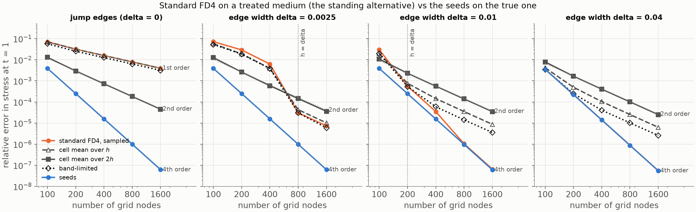

**At a jump (δ = 0)** no coefficient treatment lifts the collocated
scheme's first order except the two-cell mean, which is second order at
every n (rates 2.1, 2.0, 2.0, 2.0): 5.5× below naive at n = 100 and 87× at
n = 1600. The one-cell mean is naive to rounding (above); the band-limited
medium keeps first order at 0.8× the naive constant; the widened edges keep
it at 1.36× and 2.7× the naive constant, which is Tornberg & Engquist's
prediction for regularising a itself. The interface-aware stencils are
3.3× below the two-cell mean at n = 100 and 730× at n = 1600. So their
second order does carry over to collocated FD4 once the averaging reaches
the nodes beside the jump, and it is the ceiling: no treatment of the
coefficients gets the collocated scheme past second order at a jump, and
Tornberg & Engquist's §5 says the same of their fourth-order scheme.

**Through an unresolved edge (δ = 0.0025, h = 8δ down to 2δ)** the one-cell
mean and the band-limited medium cut the naive error by 1.25–1.6× and keep
its pre-knee rates (1.5–2.3), then follow it through the knee at h = δ (the
one-cell mean 1.4× above naive there and beyond, the band-limited medium
level with it). The two-cell mean stays second order and does not see the
knee: 5.7× below naive at h = 8δ, 11× at 4δ and 2δ, then 4.7× and 4.9×
*above* naive at h = δ and δ/2, where the naive scheme is fourth order and
the averaged medium is not the true one. The seeds are 3.2× below the
two-cell mean at h = 8δ, 10× at 4δ, 37× at 2δ, 146× at δ and 580× at δ/2:
the gap widens toward the knee, the opposite of the outcome #69 named as
the one that would change the story (averaged FD4 matching the seeds near
h ≈ δ). The widened edges are worse than naive wherever they act (widened
h: 1.03×, 1.1×, 1.7× at h = 8δ, 4δ, 2δ; widened 2h: 2.2×, 2.6×, 5.1×, and
350× at h = δ where the 2h edge is still twice the true one) and equal to
it once mh ≤ δ.

**On a resolved edge (δ = 0.01 from n = 200 on, δ = 0.04 everywhere)** every
treatment applied at its prescribed width is second order and falls behind
the fourth-order naive scheme: at n = 1600 the one-cell mean is 133× above
naive through δ = 0.01 and 114× through δ = 0.04, the band-limited medium
55× and 47×, the two-cell mean 530× and 455×. This is the second-order
component the ledger's K6 describes, measured on this scheme. The
treatments therefore need the same switch as the seeds (apply while h > δ,
sample the true medium otherwise), which the sources, written for jumps, do
not state; with it, the best of them is second order through the edge at no
cost per stencil, and the seeds are fourth order at one ODE march per
rebuilt row.

**Scope, and what the measurement licenses.** One collocated scheme, one
contrast (c: 1 → 2), one pulse, our implementations of the treatments on a
cell-centred grid whose cell boundaries hold the jump; the sources analyse
and run them on staggered grids, where their orders are proven or observed,
and Koene et al. find the anisotropic Schoenberg–Muir medium better still in
elastic media (not built here: the port has no anisotropic operator). The
measurement converts the ledger's "not run" into: on these grids the seeds
are 3.2× below the best coefficient treatment on the coarsest grid and
further below it on every finer one (37× at h = 2δ; 730× at n = 1600 for
the jump), at and past the knee 31× and 96× below the band-limited medium
(then level with naive) and 146× and 580× below the two-cell mean, and no
coefficient treatment reaches the seeds' order anywhere. It is not a proof
that one method beats another in general. In 2-D only the widened edge was
run (section 5.7): there the changed medium's own error dominates and it is
worse than sampling at every n where it acts.

## 3. Related work (#33)

Brad's question: the construction came from intuition about these
problems around 2013; are similar approaches known? An afternoon's scan on
2026-09-19, every entry checked against a page that was actually opened
(publisher or repository page where reachable; SIAM, IEEE, AMS and
Springer block automated fetching, so for those the Crossref record of the
DOI was read instead, which is publisher-deposited metadata). Not a survey.

**Same mechanism for steady problems: basis functions from local
solutions of the operator.**

- A. N. Tikhonov and A. A. Samarskii, "Homogeneous difference schemes",
  Zh. Vychisl. Mat. Mat. Fiz. 1:1 (1961) 5–63; USSR Comput. Math. Math.
  Phys. 1:1 (1962) 5–67, [doi:10.1016/0041-5553(62)90005-8](https://doi.org/10.1016/0041-5553(62)90005-8),
  [mathnet.ru/eng/zvmmf7977](http://www.mathnet.ru/eng/zvmmf7977).
  Difference schemes for Sturm–Liouville operators with smooth and
  discontinuous coefficients. Their conservative scheme's cell coefficient
  is the harmonic mean h / ∫ dx/k over the cell, which is the two-point
  version of φ₁ (constant flux). Textbook form: Samarskii, *The Theory of
  Difference Schemes*, Marcel Dekker 2001.
- The "exact three-point schemes" line descending from it, e.g.
  [Adv. Cont. Discrete Models 2020](https://link.springer.com/article/10.1186/s13662-020-02957-7):
  stencils exact on the local solutions of a second-order ODE. Elliptic
  boundary-value problems, not waves.
- I. Babuška and J. E. Osborn, "Generalized finite element methods: their
  performance and their relation to mixed methods", SIAM J. Numer. Anal.
  20 (1983) 510–536, [doi:10.1137/0720034](https://doi.org/10.1137/0720034);
  I. Babuška, G. Caloz and J. E. Osborn, "Special finite element methods
  for a class of second order elliptic problems with rough coefficients",
  SIAM J. Numer. Anal. 31 (1994) 945–981,
  [doi:10.1137/0731051](https://doi.org/10.1137/0731051). Finite elements
  whose shape functions solve (a u')' = 0 locally: the FEM version of φ₁.
- T. Y. Hou and X.-H. Wu, "A multiscale finite element method for
  elliptic problems in composite materials and porous media", J. Comput.
  Phys. 134 (1997) 169–189,
  [doi:10.1006/jcph.1997.5682](https://doi.org/10.1006/jcph.1997.5682).
  Basis functions from local cell problems of the operator, in 2-D.
- H. Owhadi and L. Zhang, "Metric-based upscaling", Comm. Pure Appl. Math.
  60 (2007) 675–723, [arXiv:math/0505223](https://arxiv.org/abs/math/0505223):
  solutions of divergence-form elliptic equations are C^{1,α} as functions
  of the *harmonic coordinates* F, ∇·(a ∇F) = 0 with F ≈ x, which is the
  2-D x-like seed. Their follow-up, "Numerical homogenization of the
  acoustic wave equations with a continuum of scales", Comput. Methods
  Appl. Mech. Engrg. 198 (2008) 397–406,
  [Caltech repository](https://authors.library.caltech.edu/records/y53sh-pjq83),
  uses precomputed harmonic coordinates for the wave equation without
  scale separation. The closest 2-D relative of this construction.

**Fitted operators for singularly perturbed problems.** D. N. de G. Allen
and R. V. Southwell, Q. J. Mech. Appl. Math. 8 (1955) 129–145,
[doi:10.1093/qjmam/8.2.129](https://doi.org/10.1093/qjmam/8.2.129);
A. M. Il'in, Math. Notes 6 (1969) 596–602,
[mathnet.ru/eng/mzm6928](http://www.mathnet.ru/eng/mzm6928); D. L.
Scharfetter and H. K. Gummel, IEEE Trans. Electron Devices 16 (1969)
64–77, [doi:10.1109/T-ED.1969.16566](https://doi.org/10.1109/T-ED.1969.16566).
Stencil coefficients from the local exponential solutions of
convection–diffusion, so that the scheme is uniformly accurate in the
small parameter. Surveyed as "operator-fitted methods" in H.-G. Roos,
M. Stynes and L. Tobiska, *Robust Numerical Methods for Singularly
Perturbed Differential Equations*, 2nd ed., Springer 2008, §3.5.1
([PDF at Charles University](https://www.karlin.mff.cuni.cz/~knobloch/FILES/Roos-Stynes-Tobiska.pdf)).
Same mechanism, different regime: steady boundary layers, not a
propagating wave through an internal layer.

**Trefftz and quasi-Trefftz methods: basis functions that are (nearly)
local solutions of the time-dependent equation.**

- F. Kretzschmar, A. Moiola, I. Perugia and S. M. Schnepp, "A priori
  error analysis of space–time Trefftz discontinuous Galerkin methods for
  wave problems", IMA J. Numer. Anal. 36 (2016) 1599–1635,
  [doi:10.1093/imanum/drv064](https://doi.org/10.1093/imanum/drv064);
  L. Banjai, E. H. Georgoulis and O. Lijoka, "A Trefftz polynomial
  space-time discontinuous Galerkin method for the second order wave
  equation", SIAM J. Numer. Anal. 55 (2017) 63–86,
  [doi:10.1137/16M1065744](https://doi.org/10.1137/16M1065744): space-time
  polynomial solutions of the constant-coefficient wave equation as DG
  basis. The seeds of section 1.2 are the t = 0 traces of such solutions.
- L.-M. Imbert-Gérard, A. Moiola and P. Stocker, "A space–time
  quasi-Trefftz DG method for the wave equation with piecewise-smooth
  coefficients", Math. Comp. 92 (2023) 1211–1249,
  [arXiv:2011.04617](https://arxiv.org/abs/2011.04617), and "Polynomial
  quasi-Trefftz DG for PDEs with smooth coefficients: elliptic problems",
  [arXiv:2408.00392](https://arxiv.org/abs/2408.00392). Polynomial basis
  functions that satisfy the variable-coefficient wave equation to Taylor
  order at a point, with an algorithm to build them. The closest published
  relative of "seeds from time-polynomial solutions", and exactly the
  Taylor route of section 1.5: it needs the coefficients resolved by the
  polynomial degree, which a sub-grid edge is not.

**Chebyshev systems, the well-posedness side.** G. Pólya, "On the
mean-value theorem corresponding to a given linear homogeneous
differential equation", Trans. Amer. Math. Soc. 24 (1922) 312–324,
[doi:10.1090/S0002-9947-1922-1501228-5](https://doi.org/10.1090/S0002-9947-1922-1501228-5)
(the factorisation / disconjugacy result; the AMS PDF could not be
fetched, so its open-access status is unverified); S. Karlin and W. J.
Studden, *Tchebycheff Systems: With Applications in Analysis and
Statistics*, Interscience 1966 ([archive.org record](https://archive.org/details/tchebycheffsyste0000karl));
W. A. Coppel, *Disconjugacy*, Lecture Notes in Math. 220, Springer 1971,
[doi:10.1007/BFb0058618](https://doi.org/10.1007/BFb0058618); R. A. Zalik,
"Another look at Chebyshev systems",
[webhome.auburn.edu/~zalikri/fv/t.pdf](http://webhome.auburn.edu/~zalikri/fv/t.pdf),
which states the ECT structure theorem used in section 1.4 with the page
references into Karlin & Studden. G. Mühlbach, "A recurrence formula for
generalized divided differences and some applications", J. Approx. Theory
9 (1973) 165–172, [doi:10.1016/0021-9045(73)90104-4](https://doi.org/10.1016/0021-9045(73)90104-4):
a Neville–Aitken recurrence for Chebyshev systems, i.e. the analogue of
Fornberg's algorithm for the seeds, should one ever want to avoid the
dense solve. M. H. Schultz and R. S. Varga, "L-splines", Numer. Math. 10
(1967) 345–369, [doi:10.1007/BF02162033](https://doi.org/10.1007/BF02162033):
splines whose pieces lie in ker L.

**The jump case, for contrast.** R. J. LeVeque and Z. Li, "The immersed
interface method for elliptic equations with discontinuous coefficients
and singular sources", SIAM J. Numer. Anal. 31 (1994) 1019–1044,
[doi:10.1137/0731054](https://doi.org/10.1137/0731054) (erratum 32 (1995)
1704): jump conditions folded into modified stencils. B. Martin,
B. Fornberg and A. St-Cyr, "Seismic modeling with
radial-basis-function-generated finite differences", Geophysics 80 (2015)
T137–T146, [doi:10.1190/geo2014-0492.1](https://doi.org/10.1190/geo2014-0492.1);
B. Martin and B. Fornberg, "Seismic modeling with radial basis
function-generated finite differences (RBF-FD): a simplified treatment of
interfaces", J. Comput. Phys. 335 (2017) 828–845,
[doi:10.1016/j.jcp.2017.01.065](https://doi.org/10.1016/j.jcp.2017.01.065):
the dissertation's construction, which section 1.3 shows to be the δ → 0
limit of the seeds. The practical competitor in seismic FD codes is
equivalent-medium parametrisation (averaging the coefficients over the
cell rather than changing the basis), e.g. Geophys. J. Int. 239 (2024)
675, [academic.oup.com/gji/article/239/1/675/7733912](https://academic.oup.com/gji/article/239/1/675/7733912).

**What Brad's intuition coincides with, and what looks unwritten.** The
x-like seed, constant flux through the feature, is the harmonic mean of
Tikhonov–Samarskii, the special elements of Babuška–Osborn and the
harmonic coordinates of Owhadi–Zhang; basis functions from local
solutions are the fitted operators of the 1950s–60s; basis functions that
are time-polynomial solutions are the polynomial Trefftz spaces of the
2010s. Not found in this form: an ordinary equispaced finite-difference
stencil for the time-domain wave equation whose basis is the t = 0 profile
of time-polynomial solutions *integrated through a sub-grid smooth
feature*, with everything else in the scheme left standard, and the
observation that this is one construction from the jump (algebra) to the
resolved edge (Fornberg) with the ODE march in between. That is a
statement about a few hours of searching, not a claim of novelty.

## 4. Two dimensions: the seeds (#34, #38)

### 4.1 Design (#34)

A design note answering the three questions in #27, written before any 2-D
code; §4.2 is what #38 then built. The 2-D acoustic operator
L = (1/ρ) ∇·(K ∇) is the first target; the elastic system of `wave2d` adds
bookkeeping, not ideas.

**The chain survives, the choice of seeds does not come for free.** The
recursion L φ = (lower seeds) and the nested spaces {1} ⊂ ker L ⊂
{L f = const} ⊂ ker L² ⊂ … are dimension-free. What changes is that ker L
is infinite-dimensional in 2-D, so "polynomial-like of degree ≤ d", a
space of dimension (d+1)(d+2)/2 that reduces to the polynomials P_d for
constant coefficients, needs a rule for which L-harmonic functions play
the role of 1, x, y, x² − y², xy, …: the 2d + 1 harmonic polynomials of
degree ≤ d each need an L-harmonic continuation through the feature that
looks like them away from it. Given those, the chain generates the rest
(x² + y², for instance, is the φ with L φ = 4 c_e², anchored like φ₂).

**Straight feature: ODEs in the normal coordinate only.** If the material
depends on the normal coordinate n alone (locally true for any smooth
feature, exactly true for a flat edge), write the seed for the monomial
nᵃ sᵇ (s tangential) as φ = Σ_j g_j(n) sʲ, a polynomial in s. Then

    L (g(n) sʲ) = sʲ L_n g + j (j−1) (K/ρ) g s^{j−2},   L_n = (1/ρ) ∂ₙ K ∂ₙ,

so the coefficient functions solve a triangular chain of 1-D ODEs in n:
the top coefficient g_b satisfies the 1-D seed equation, g_{b−2} picks up
the source j(j−1)(K/ρ) g_b, and so on down. Every seed of a straight
feature is a short list of 1-D marches of exactly the kind `stiff.py` does,
with more right-hand sides. So the answer to "PDEs for each dimension of
each stencil's support" is no: for a straight feature, ODEs in one
coordinate.

**Curved feature: a local problem per stencil, three ways.** In the
feature's own coordinates (n, s) the operator picks up curvature terms
(κ ∂ₙ and the metric factors of the tangential derivative), and the
s-polynomial ansatz no longer closes. Three routes, in increasing
faithfulness and cost: (a) treat the curvature perturbatively, κh ≪ 1 for
a stencil, and add an O(κ) correction to the straight-feature seeds from
one more ODE chain (the same spirit as the "curvature terms are a possible
refinement" note in `wave2d/interface.py`, JCP 2017 Fig. 10); (b) solve a
small boundary-value problem L φ = (lower seed) on a patch around the
stencil on a fine local grid, with the harmonic polynomial as boundary
data, which is the multiscale-FEM / oversampling construction (Hou–Wu) and
the honest "PDE per stencil"; (c) compute the harmonic coordinates F once
globally (Owhadi–Zhang), use polynomials in F as the degree-one seeds and
the chain for the rest. For an edge whose curvature radius is many h,
(a) should be enough; (b) is the robust fallback. This is #42.

**Characteristics away from the interface?** No. Away from the feature
the material is constant, the seeds are the monomials, and nothing
changes; the seeds only differ from monomials on stencils whose nodes see
a varying material, and what "starts" them is the anchor at the
evaluation point, not characteristics. Characteristics would enter only if
one built seeds for the first-order system directly; here each field's
second-order operator defines its seeds, as in 1-D, and the odd seeds
carry the other field's information (f_ttt = C for the u-field's φ₃) the
way `continuity_matrices` routes odd time derivatives through the other
field.

**The elastic system and the "not full rank" subspace.** The existing
interface-aware 2-D stencils (`wave2d/interface.py`, dissertation §3.3)
work in a local tangent/normal frame, replace the polynomial augmentation
of the RBF-FD saddle-point system by piecewise polynomials translated
across the interface with the elastic continuity conditions, generate the
stress basis from the velocity basis through the PDE operator, truncate to
degree p, and solve coupled systems across fields (27 basis functions for
p = 3). The seeds slot into exactly that place: the piecewise-polynomial
values at the stencil nodes become ODE-marched values, the same coupled
saddle-point solve follows, and the Gaussian RBF part stays as it is. The
nested-kernel chain answers the subspace question: "degree ≤ d" means
{f : Lᵐ f ∈ seeds of degree ≤ d − 2m}, and the stress seeds follow from the
velocity seeds by applying the constitutive rows of the operator, as
`interface_basis` already does with polynomials. L is then the 2 × 2
matrix operator of linear elasticity acting on (u, v); the straight-feature
reduction still holds because the isotropic operator keeps its form under
the rotation into the feature's frame.

### 4.2 The elastic seeds of a straight feature (#38, `wave2d/seeds.py`)

**Frame and operator.** As in `wave2d/interface.py`: origin at the
closest edge-centre point, x' tangential, y' normal, and the rotated
fields (u', v', f', g', h') obey eq. 32 unchanged; primes are dropped
below. The material depends on y' only, exactly for a flat edge and
locally for a curved one. Eliminating the stresses from eq. 32 with
λ(y), μ(y), ρ(y) and K = λ + 2μ:

    ρ u_tt = ∂ₓ[K u_x + λ v_y] + ∂ᵧ[μ (u_y + v_x)]
    ρ v_tt = ∂ₓ[μ (u_y + v_x)] + ∂ᵧ[λ u_x + K v_y].

Call the right-hand side, divided by ρ, L(u, v).

**Ansatz.** u = Σ_j a_j(y) xʲ, v = Σ_j b_j(y) xʲ, degree ≤ q in x. The
brackets are the stress rates of eq. 32, each a polynomial in x with
coefficient functions of y:

    K u_x + λ v_y   = Σ_j [K (j+1) a_{j+1} + λ b_j']  xʲ   =: Σ_j F_j xʲ
    μ (u_y + v_x)   = Σ_j [μ (a_j' + (j+1) b_{j+1})]  xʲ   =: Σ_j τ_j xʲ
    λ u_x + K v_y   = Σ_j [λ (j+1) a_{j+1} + K b_j']  xʲ   =: Σ_j σ_j xʲ,

and ∂ₓ shifts the index while ∂ᵧ differentiates the coefficient, so the
xʲ coefficient of ρ L is

    ρ (L)₁,j = (j+1) F_{j+1} + τ_j' = (j+1)(j+2) K a_{j+2} + (j+1) λ b_{j+1}' + τ_j'
    ρ (L)₂,j = (j+1) τ_{j+1} + σ_j'.

Level j is driven by levels j+1 and j+2 only: the system is triangular
from the top x-degree down, and each level is a 2-component second-order
ODE in y for (a_j, b_j). The two tractions τ_j, σ_j are what stays
continuous across a jump (g and h in eq. 32), so they are the flux
variables of the first-order form, the 2-D version of ψ = K φ' in §1.2:

    a_j' = τ_j / μ − (j+1) b_{j+1}
    b_j' = (σ_j − λ (j+1) a_{j+1}) / K
    τ_j' = ρ R₁,j − K (j+2)(j+1) a_{j+2} − λ (j+1) b_{j+1}'
    σ_j' = ρ R₂,j − (j+1) τ_{j+1},

with b_{j+1}' substituted from the second line at level j+1, so λ, μ, ρ
are only ever evaluated, never differentiated. (R₁, R₂) is the chain's
right-hand side, next.

**The chain.** With constant coefficients L maps a monomial pair to
lower-degree monomial pairs:

    L (xᵃ yᵇ, 0) = (1/ρ) [ K a(a−1) x^{a−2} yᵇ + μ b(b−1) xᵃ y^{b−2},  (λ+μ) a b x^{a−1} y^{b−1} ]
    L (0, xᵃ yᵇ) = (1/ρ) [ (λ+μ) a b x^{a−1} y^{b−1},  μ a(a−1) x^{a−2} yᵇ + K b(b−1) xᵃ y^{b−2} ],

i.e. a matrix C over the 2m monomial pairs e (m monomials to degree q,
u-block then v-block), C = (D²)[uv, uv] with D the block operator of
eq. 35 as `pde_operator` builds it, degree-lowering by two and so strictly
triangular in degree. The seed S_e of monomial pair e is the solution of

    L S_e = Σ_e' C[e', e] S_e',      C frozen at the anchor y_e,

with the *seeds* of the lower monomials on the right, exactly
L φ_k = k(k−1) c_e² φ_{k−2} of §1.2 read in 2-D; in the ansatz,
R₁,j = Σ_e' C[e', e] a_j^{(e')} and R₂,j = Σ_e' C[e', e] b_j^{(e')}. All
2m seeds march as one linear system, and the triangularity in degree is
what makes it consistent: the right-hand side of a seed only ever needs
seeds two degrees down. Initial data at y_e are the monomial's jet: for
(xᵃ yᵇ, 0), a_a(y_e) = [b = 0] and a_a'(y_e) = [b = 1], everything else
zero (and the mirror for (0, xᵃ yᵇ)); τ and σ at y_e follow from the jet
and the anchor material. With constant coefficients the right-hand side
is L of the monomial itself (induction on degree) and the linear ODE with
that data has one solution, the monomial: the seeds *are* the monomials,
to 2.5 × 10⁻¹⁴ in `test_constant_material_seeds_are_the_monomial_basis`.

**The system for p = 3, written out.** The stress seeds need velocity
seeds to degree q = p + 1 = 4 (as `interface_basis` expands to degree
p + 1), so there are 15 monomials per component, 30 seeds, x-degrees
j = 0..4, and each seed carries five levels of (a_j, b_j, τ_j, σ_j): a
600-state system. Level by level (K = λ + 2μ, everything a function of
y, R the chain terms):

    j = 4:  a₄' = τ₄/μ            b₄' = σ₄/K              τ₄' = ρR₁,₄                       σ₄' = ρR₂,₄
    j = 3:  a₃' = τ₃/μ − 4 b₄     b₃' = (σ₃ − 4λ a₄)/K    τ₃' = ρR₁,₃ − 4λ b₄'              σ₃' = ρR₂,₃ − 4 τ₄
    j = 2:  a₂' = τ₂/μ − 3 b₃     b₂' = (σ₂ − 3λ a₃)/K    τ₂' = ρR₁,₂ − 12K a₄ − 3λ b₃'     σ₂' = ρR₂,₂ − 3 τ₃
    j = 1:  a₁' = τ₁/μ − 2 b₂     b₁' = (σ₁ − 2λ a₂)/K    τ₁' = ρR₁,₁ − 6K a₃ − 2λ b₂'      σ₁' = ρR₂,₁ − 2 τ₂
    j = 0:  a₀' = τ₀/μ − b₁       b₀' = (σ₀ − λ a₁)/K     τ₀' = ρR₁,₀ − 2K a₂ − λ b₁'       σ₀' = ρR₂,₀ − τ₁

For the seed of (xᵃ yᵇ, 0) only levels j ≤ a are ever non-zero (nothing
above is driven), so the seed's x-degree is that of its monomial, and the
y-structure is where the medium enters. Two seeds in closed form, through
any edge: (y, 0) becomes (∫ μ_e/μ dy, 0) and (0, x) becomes
(∫ (μ_e/μ − 1) dy, x), both with the constant shear stress g = μ_e and
no other stress. That is the 2-D twin of φ₁ = K_e ∫ dξ/K: the traction is
what stays smooth, not the slope.

**Stress seeds and rigid motions.** As `interface_basis` step 3: the
stress seed of a velocity seed is (f, g, h) = (Σ F_j xʲ, Σ τ_j xʲ,
Σ σ_j xʲ), read off the marched state and the flux variables (F_j uses
b_j' from the b-equation), so nothing is differentiated numerically. The
constants in u and v have no stress, and the shear pair (y, 0) and (0, x)
share theirs (g = μ_e, above), through any edge and not just for constant
coefficients; the same three columns are dropped as in the polynomial
case, and `test_rigid_motions_have_no_stress_and_the_shear_pair_shares_one`
checks it through a δ = 0.01 edge. That leaves 27 stress seeds for
p = 3, from the 30 velocity seeds, and the 20 velocity seeds of degree
≤ 3 for the velocity block: the same counts as the dissertation's.

**Anchor and scaling: which won.** The 1-D lesson (§1.2, §2) was that
anchoring at the evaluation point keeps the interpolation block
conditioned. The seeds are therefore anchored at the *evaluation node* in
both coordinates and scaled by r_max, the distance to the farthest
stencil node, so S ≈ Xᵃ Yᵇ in (X, Y) = (x − x_e, y − y_e)/r_max; the
material is sampled at y_e + r_max Y. The polynomial basis of
`interface.py` keeps its origin at the interface point (and the same
r_max). The two conventions are reconciled, not unified: moving the
origin is a change of basis within the same span (`shift_matrix` gives
it, and the tests use it to compare the two bases column by column), so
`interface_weights` is untouched and the jump path stays bit for bit.
What is not a change of basis is where the *normal* coordinate is
anchored, because that is where the jet is imposed and the coefficients
are frozen; there the seeds follow the 1-D lesson. A side benefit: at the
anchor the velocity seeds have the monomials' first derivatives (only X
and Y have one), and the stress seeds' derivatives (f_X, g_X, g_Y, h_Y)
come from the state and the ODE right-hand side at Y = 0; `seed_basis`
returns both jets, in stencil units, so the consumer multiplies by
1/r_max once, as `interface_weights` does with its `sc`. The identity
(f_X + g_Y)/ρ_e = C[const, e] (the rate of a stress seed at the anchor is
the chain's constant term) is checked in
`test_jets_at_the_anchor_are_the_monomial_jets_and_the_chain_constants`.

**Jump limit.** As δ → 0 the state (a, b, τ, σ) passes through the edge
unchanged, which is velocity and traction continuity, and on the far side
the chain holds with the anchor's frozen coefficients, which is what the
continuity matrices encode: matching D^k on both sides at every order
says L_other P_other is the translation of L_std (monomial). So the seeds
should tend to the translated basis of `interface_basis` with the
standard side at the anchor, re-expanded about the anchor. They do, at
first order in δ, for velocity and stress and with the anchor on either
side (`test_jump_limit_recovers_the_interface_basis_at_first_order`;
n = 400 node set, h = 0.05, 19-node stencil on the row nearest the lower
interface, relative to the largest basis value):

| anchor | block | δ = 10⁻³ | 10⁻⁴ | 10⁻⁵ |
|---|---|---|---|---|
| in the band (y' = +h/2) | velocity | 2.3e-2 | 2.4e-3 | 2.4e-4 |
| | stress | 1.25e-2 | 1.24e-3 | 1.24e-4 |
| in the background (y' = −h/2) | velocity | 9.9e-3 | 9.9e-4 | 9.9e-5 |
| | stress | 1.6e-2 | 1.6e-3 | 1.6e-4 |

**Residual.** `test_seeds_satisfy_the_2d_operator_applied_by_finite_differences`
uses none of the module's coefficient bookkeeping: it evaluates every seed
as a 2-D function on a 25 × 401 tensor grid through a δ = 0.01 edge,
applies the second-order elastic operator of `domain.py`'s docstring with
8th-order finite differences in both x and y (exact in x, where the seeds
are polynomials of degree ≤ 4), and compares with ρ Σ C S, the chain
matrix having been checked against its closed form separately. The
relative residual is 2 × 10⁻¹². An earlier version of this test rebuilt
the xʲ coefficient formulas the way `rhs` does and so could not see a
derivation error shared by the two; the adversarial review of PR #46
showed that by injecting one. The present test drops from 2 × 10⁻¹² to
0.23 when the (j+2)(j+1) factor is wrong and to 0.06 when the λ (j+1) b'
term is dropped.

**Conditioning.** On the same real stencil, the 2-norm condition numbers
of the velocity block (38 × 20) and the stress block (57 × 27):

| basis | velocity | stress |
|---|---|---|
| polynomial jump basis, re-expanded about the anchor | 34 | 30 |
| polynomial jump basis as `interface_weights` evaluates it (interface origin) | 32 | 51 |
| seeds, δ = h | 17 | 24 |
| seeds, δ = h/2.5 | 24 | 27 |
| seeds, δ = h/5 | 29 | 29 |
| seeds, δ = h/8 | 31 | 29 |
| seeds, δ = h/20 | 33 | 30 |
| seeds, δ = h/5000 | 34 | 30 |

The seed blocks are as well conditioned as the polynomial block at every
width and tend to it as δ → 0, the extended-Chebyshev-system behaviour of
§1.4 carried over (`test_seed_blocks_are_conditioned_like_the_polynomial_block`).

**Numerics and runtime.** One `SeedChain` per stencil: the 600-state
linear system, DOP853 at rtol 10⁻¹³, one march per side from Y = 0
outward, restarted at every node's Y (so node values are integrated, not
interpolated) and at the edge centres and their ±10δ flanks, as in 1-D.
The flanks matter: a single solve without them differs from the segmented
march by 4 × 10⁻¹⁰ at δ = 10⁻⁴, where the adaptive step has to discover
the edge. 22 to 40 ms per 19-node stencil for δ from h down to h/5000
(the ODE right-hand side is five array operations and one 30 × 30
product; `LayeredMedium2D.material_at` evaluates the blend weight once for
all three parameters). For the n = 900 to 19600 node sets of §5, the
stencils that see an edge number a few hundred to a few thousand, so an
operator costs seconds to a minute. The flat case has a translation
symmetry in x' (every stencil in one fixed row shares y_e and the
material profile, so one march with dense output could serve a whole
row); that is an optimisation for later, not now.

**What #39 gets.** `seed_basis(local, profile, degree)` takes the frame
`operators._local_frames` already builds (node 0 the evaluation node,
origin at the foot point) and a `NormalProfile` from
`normal_profile(medium, interface, x0)`, and returns the velocity seeds
`uv` (2, n, 20) and stress seeds `fgh` (3, n, 27) at the nodes plus both
jets at the anchor: the exact shapes `interface_weights` consumes through
`eval_side` and `deriv_e`, so the seed-augmented weights are the same
coupled saddle-point solve with the polynomial block swapped. One open
point for #39: the polynomial branch also imposes Δ³ p = 0 on its
augmentation (exact for degree ≤ 3). The seeds' sixth derivatives at the
anchor are not zero in a varying medium (they carry the material's
derivatives through the ODE), but hyperviscosity is a stabiliser, not
part of the discretised operator, and the natural choice is to let it
annihilate the seed space as it annihilates the polynomial one, i.e.
impose zero. Whether that is right is an eigenvalue question and belongs
with the spectrum study of #39 (§5.3: it is, provided the Δ³ row has the
naive stencil's footprint).

## 5. Two dimensions: results (#36–)

The 2-D chain runs flat first (Brad, 2026-09-19): the principles and the
RBF-FD stability question get settled on the flat two-interface problem of
Part 2, which has an independent reference, before curvature enters (#42).

### 5.1 Smooth flat edges and the normal-incidence reference (#36, PR #43)

`LayeredMedium2D(edge_width=δ)` smooths both interfaces of the band
`[0.25, 0.5)` into tanh transitions of scale δ in the vertical offset,
summed over periodic images in y; λ, μ and ρ are blended linearly in the
tanh weight, so K = λ + 2μ is linear in it and c_p is not. That differs
from the 1-D `LayeredMedium`, which blends c and ρ; the two conventions
meet only in the jump limit, and it is why the reference below maps the
2-D profiles pointwise instead of building a 1-D layer of width 2δ. Two
edges a gap g apart only reach tanh(g / 2δ) of the contrast between them
(99.6% at δ = 0.03 for this band), so the class refuses 4δ > g.

The reference, `wave2d/exact.py: spectral_plane_wave`, is the 1-D
pseudo-spectral solver of section 2 on the image of the problem under
x = 1 − 2y (c′ = 2c_p, ρ′ = ρ/2, impedances unchanged), fed the exact
image of the 2-D initial state (u₁D = −v/Z_p, f₁D = h/Z_p with the
background Z_p), with f recovered exactly from f_t = λ v_y as
f = f₀ + λ/(λ+2μ) (h − h₀). Checks (`tests/test_wave2d_smooth_edges.py`):
the reference tends to the ray sum at first order in δ (max |Δv| = 0.167,
0.090, 0.046, 0.023, 0.012 for δ = 0.016 down to 0.001 at t = 0.3);
doubling the 1-D grid or halving the time step at δ = 0.005 changes v, f,
h by under 3·10⁻¹⁰ at t = 1; and a naive 2-D run at 10,000 nodes through a
δ = 0.02 = 2h edge agrees with it to 7.9·10⁻³ in v at t = 0.3, below the
run's own resolution floor of 1.07·10⁻², while differing from the jump
solution by 0.33. The shortcut f = λ/(λ+2μ) h of the jump case is off by
|h₀| |ratio − ratio_bg|, frozen in time: nothing for the default contrast
(λ = μ on both sides), and 2·10⁻¹⁴, 10⁻⁹, 7·10⁻⁶ at δ = 0.01, 0.02, 0.04
for a band with a different ratio.

### 5.2 Naive baseline: is there a knee in 2-D? (#37, `scripts/wave2d_stiff.py`)

Setup: the flat band with the default contrast, plain RBF-FD everywhere
(30-node stencils, degree-4 augmentation, Δ³ hyperviscosity at the MATLAB
γ), material coefficients sampled at the stencil centres, RK4 at CFL 0.5,
t = 1, the node sets of Part 2 (seed 0). Fixed δ per panel, as in 1-D, so
a knee would appear as n crosses h = δ: δ = 0 (ray-sum reference),
0.0025 (h/δ from 8 to 2.9, never resolved), 0.01 (h/δ from 2 to 0.71) and
0.04 (h/δ ≤ 0.5, resolved everywhere). Errors are relative l2 errors at
t = 1 against the ray sum or the cached 1-D spectral snapshots (4096 nodes
for δ = 0.0025, 1024 otherwise, dt = 5·10⁻⁵). "Floor" is the same pulse on
the same nodes in a uniform medium. Two pulses: the dissertation's
(sharpness 23, centre 0.75) and a wider one (sharpness 15, centre 0.875,
tails 2·10⁻¹⁴ at the edges), for the reason section 2 gave in 1-D.
Runtime 2 min 10 s per pulse, 19 s of it the references (cached after).

Dissertation pulse, error in v:

| δ | n = 2500 | 4900 | 10000 | 19600 | rates |
| --- | --- | --- | --- | --- | --- |
| 0 (jump) | 2.4e-1 | 1.4e-1 | 6.9e-2 | 3.5e-2 | 1.5, 2.1, 2.0 |
| 0.0025 | 2.0e-1 | 1.1e-1 | 5.2e-2 | 2.2e-2 | 1.8, 2.0, 2.5 |
| 0.01 | 1.5e-1 | 8.4e-2 | 3.0e-2 | 8.6e-3 | 1.8, 2.9, 3.7 |
| 0.04 | 1.9e-1 | 8.7e-2 | 3.0e-2 | 8.8e-3 | 2.3, 3.0, 3.6 |
| floor | 1.9e-1 | 9.2e-2 | 3.3e-2 | 1.0e-2 | 2.0, 3.0, 3.4 |

Wider pulse, error in v and the largest spurious |u| (the exact u is 0):

| δ | n = 2500 | 4900 | 10000 | 19600 | rates | max \|u\| at 2500 … 19600 |
| --- | --- | --- | --- | --- | --- | --- |
| 0 (jump) | 1.3e-1 | 7.2e-2 | 3.6e-2 | 2.2e-2 | 1.7, 2.0, 1.5 | 9.6e-3, 1.1e-2, 5.7e-3, 5.7e-3 |
| 0.0025 | 8.9e-2 | 4.8e-2 | 2.7e-2 | 1.3e-2 | 1.9, 1.6, 2.2 | 9.5e-3, 1.1e-2, 4.7e-3, 3.4e-3 |
| 0.01 | 6.2e-2 | 2.2e-2 | 5.7e-3 | 1.4e-3 | 3.1, 3.7, 4.2 | 2.7e-3, 1.5e-3, 7.6e-4, 8.5e-5 |
| 0.04 | 5.2e-2 | 1.9e-2 | 5.1e-3 | 1.4e-3 | 2.9, 3.7, 3.9 | 1.2e-3, 4.8e-4, 1.0e-4, 2.4e-5 |
| floor | 5.2e-2 | 1.8e-2 | 4.8e-3 | 1.3e-3 | 3.0, 3.8, 3.8 | 8.9e-4, 4.5e-4, 1.2e-4, 3.0e-5 |

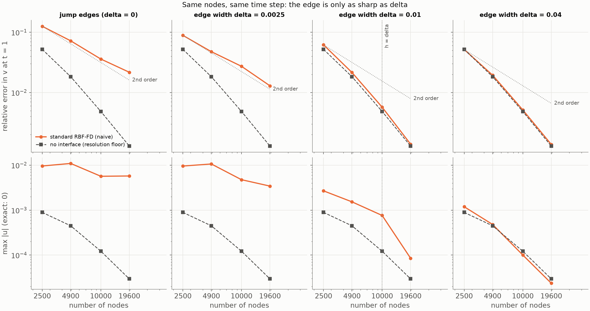

**What the table says.**

- *The resolution floor is the first thing to see.* With the dissertation
  pulse, only the jump and the never-resolved δ = 0.0025 edge stand out
  from the floor (3.5× and 2.2× at 19,600 nodes); δ = 0.01 sits at the
  floor even at h = 2δ, where the 1-D naive scheme was 400× worse than the
  seeds. The 2-D floor is 10⁻² at our finest node set, against 10⁻⁷ in the
  1-D study, and the pulse can only be widened so far (its tails must
  clear both edges for the ray sum). The wider pulse lowers the floor by
  8× at 19,600 nodes and is the configuration to read.
- *A never-resolved edge behaves like the jump.* At δ = 0.0025 the naive
  error is second order and 10× the floor at 19,600 nodes, at 0.6–0.75 of
  the jump's level: the straddling rows at h/2 see tanh(h/2δ) of the
  contrast, 0.9993 at 2500 nodes and 0.89 at 19,600.
- *A resolved edge costs nothing.* At δ = 0.04 (h ≤ δ/2) the naive error is
  the floor to within 7% at every n, with the floor's rates.
- *The knee is there but small in v.* At δ = 0.01 the naive error exceeds
  the floor by 19%, 17%, 18% and 7% from h = 2δ to h = 0.71δ; taking the
  excess in quadrature, the edge's own contribution falls 3.3e-2, 1.1e-2,
  3.0e-3, 5.1e-4, faster than second order and accelerating, which is the
  knee shape of section 2 seen through a high floor.
- *The spurious u separates the cases far more sharply than v.* The
  naive stencils excite u where a field varies sharply in y, because d/dx
  on scattered nodes does not annihilate such a field exactly; u carries
  none of the pulse's own dispersion error, and the uniform-medium run
  gives its floor (8.9e-4 down to 3.0e-5). Against that floor the jump is
  11×, 24×, 48×, 190× from 2500 to 19,600 nodes and δ = 0.0025 is 11×,
  24×, 39×, 113×: an unresolved edge's error decays like the jump's,
  slower than the floor, so the ratio grows with n. δ = 0.04 equals the
  floor at every n. δ = 0.01 sits 3×, 3×, 6×, 3× above it: on the way to
  jump-like behaviour while h ≥ δ (the ratio rising to 6 at h = δ) and
  falling back once h < δ. That is the knee of section 2 in the one
  quantity the floor does not pollute, as a plateau rather than a drop,
  because at h = 0.71δ the edge is only just resolved.
- *Spectrum* (`scripts/wave2d_eigenvalues.py --edge-width`, 900 flat nodes,
  standard γ): max Re λ = +5.9·10⁻² for the jump and for δ = h/8, and
  +8.2·10⁻⁵ for δ = 2h; RK4 amplification 1.0004, 1.0004, 1.0000. As
  expected: only the centre-sampled coefficients change.

**Consequences for #38–#40.** The seed stencils can at most remove the
excess over the floor: 8–20% in v at δ = 0.01, a factor 10 at δ = 0.0025
(an edge 3–8× thinner than the node spacing), and in spurious u a factor
3–6 at δ = 0.01 and 11–190× for the jump-like cases. So the flat
convergence study of #40 should report max |u| and the δ = 0.0025 column
as its primary evidence, use the wider pulse, and treat the δ = 0.01
v-curve as a secondary check; a "knee plot" in v alone would show little. The 2-D naive scheme is not first order through
an unresolved edge the way 1-D FD4 was: the fixed rows straddling the edge
centre keep the coefficient sampling symmetric, and RBF-FD's error through
a jump is already the "second order, large constant" of Part 2.

### 5.3 Seed-augmented stencils and the stability question (#39, `scripts/wave2d_stiff_eigenvalues.py`)

**What was built.** `wave2d/seeds.py: seed_weights` is the coupled
saddle-point solve of `interface_weights` with the seeds of §4.2 in place
of the piecewise polynomials: `interface.py` now exposes the Gaussian
block (`gaussian_rows`) and the solve-and-rotate step (`coupled_weights`)
for any augmenting basis, the seed values at the nodes are the
augmentation, the elastic right-hand sides come from the jets at the
anchor, and the hyperviscosity rows impose Δ³ = 0 on the seed space
(Brad's decision on #39). The jump path is unchanged bit for bit.
`build_operators(mode="aware")` on a medium with `edge_width > 0` rebuilds
every row whose 19-node stencil sees varying material (the 1-D rule,
`LayeredMedium2D.varies_over`, exact inequality by default and `seed_rtol`
to trim the tails); the nearest interface only sets the frame, the
material profile along the normal carries both edges, so a stencil that
sees both is marched through both and the thin-layer guard of the jump
path does not apply. Checks (`tests/test_wave2d_seeds.py`,
`tests/test_wave2d_smooth_edges.py`): without contrast the seed weights
equal the degree-3 RBF-FD weights and the no-contrast interface weights to
10⁻¹⁰; as δ → 0 they tend to `interface_weights` at first order in δ on a
real stencil, all four blocks, whichever side carries the standard
monomials (the translation keeps the degree, so both choices span the
same functions); every block is exact on the seed space through a
δ = h/4 edge and the Δ³ blocks annihilate it; the operator's rebuilt rows
are exactly the stencils that see the edge and no other entry moves.

**The question.** Brad's empirical stability recipe for RBF-FD (Δ³
hyperviscosity at γ = 2.4·10⁻¹¹ (h/0.02)⁵, fixed rows straddling each
interface) took years to find; does it survive when the augmentation is
no longer polynomial? Measured on the 900-node flat set (4500 eigenvalues,
dense), standard γ, CFL 0.5, by the largest real part with hyperviscosity
and the RK4 amplification max |R(λΔt)|; 1.0004 is the naive scheme's own
value (a mode growing by 4·10⁻⁴ per step, harmless over a run), anything
above 1.001 is a run that visibly grows.

**First attempt: 19-node seed rows with their own Δ³ rows.** Each seed
row (19 nodes, degree 3, as the dissertation's interface stencils) also
built its Δ³ weights on those 19 nodes with the seeds annihilated, the
exact twin of the jump path (dissertation p. 41).

| operator | rebuilt rows | max Re λ, with γ | RK4 max \|R\| |
|---|---|---|---|
| jump, naive | 0 | +5.9e-2 | 1.0004 |
| jump, interface-aware | 460 | +4.2e-2 | 1.0003 |
| δ = h/8, naive | 0 | +5.9e-2 | 1.0004 |
| δ = h/8, seeds | 513 | +6.2e-2 | 1.0004 |
| δ = h/4, seeds | 634 | +8.7e-2 | 1.0006 |
| δ = h/2, seeds | 900 | +1.05 | 1.003 |
| δ = h, seeds | 900 | +2.65 | 1.018 |
| δ = 1.9h (0.0625, the band's limit), seeds | 900 | +0.93 | 1.003 |

Fine while the seed rows form a band around each edge, unstable once the
tails (19δ plus the stencil radius) make every row a seed row, from about
δ = h/2 on this node set. The naive spectrum does not move with δ (§5.2),
so the movement is the seed rows'; but it is not the seeds:

- *Control.* Plain 19-node degree-3 RBF-FD stencils everywhere on the
  jump medium, no seeds at all: max Re = +2.4, max |R| = 1.012, worse
  than any seed operator. Doubling γ brings it to +1.4·10⁻². The 19-node
  degree-3 scheme is unstable at the MATLAB γ, which was tuned for the
  30-node degree-4 stencils; the jump path never sees this because its
  band is 4h wide.
- *Why.* The extreme Δ³ eigenvalue of the all-seed-row operator is −82
  against −151 for the naive one: the 19-node Δ³ rows carry half the
  damping. A 19-node stencil with the coupled degree-3 augmentation has
  38 unknowns and 20 constraints, 18 degrees of freedom for the Gaussian
  part of a sixth-order operator, and what comes out is barely a Δ³.
- *Trimming the rows does not help.* At δ = h/2, `seed_rtol` of 10⁻⁶,
  10⁻³ and 10⁻² leave 574, 458 and 420 rows and max Re +1.05, +1.05 and
  +0.35; at δ = h, 800, 578 and 513 rows and +2.65, +2.65 and +2.60. It is
  the width of the contiguous 19-node region that matters, not the count.
- *γ × 2.* Everywhere: stable (+2.9·10⁻² at δ = h/2, +3.9·10⁻² at δ = h),
  at the price of doubling the damping of the whole solution. On the seed
  rows only: also stable (same numbers), which is the measured ratio of
  the two Δ³ extremes; 1.5γ is stable too (+2.2·10⁻², +2.9·10⁻²).
- *The naive footprint for everything* (30-node degree-4 seed stencils):
  stable for a resolved edge (+0.10, +0.05, +0.06 at δ = h/2, h, 1.9h) and
  violently unstable for a sharp one, +22, +30, +28 at δ = h/20, h/8, h/4
  with max |R| up to 1.23. The jump-aware path with 30-node degree-4
  stencils is unstable the same way (+17, 1.12): a degree-4 basis across
  a sharp feature is the problem, presumably why the dissertation settled
  on 19 nodes and degree 3. Conditioning is not the cause (the 30-node
  seed blocks are at 85–215 against 17–34, still fine). 30-node
  *degree-3* seed stencils, for the record, are stable everywhere
  (+0.12, +0.06, +0.06), but they are a different scheme from the
  dissertation's and were not pursued.
- *Keeping the naive Δ³ rows on the seed rows* (the issue's first
  reading): stable everywhere (+0.09, +0.08, +0.03, +0.009 at
  δ = h/8 … h) but the naive Δ³ does not annihilate the seeds, and the
  seeds are what the scheme resolves through the edge.

**What works: annihilate the seeds on the naive footprint.** The elastic
rows keep the 19-node seed stencils; the Δ³ rows of the same nodes are
built on the naive 30-node footprint with the same seeds annihilated, a
second march per stencil (`seed_hyper_stencil`, default `stencil_size`).
Stable at every width at the standard γ, with the naive damping restored
(extreme Δ³ eigenvalue −176):

| δ | rebuilt rows | max Re λ, with γ | min Re λ | RK4 max \|R\| |
|---|---|---|---|---|
| h/8 | 513 | +4.1e-2 | −176 | 1.0003 |
| h/2 | 900 | +6.6e-2 | −167 | 1.0005 |
| h | 900 | +5.2e-2 | −175 | 1.0004 |
| 1.9h | 900 | +5.6e-2 | −168 | 1.0004 |

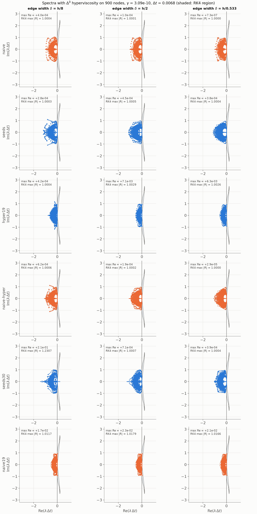

**Accuracy, as a check on the choice** (n = 2500, δ = 0.0025 = h/8, the
wider pulse of §5.2, t = 1, against the cached spectral reference; the
floor is the naive scheme in a uniform medium; the rejected rows come
from `--variants hyper19 naive-hyper seeds30` and, for 2γ,
`--seed-hyper-scale 2 --variants hyper19`):

| operator | error in v | max \|u\| | E(1)/E(0) |
|---|---|---|---|
| naive | 8.9e-2 | 9.5e-3 | 0.969 |
| floor | 5.2e-2 | 8.9e-4 | |
| seeds, 19-node Δ³ rows (unstable when wide) | 4.7e-2 | 1.5e-3 | 0.982 |
| seeds, naive Δ³ rows kept | 4.4e-2 | 2.2e-3 | 0.993 |
| seeds, 19-node Δ³ rows at 2γ | 6.5e-2 | 1.0e-3 | 0.971 |
| seeds, 30-node degree-4 (unstable when sharp) | 5.8e-2 | 1.1e-3 | 0.994 |
| **seeds, 30-node annihilating Δ³ rows (chosen)** | **3.0e-2** | **1.7e-3** | **0.995** |

Every seed variant removes most of the naive scheme's excess: the
spurious u falls 4–9×, to 1–2.5× the floor, and v reaches the floor. The
chosen one is the best in v (below the naive floor: the 19-node seed rows
in the tails, where the seeds are monomials, are not the naive scheme,
and its "floor" is not theirs) and keeps the most energy; the 2γ variant
buys the smallest u with extra damping of the pulse, twice the chosen
operator's error in v. The
answer to the question, then: yes, RBF-FD stability survives
seed-augmented stencils, at the standard γ and with the straddling rows
kept, provided the hyperviscosity row of a seed stencil has the footprint
γ was tuned for. Hyperviscosity annihilating the seed space is the right
choice (it was the only variant tried that both annihilates and is
stable), and the alternative in #38's open point, the seeds' true sixth
derivatives, was never needed.

**Acceptance run on 2500 nodes** (`--n 2500 --run --floor`, 12,500
eigenvalues per operator, the wide pulse to t = 1, references as in §5.2):

| δ | operator | rebuilt rows | max Re λ, with γ | RK4 max \|R\| | E(1)/E(0) | max \|u\| | error in v |
|---|---|---|---|---|---|---|---|
| jump | naive | 0 | +3.5e-3 | 1.00001 | 0.969 | 9.6e-3 | 1.3e-1 |
| jump | interface-aware | 805 | +4.9e-2 | 1.0002 | 0.979 | 1.2e-3 | 5.4e-2 |
| (floor) | naive, uniform medium | 0 | 0 | 1.0000 | 0.925 | 8.9e-4 | 5.2e-2 |
| h/8 | naive | 0 | +3.5e-3 | 1.00001 | 0.969 | 9.5e-3 | 8.9e-2 |
| h/8 | seeds | 985 | +6.3e-2 | 1.0003 | 0.995 | 1.7e-3 | 3.0e-2 |
| h/2 | naive | 0 | +4.6e-3 | 1.00002 | 0.992 | 2.7e-3 | 6.2e-2 |
| h/2 | seeds | 1796 | +7.8e-2 | 1.0003 | 1.003 | 3.5e-3 | 3.0e-2 |
| 2h | naive | 0 | +6.7e-5 | 1.0000 | 0.988 | 1.2e-3 | 5.2e-2 |
| 2h | seeds | 2500 | +9.6e-2 | 1.0004 | 1.012 | 5.9e-3 | 7.5e-2 |

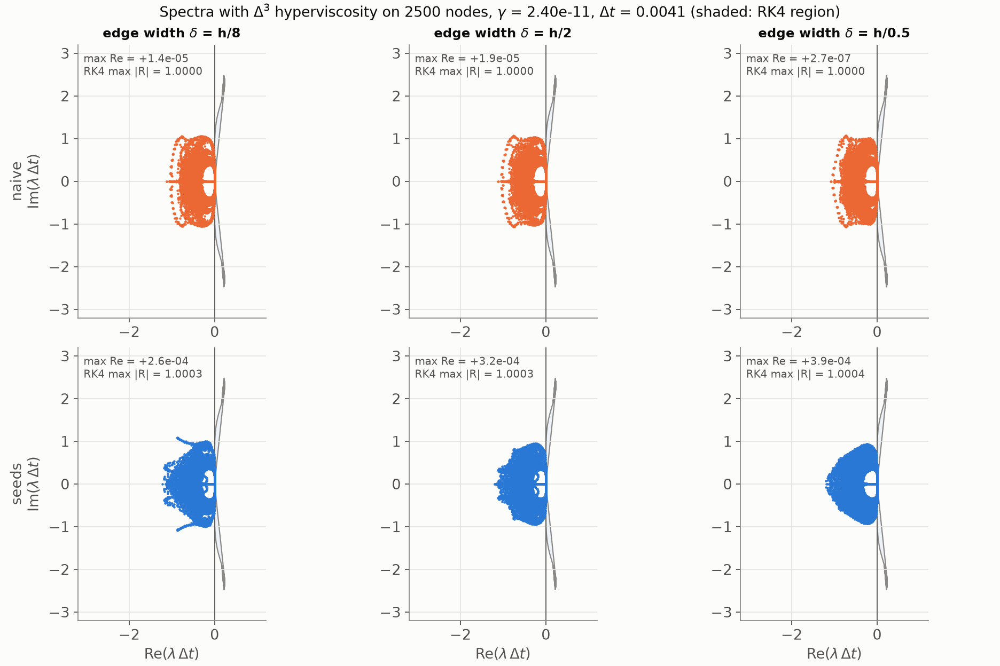

The seed operator's rightmost eigenvalues sit at max |R| = 1.0003–1.0004
whatever δ, the level of the jump-aware operator (1.0002) and of the naive
scheme on 900 nodes (1.0004), while the naive scheme on 2500 nodes is at
1.00001: the rebuilt rows carry a slightly larger rightmost eigenvalue
than plain stencils, as the dissertation's interface rows do, and no
more. The energy ratios say the same in the time domain, 0.995 at δ = h/8
and 1.003 at h/2 against a quadrature drift of ±5% for the exact solution
on these nodes (the floor loses 7.5%); at δ = 2h the ratio is 1.012.
Run to t = 3 that last case keeps rising, 1.045, 1.055, 1.063, 1.071 at
t = 1.5 … 3, a rate of about 0.012 per unit time, while the naive scheme
(0.999 at t = 3), the jump-aware operator (0.96; its rightmost eigenvalue
is +0.049) and the seed operator at δ = h/8 (1.006) all stay bounded. So
the acceptance run passes cleanly at δ = h/8 and not quite at 2h: a
weakly excited mode near the +0.1 rightmost eigenvalue, far below what
max |R| = 1.0004 would allow (10% per unit time), confined to the regime
where every row is a seed row, and the item to fix, with a slightly
larger γ on the seed rows or the 30-node degree-4 stencils that are
stable there, if #40 ever seeds a resolved edge.

Where the seeds earn their keep is as sharp as the spectrum is uniform.
At δ = h/8 they cut the spurious u from 9.5·10⁻³ to 1.7·10⁻³ (the floor
is 8.9·10⁻⁴) and the error in v from 8.9·10⁻² to 3.0·10⁻², below the naive
floor; the 900-node run says the same (u 3.4·10⁻² → 6.7·10⁻³ against a
floor of 4.4·10⁻³). At δ = h/2 the picture is mixed (v halves, u is 30%
worse than naive), and at δ = 2h, where every row is a 19-node degree-3
seed row and the naive scheme is already at its floor, the seed operator
is the worse scheme: u 5.9·10⁻³ against 1.2·10⁻³, v 7.5·10⁻² against
5.2·10⁻², and the 900-node run agrees (v 0.28 against 0.16). The 30-node
degree-4 seed stencils are the accurate ones there (on 900 nodes u is
3.5× below naive at δ = h/2 and at the naive level at 1.9h), and they are
the ones that blow up on a sharp edge (their run at δ = h/8 reaches 10¹⁴).
So the seeds are for the twilight zone, δ ≲ h/4, and #40 should either
not seed a resolved edge (a rule on the variation per node spacing, not
`seed_rtol`, which trims tails but not the contiguous region) or find
what makes a degree-4 seed basis unstable across a sharp feature, since
that is the accurate stencil wherever it is stable.

**The true Δ³ of the seeds as right-hand sides** (Brad's question,
2026-09-20): the hyperviscosity rows impose Δ³ S = 0 on every seed; the
honest alternative is the seeds' actual sixth derivatives at the anchor,
Δ³ S = Σ_k C(3,k) (2k)! a_{2k}^{(6−2k)}(0) from the ansatz, which needs
the Y-derivatives of the coefficient functions to sixth order and so the
material's derivatives to fifth. Finite differences of the marched seeds
along Y cannot give them at a sharp edge (a sixth difference at step
δ/10 amplifies rounding by 10¹³); the clean route is a Taylor recursion
on the first-order system at the anchor, y_{k+1} = (1/(k+1)) Σ_i M_i
y_{k−i}, with the Taylor coefficients M_i of the coefficient matrix from
the tanh recurrence T' = (1 − T²)/δ, about sixty lines plus a test
against the monomials' Δ³ in constant material. Not built here. What it
would do is predictable: at an anchor a distance d from an edge of width
δ the sixth derivative scales like (r_max/δ)⁵ e^(−2d/δ), so the
hyperviscosity would act on the seed part of the solution with strength
γ Δ³ S ∝ (h/δ)⁵, a consistent discretisation of γ Δ³ applied to the
edge structure, strong exactly when the edge is unresolved. That is the
behaviour the seeds exist to remove, so the expectation is a stable
operator (more damping, not less) that damps the resolved physics at
the edge; the comparison is a half-day item on #40 if the spectrum or
the errors ever call for it.

**Cost.** One march per 19-node stencil is 21–25 ms; with the second,
30-node march a seed row costs 53 ms. On 10,000 nodes (the clip
resolution) δ = h/8 has 1965 seed rows and builds in 105 s (49 s with the
19-node Δ³ rows); δ = 0.01 = h has 6719 rows and builds in 331 s.
The two optimisations for #40, if it hurts: the 19-node
stencil is the prefix of the 30-node one, so one march with the seeds
rescaled to the smaller r_max (column scalings, the span is unchanged)
serves both; and the flat case's translation symmetry (§4.2). Neither is
built.

### 5.4 The flat δ sweep: naive vs seeds vs the spectral reference (#40, `scripts/wave2d_stiff.py`)

The 2-D twin of the 1-D knee plot of section 2. Setup as §5.2 (the flat
band, the wide pulse of sharpness 15 centred at 0.875, t = 1, the Part 2
node sets, the MATLAB γ, CFL 0.5), now with both operators at every
(n, δ): the naive scheme, and `build_operators(mode="aware")`, which at
δ = 0 is Part 2's interface-aware operator and for δ > 0 puts the seed
stencils of §5.3 on every row whose 19-node stencil sees the edge. No
rule about which rows to seed was imposed beforehand; the sweep is what
sets the rule. Errors are relative l2 errors at t = 1 against the ray
sum (δ = 0) or the cached 1-D spectral snapshots, in v and h, plus the
largest spurious |u|. The reference depends on y only and is evaluated at
every node directly, so no resampling enters. Seed rows: 985, 1627, 2735,
4888 at δ = 0.0025 (39% down to 25% of the nodes: the tails reach 19δ
plus a stencil radius); 1796, 3388, 6719, 12929 at δ = 0.01 (72% to
66%); every row at δ = 0.04. The marches run on a process pool
(`build_operators(workers=...)`, bit for bit the serial weights) and the
seed operators are cached under `outputs/`; the default configuration
takes 636 s on 12 workers with the operators built (the largest, 19,600
seed rows, in 94 s) and about 4 minutes from the cache.

Error in v (rates in h between consecutive n):

| δ | operator | n = 2500 | 4900 | 10000 | 19600 | rates |
| --- | --- | --- | --- | --- | --- | --- |
| 0 (jump) | naive | 1.3e-1 | 7.2e-2 | 3.6e-2 | 2.2e-2 | 1.7, 2.0, 1.5 |
| 0 (jump) | interface-aware | 5.4e-2 | 1.8e-2 | 4.7e-3 | 1.2e-3 | 3.2, 3.8, 4.0 |
| 0.0025 | naive | 8.9e-2 | 4.8e-2 | 2.7e-2 | 1.3e-2 | 1.9, 1.6, 2.2 |
| 0.0025 | seeds | 3.0e-2 | 7.7e-3 | 2.1e-3 | 6.4e-4 | 4.1, 3.7, 3.5 |
| 0.01 | naive | 6.2e-2 | 2.1e-2 | 5.7e-3 | 1.4e-3 | 3.1, 3.7, 4.2 |
| 0.01 | seeds | 3.0e-2 | 1.1e-2 | 3.9e-3 | 1.6e-3 | 3.1, 2.8, 2.7 |
| 0.04 | naive | 5.2e-2 | 1.9e-2 | 5.1e-3 | 1.4e-3 | 2.9, 3.7, 3.9 |
| 0.04 | seeds | 7.5e-2 | 2.8e-2 | 7.7e-3 | 2.7e-3 | 2.9, 3.6, 3.1 |
| floor | naive, uniform | 5.2e-2 | 1.8e-2 | 4.8e-3 | 1.3e-3 | 3.1, 3.7, 3.9 |

h/δ at the four n: 8, 5.7, 4, 2.9 for δ = 0.0025; 2, 1.4, 1, 0.71 for
δ = 0.01; 0.5, 0.36, 0.25, 0.18 for δ = 0.04.

Largest spurious |u| (exact: 0), and the error in h:

| δ | operator | max \|u\| at 2500 … 19600 | error in h at 2500 … 19600 | rates in h |
| --- | --- | --- | --- | --- |
| 0 (jump) | naive | 9.6e-3, 1.1e-2, 5.7e-3, 5.7e-3 | 7.3e-2, 4.1e-2, 2.1e-2, 1.2e-2 | 1.7, 1.9, 1.6 |
| 0 (jump) | interface-aware | 1.2e-3, 4.6e-4, 1.5e-4, 3.3e-5 | 4.0e-2, 1.4e-2, 3.8e-3, 1.1e-3 | 3.2, 3.5, 3.8 |
| 0.0025 | naive | 9.5e-3, 1.1e-2, 4.7e-3, 3.4e-3 | 5.9e-2, 4.2e-2, 2.8e-2, 1.2e-2 | 1.0, 1.2, 2.4 |
| 0.0025 | seeds | 1.7e-3, 6.5e-4, 1.9e-4, 5.1e-5 | 2.3e-2, 6.8e-3, 2.2e-3, 6.7e-4 | 3.6, 3.2, 3.5 |
| 0.01 | naive | 2.7e-3, 1.5e-3, 7.6e-4, 8.5e-5 | 3.9e-2, 1.5e-2, 4.2e-3, 1.0e-3 | 2.8, 3.6, 4.3 |
| 0.01 | seeds | 3.5e-3, 1.1e-3, 4.3e-4, 1.1e-4 | 3.7e-2, 8.6e-3, 2.4e-3, 1.1e-3 | 4.4, 3.6, 2.4 |
| 0.04 | naive | 1.2e-3, 4.8e-4, 1.0e-4, 2.4e-5 | 3.4e-2, 1.1e-2, 2.9e-3, 7.4e-4 | 3.3, 3.8, 4.0 |
| 0.04 | seeds | 5.9e-3, 1.8e-3, 5.7e-4, 1.2e-4 | 4.2e-2, 1.7e-2, 6.0e-3, 2.2e-3 | 2.6, 3.0, 3.0 |
| floor | naive, uniform | 8.9e-4, 4.5e-4, 1.2e-4, 3.0e-5 | | |

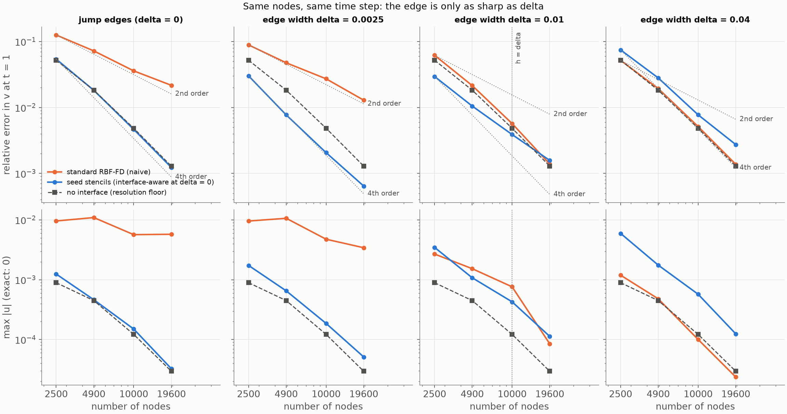

**What the table says.**

- *Through an edge the nodes never resolve (δ = 0.0025, h/δ from 8 to
  2.9) the seeds are fourth order at every resolution*, rates 4.1, 3.7,
  3.5 in v and 3.6, 3.2, 3.5 in h, against 1.6–2.2 for the naive scheme,
  which is 3×, 6×, 13×, 20× worse in v and 6×, 17×, 25×, 67× worse in
  spurious u from 2500 to 19,600 nodes. The seeds' u sits at 1.9×, 1.4×,
  1.6×, 1.7× the floor's (the naive scheme: 11× to 113×). That is the
  1-D result of section 2 in 2-D: the order of the jump-aware stencils,
  reached without the grid seeing the edge, on the same nodes and the
  same time step. The constant is not the jump row's but half of it, at
  every n (3.0e-2 against 5.4e-2, …, 6.4e-4 against 1.2e-3), and half
  the uniform-medium floor's. That is the seed operator's own floor, not
  the edge: seeding the same rows through a contrast of 10⁻⁶ (a medium
  the exact translated pulse cannot tell from uniform, seeds equal to
  the monomials to rounding, 794, 1103, 1965, 3353 rows) gives 2.7e-2,
  6.2e-3, 1.9e-3, 6.9e-4, half the naive floor at every n and within
  10–25% of the seed errors at δ = 0.0025. So the seeds remove the edge
  error down to their own resolution floor, as the jump-aware operator
  does down to the naive one. Why a band of 19-node degree-3 seed rows
  with 30-node annihilating Δ³ rows is more accurate than 30-node
  degree-4 stencils everywhere on this pulse is not settled: plain
  19-node degree-3 stencils everywhere, with their own Δ³ rows, are 2–4×
  *worse* than 30/4 (9.5e-2, 3.9e-2, 1.4e-2, 4.9e-3; the scheme §5.3
  found unstable at the MATLAB γ, harmless to t = 1), so it is not the
  degree; and the energy ratios E(1)/E(0) match the naive floor's
  (0.93, 0.92, 0.99, 0.99 against 0.93, 0.92, 0.99, 0.99), so it is not
  less damping. The §5.3 variants at 2500 nodes point at the Δ³ rows:
  the seed elastic rows with the naive Δ³ rows sit at 4.4e-2, with
  19-node Δ³ rows at 4.7e-2, with the chosen 30-node annihilating rows at
  3.0e-2. A uniform-medium dispersion study of those rows would settle
  it; nothing in the sweep's conclusions depends on it.
- *The crossover is at h ≈ δ.* At δ = 0.01 the seeds lead by 2.1× in v at
  h = 2δ (u equal), 2.0× at h = 1.4δ (u 1.4×), 1.5× at h = δ (u 1.8×),
  and trail by 0.9× (u 0.8×) at h = 0.71δ. The seed rates fall from 3.1
  to 2.7 across the panel while the naive rates rise from 3.1 to 4.2,
  because the naive scheme is resolving the edge and the seeds are
  seeding rows that no longer need it: 66–72% of the nodes carry the
  19-node degree-3 stencils here.
- *A resolved edge should not be seeded* (δ = 0.04, h ≤ δ/2, every row a
  seed row): the seeds are 1.4–2.0× worse than naive in v and 4–5×
  worse in u, at rates of 2.9–3.6 against 2.9–3.9, as the 2500-node
  acceptance run of §5.3 found. The naive scheme is at its floor to
  within 7% at every n, with the floor's rates; there is nothing left
  for the seeds to remove and the 19/3 stencils through a resolved
  profile are the less accurate scheme.
- *So the rule for a flat edge is: seed when δ ≤ h, run naive otherwise.*
  In this sweep that means every n at δ = 0.0025, up to 10,000 nodes at
  δ = 0.01 and never at δ = 0.04; with it the seed operator is never
  worse than naive and is at or below the floor wherever it is used. The
  rule is per edge (δ is the edge's, h the node set's), not per row:
  `seed_rtol` trims the tails, and the accuracy loss on a resolved edge
  comes from the rows at its centre, not its tails. A per-row version for
  edges of varying width would threshold the material change across a
  stencil's own diameter; nothing here needs it. The δ ≲ h/4 estimate
  from the three 2500-node points of §5.3 was too cautious: at h/2 the
  seeds halve v and only just lose in u, and this sweep puts the
  break-even between h = δ and h = 0.71δ.
- *The naive knee.* In v it is the 8–19% excess over the floor at
  δ = 0.01 that §5.2 measured; in spurious u, the quantity the floor
  does not pollute, the naive scheme at δ = 0.01 sits 3×, 3×, 6×, 3×
  above the floor and drops 9× between 10,000 and 19,600 nodes (h = δ to
  0.71δ) against 4× for the floor: the plateau while h ≥ δ and the drop
  once h < δ, at h = δ as in 1-D. The 2-D naive scheme is not first
  order through an unresolved edge as 1-D FD4 was (rates 1.6–2.2 in v
  at δ = 0.0025): the fixed rows straddling the edge centre keep the
  coefficient sampling symmetric, and RBF-FD through a jump is already
  the "second order, large constant" of Part 2, so the knee is a change
  of constant, not of order, and shows as a bend rather than a kink.
- *h says what v says*, table above: fourth order for the seeds at
  δ = 0.0025 (2.3e-2 down to 6.7e-4, 18× below naive at 19,600 nodes),
  and the same crossover and loss at 0.01 and 0.04.

**The still** (`docs/figures/wave2d_stiff_snapshot.png`, 10,000 nodes,
δ = 0.0025 = h/4, the wide pulse, one-sided resampling to a 250² grid,
both error maps on one colour scale): the reference wave, then the two
error maps at t = 0.25, when the pulse has just split at the upper edge,
and at t = 1, the sweep's measurement time (the t = 0.5 row below is from
the same runs, not in the figure).

| t | naive: error in v, max \|u\| | seeds: error in v, max \|u\| |
|---|---|---|
| 0.25 | 1.5%, 3.5e-3 | 0.07%, 1.9e-4 |
| 0.50 | 2.6%, 3.3e-3 | 0.11%, 1.6e-4 |
| 1.00 | 2.7%, 4.7e-3 | 0.21%, 1.9e-4 |

At t = 0.25 the naive error is the horizontal streaking along the edge
that the stencils straddling it produce, already spread over the whole
pulse; the seed panel is nearly blank at this scale (0.07%). By t = 1
the naive error
has been carried everywhere the reflections went, and the seeds' 0.2% is
the resolution error of the pulse.

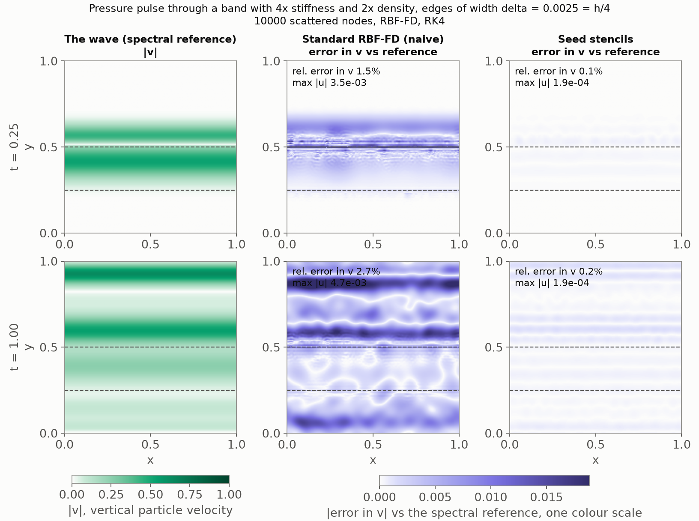

**Regression test.** `test_seed_stencils_beat_naive_through_an_edge_between_the_rows`
in `tests/test_wave2d_smooth_edges.py`: 900 nodes, δ = h/8, the wide
pulse, t = 1, about 15 s with four workers. Seeds against naive: u 6.7e-3
against 3.4e-2 (floor 4.4e-3), v 0.19 against 0.32 (floor 0.17); the
test asserts u below a third of naive's, v below naive's by 1.4× and
within 1.25× of the floor, and naive above 1.6× the floor. 400 nodes
cannot resolve the wide pulse (floor 0.3) and the comparison there
depends on the node set's seed.

**Acceptance.** (1) Fourth order with a δ-independent constant: yes for
δ ≤ h, rates 3.5–4.1 at δ = 0.0025 at a constant below the jump row's;
the rates fall towards the crossover at δ = 0.01 and the seeds lose
beyond it, hence the rule. (2) The naive knee: at h = δ, in spurious u;
in v the floor hides it as §5.2 predicted. (3) Figures under
`docs/figures/`, this section, the regression test, runtime above.

### 5.5 Oblique incidence: the x'-dependent seeds act (#41, `scripts/wave2d_stiff.py --direction 1 2`)

At normal incidence the solution is independent of x', u ≡ 0, and the
seeds of x'ᵃ y'ᵇ with a ≥ 1 could only show through the weights, never
through the solution (`test_seed_weights_are_exact_on_the_seed_space`
checks them at the weight level). This section sends the pulse in at an
angle, where u ≠ 0, the x'-strain of the incident P wave meets the edge,
and P-to-S conversion appears.

**The pulse.** A plane pulse that is periodic on the unit square and
tilted cannot be kept out of the band: a single crest line tilted by θ
sweeps every y as x goes round. What the periodicity allows is the
doubly periodic *train* along a lattice direction, `wave2d/domain.py:
oblique_p_wave(direction=(m_x, m_y))`: crests m_x x − m_y y = const,
angle θ = atan(m_x / m_y) to the edge normal, travelling towards +x and
−y, one crest through (0, 0.875) repeated every 1/√(m_x² + m_y²) along
the direction of travel, the Gaussian profile of sharpness 15
periodised. The normal pulse of §5.2–5.4 is the (0, 1) member of the
same family (to 10⁻²⁴, the periodic images). A quarter of the strip
length starts inside the band by area, whichever direction and phase
are chosen. The direction is (1, 2), θ = 26.6°: the largest crest
spacing of any sub-critical lattice direction (P → P transmission into
the band turns critical at 45°, the (1, 1) direction; at 26.6° the
transmitted P, transmitted S and reflected S leave at 39°, 21° and
15°, all propagating). The train's period is 0.447 along the direction
of travel, so neighbouring crests overlap at 1.3·10⁻⁵, and its
x-content is 13 Fourier modes to 10⁻¹⁴.

Every point carries the *background* material's P eigenvector, as
`plane_p_wave` does: (u, v) = −d G, f = [K d_x² + λ d_y²] G / c_p,
g = 2μ d_x d_y G / c_p, h = [λ d_x² + K d_y²] G / c_p. So every field is
one smooth profile everywhere, and the in-band part of a strip is a
smooth superposition of the band's own four waves (for the default
materials, with λ = μ on both sides, its strain is compatible and it
has no static component). The first attempt used the *local*
material's eigenvector, which makes the in-band strips exact band P
waves but makes the tractions g and h jump by the impedance ratio, 2.8×,
across every edge crossing over the width δ, which no solution can do.
The true dynamics resolve that into O(1) waves with δ-sharp fronts: at
δ = 0.01 the reference's v carried 33× the power below wavelength 2h of
the background construction, with a traction gradient 6× steeper at
t = 0, and on the node sets both schemes sat 50× above the resolution
floor at first-order rates (seeds 1.25e-1 down to 5.5e-2 in v at
δ = 0.0025, naive 1.66e-1 to 6.7e-2), whatever the stencils did at the
edge. Initial data must respect the interface conditions at the
sub-grid scale or every scheme measures the initial data.

**The reference** is option (i) of the issue, `wave2d/spectral.py:
run_fourier`: on a flat medium the coefficients depend on y only, so the
x-modes of the state never mix, and each mode is a 1-D system in y with
∂ₓ → 2πik, complex coefficients, Fourier pseudo-spectral in y and RK4,
all modes marched as one array. It is exact in x, shares nothing with
the stencils, and costs minutes (13 modes at n_y = 4096 for δ = 0.0025,
20,000 steps at Δt = 5·10⁻⁵, 220 s; 40 s at δ = 0.01), less than one
78,400-node seed run, so option (ii), the 4× finer seed run, was not
needed; its y-direction machinery is what the product-grid reference of
#42 will build on. Checks (`tests/test_wave2d_oblique.py`): the train
is the exact translate in a uniform medium to 10⁻¹⁰ and has zero curl
(a P wave); at normal incidence the solver agrees with the mapped 1-D
reference of §5.1 to 10⁻¹⁰, two independent code paths; through an
edge at oblique incidence the elastic energy is conserved to 10⁻¹² and
doubling the grid while halving the step moves the answer by 10⁻⁸, so
the RK4 step sets the accuracy and it is far below anything measured.
`ModeState` evaluates the fields at any point by trigonometric
interpolation in both directions, and their curl u_y − v_x, which is
zero for a P wave and so maps the S waves alone.

**What is measured.** As §5.4 (same node sets, the same seed operators
from the cache since they are pulse-independent, the MATLAB γ, CFL 0.5,
t = 1): relative l2 errors in v, h and now u against the Fourier
reference (the spurious u of §5.4 is no longer evidence because u ≠ 0
exactly). Two floors: the train in the uniform medium against its exact
translate (the resolution floor of §5.4), and the seed rows built
through a 10⁻⁶ contrast against the same translate (the seed operator's
own floor, §5.4's measurement made a driver flag, `--seed-floor`). And
the ablation of the issue, `--modes ablate`
(`build_operators(seed_tangential=False)`): the seeds of the pure y'ᵇ
monomials are kept and every x'ᵃ y'ᵇ with a ≥ 1 is the plain monomial
with the anchor material's stress, from a second chain on the material
frozen at the anchor (a frozen column must see frozen lower seeds on its
right-hand side, or x'² y'² would still be driven by the marched y'²);
same span dimension, same jets. What the ablation removes is, for
instance, the v-component that the seed of u = x' acquires across the
edge (0.5 at δ = h/4 on a 400-node stencil): continuity of the normal
stress λ u_x + K v_y with λ changing forces a kink in v_y, the Poisson
coupling of the edge, which a monomial cannot carry.

Error in v at t = 1, direction (1, 2) (rates in h between consecutive n):

| δ | operator | n = 2500 | 4900 | 10000 | 19600 | rates |
| --- | --- | --- | --- | --- | --- | --- |
| 0.0025 | naive | 1.17e-1 | 6.0e-2 | 3.0e-2 | 1.40e-2 | 2.0, 2.0, 2.2 |
| 0.0025 | seeds | 8.2e-2 | 3.6e-2 | 1.56e-2 | 8.3e-3 | 2.5, 2.3, 1.9 |
| 0.0025 | ablation | 9.9e-2 | 5.7e-2 | 3.5e-2 | 1.91e-2 | 1.7, 1.4, 1.8 |
| 0.0025 | seed floor | 3.6e-2 | 1.26e-2 | 3.6e-3 | 1.06e-3 | 3.1, 3.5, 3.6 |
| 0.01 | naive | 1.01e-1 | 4.9e-2 | 2.0e-2 | 8.2e-3 | 2.2, 2.5, 2.7 |
| 0.01 | seeds | 7.4e-2 | 3.0e-2 | 1.16e-2 | 5.1e-3 | 2.7, 2.7, 2.4 |
| 0.01 | ablation | 7.3e-2 | 3.0e-2 | 1.18e-2 | 5.3e-3 | 2.6, 2.7, 2.4 |
| 0.01 | seed floor | 2.1e-2 | 7.2e-3 | 3.3e-3 | 1.46e-3 | 3.1, 2.1, 2.5 |
| floor | naive, uniform | 4.7e-2 | 1.55e-2 | 4.3e-3 | 1.20e-3 | 3.3, 3.6, 3.8 |

Error in u and in h:

| δ | operator | u at 2500 … 19600 | rates | h at 2500 … 19600 | rates |
| --- | --- | --- | --- | --- | --- |
| 0.0025 | naive | 1.7e-1, 1.1e-1, 5.5e-2, 2.6e-2 | 1.4, 1.8, 2.2 | 1.10e-1, 6.2e-2, 3.1e-2, 1.58e-2 | 1.7, 1.9, 2.0 |
| 0.0025 | seeds | 1.4e-1, 7.9e-2, 3.6e-2, 1.6e-2 | 1.8, 2.2, 2.5 | 7.0e-2, 4.2e-2, 2.6e-2, 1.62e-2 | 1.5, 1.3, 1.4 |
| 0.0025 | ablation | 1.9e-1, 1.3e-1, 8.7e-2, 4.3e-2 | 1.0, 1.2, 2.1 | 9.4e-2, 6.3e-2, 4.0e-2, 2.4e-2 | 1.2, 1.2, 1.6 |
| 0.01 | naive | 1.4e-1, 7.6e-2, 3.7e-2, 1.5e-2 | 1.9, 2.0, 2.7 | 9.0e-2, 4.6e-2, 2.2e-2, 9.9e-3 | 1.9, 2.1, 2.4 |
| 0.01 | seeds | 1.3e-1, 6.3e-2, 2.6e-2, 8.9e-3 | 2.2, 2.5, 3.2 | 7.8e-2, 3.4e-2, 1.31e-2, 6.3e-3 | 2.5, 2.6, 2.2 |
| 0.01 | ablation | 1.4e-1, 6.4e-2, 2.6e-2, 9.1e-3 | 2.3, 2.5, 3.1 | 8.1e-2, 3.4e-2, 1.33e-2, 6.4e-3 | 2.6, 2.6, 2.2 |
| floor | naive, uniform | 4.7e-2, 1.6e-2, 4.3e-3, 1.2e-3 | 3.3, 3.6, 3.8 | | |

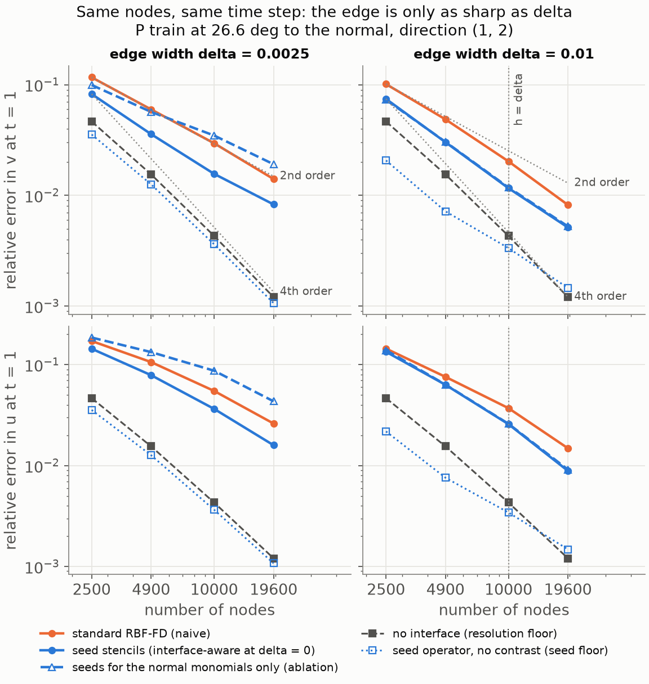

**What the table says, and what it does not.**

- *The seeds win at every (n, δ), by less than at normal incidence*:
  1.4×, 1.7×, 1.9×, 1.7× in v and 1.2×, 1.4×, 1.5×, 1.6× in u at
  δ = 0.0025; 1.4–1.7× in v and 1.1–1.7× in u at δ = 0.01. At δ = 0.01
  the naive scheme has h ≤ 2δ and is resolving the edge; the seeds still
  lead everywhere, and at h = 0.71δ by 1.6×, so the "seed when δ ≤ h"
  rule of §5.4 is safe on the seeded side here (it was set on v at
  normal incidence; this pulse does not reach below h = 0.71δ).
- *The x'-dependent seeds matter, and they matter where the edge is
  sharp.* At δ = 0.0025 the ablation is worse than the full seeds by
  1.2×, 1.6×, 2.2×, 2.3× in v and 1.4×, 1.7×, 2.4×, 2.7× in u, and from
  4900 nodes on it is worse than the *naive* scheme (1.91e-2 against
  1.40e-2 in v at 19,600, 4.3e-2 against 2.6e-2 in u): the normal-only
  seeds bend v across the edge for the y'ᵇ columns and leave u = x'
  straight, an inconsistent pair that costs more than doing nothing. At
  δ = 0.01 the ablation and the full seeds agree to three digits at
  every n: with h ≤ 2δ the kink of the x'-columns is spread over half a
  stencil radius or more and a cubic in y' carries it. So the answer to
  the issue's question is yes, they mattered, and the same crossover
  h ≈ δ that decides whether to seed decides whether the tangential
  columns are worth their march.
- *The order is not four.* The seeds converge at 2.5, 2.3, 1.9 in v
  through δ = 0.0025 (the naive scheme at 2.0, 2.0, 2.2) and sit 7× above
  the train's resolution floor at 19,600 nodes, against half the floor
  at normal incidence; in h they are no better than naive at 19,600
  (1.62e-2 against 1.58e-2, rates 1.4). Six measurements (all scratch
  runs of 2026-09-19, numbers in this section only) located where that
  comes from:
  1. *Not the hyperviscosity.* At γ/4 the seeds' v moves by under 15%
     where the run stays stable (9.6e-2, 3.6e-2, 1.4e-2 against 8.2e-2,
     3.6e-2, 1.56e-2; unstable at 19,600 nodes), and γ = 0 blows up for
     every scheme at every n.
  2. *Not the angle.* The (1, 3) train at 18.4° gives seeds 6.7e-2,
     3.2e-2, 1.44e-2, 7.5e-3 (2.2, 2.2, 1.9), naive 1.09e-1, 6.1e-2,
     3.2e-2, 1.55e-2, floor 4.9e-2 to 1.23e-3: the same picture at a
     smaller angle. Down to the curved case's range, (1, 4) at 14.0°
     and (1, 6) at 9.5°: seeds 5.7e-2, 2.7e-2, 1.26e-2, 6.5e-3 (2.2, 2.1,
     2.0) and 7.0e-2, 2.7e-2, 9.7e-3, 4.8e-3 (2.9, 2.8, 2.1), naive
     1.12e-1 to 1.50e-2 and 1.20e-1 to 9.5e-3, floors 4.5e-2 and 6.1e-2
     down to 1.2e-3. The seeds' constant falls with the angle (8.3e-3,
     7.5e-3, 6.5e-3, 4.8e-3 at 19,600 nodes from 26.6° to 9.5°) and the
     rates do not move, which is what a floor made of converted waves
     whose share shrinks with the angle looks like (item 6).
  3. *Not the u-component seeds.* An S pulse at normal incidence
     (u = G(y), g = Z_s u, no x-dependence, no conversion) through
     δ = 0.0025: seeds 2.2e-2, 4.9e-3, 1.22e-3, 4.1e-4 in u at rates
     4.4, 3.9, 3.2, at half the naive floor (4.0e-2, 1.26e-2, 3.1e-3,
     8.1e-4) and with the spurious v (exact: 0) at 2.7e-5 against the
     naive scheme's 6.2e-4 at 19,600 nodes; naive 3.0e-2, 1.30e-2,
     7.9e-3, 3.7e-3 at 2.5, 1.4, 2.2. The normal-incidence result of
     §5.4 in the other polarisation.
  4. *The jump-aware stencils do the same.* Part 2's interface-aware
     operator at δ = 0 with the (1, 2) train, measured against a
     78,400-node run of itself resampled one-sided (as Part 2's curved
     study was): 1.08e-1, 4.8e-2, 1.97e-2, 8.9e-3 in v at rates 2.4, 2.5,
     2.4 (naive 1.34e-1 to 2.17e-2 at 1.8, 1.9, 1.6). The seeds through
     δ = 0.0025 (8.3e-3 at 19,600) are where their δ → 0 limit is
     (8.9e-3): they keep the order of the stencils they generalise. That
     order was never measured at oblique incidence in Part 2: the flat
     study is at normal incidence and the curved one (tilt ≤ 7.2°,
     t = 0.3) was floor-dominated at its coarse end.
  5. *The stencils at the edge are not the bottleneck.* The truncation
     error of the elastic operator on the exact reference state at
     t = 1, per row group, relative to the exact rate: at normal
     incidence the bulk 30-node rows are fourth order (1.8e-3, 6.3e-4,
     1.7e-4, 4.7e-5) and the seed rows too (5.4e-3, 1.7e-3, 4.3e-4,
     1.05e-4). At oblique incidence the *bulk* rows, nowhere near an
     edge, sit at 5.8e-2, 4.7e-2, 3.8e-2, 2.2e-2, first order, and the
     seed rows are below them (4.1e-2, 2.5e-2, 7.9e-3, 3.7e-3; the naive
     edge rows 8.2e-2 to 1.8e-2). The exact oblique solution carries
     content the node sets barely resolve, and it lives everywhere.
  6. *It is the converted S waves.* They keep the P pulse's temporal
     spectrum at wavelengths shorter by c_p/c_s = 1.73 in the
     background and 2.45/1.41 = 1.73 in the band: the spatial profile of
     an S pulse of sharpness 26. That pulse's resolution floor in the
     uniform medium is 2.1e-1, 1.07e-1, 3.9e-2, 1.19e-2 at rates 2.0,
     2.8, 3.5 (the sharpness-15 S pulse: 4.0e-2 to 8.1e-4 at 3.4, 3.9,
     4.0; the (1, 2) P train at sharpness 26: 2.3e-1 to 1.65e-2 at 1.9,
     2.5, 3.2): pre-asymptotic on every node set here, and at 19,600
     nodes above the seeds' whole error. Weighted by the S waves' share
     of the solution it is the seeds' error, rates included.

  So at oblique incidence the seeds keep the order of the jump-aware
  stencils and land at the resolution floor of the mode-converted S
  waves, which the train's own floor, a P wave, does not see. The right
  yardstick for an oblique run is a floor with the converted content
  in it; the P train's is off by an order of magnitude at 19,600 nodes.
  Fourth-order behaviour of any scheme on this problem needs h below
  about 1/300 (the sharpness-26 floor reaches its asymptotic rate only
  at the fine end of this sweep), which is the next node set up.

**The still** (`docs/figures/wave2d_stiff_oblique_snapshot.png`, 10,000
nodes, δ = 0.0025 = h/4, direction (1, 2)): the reference's |v|, its
|u_y − v_x| (zero for the incident P; the S waves it makes at the edges,
absent above the band at t = 0.25 and everywhere by t = 1), and the two
error maps in v on one colour scale, at t = 0.25 and t = 1. Errors in v
and u: naive 1.2%, 2.0% at t = 0.25 and 3.0%, 5.5% at t = 1; seeds 0.9%,
1.5% and 1.6%, 3.7%. At t = 0.25 both error maps show the edge's
horizontal streaks, the seeds' fainter; by t = 1 the seeds' map is about
half the naive one everywhere, which is the ratio of the tables.

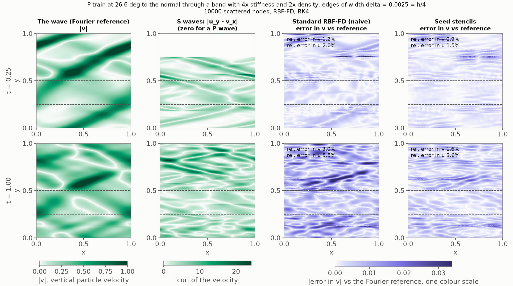

**For the curved case (#42).** A downward plane pulse on the sine
interface of amplitude 0.02 meets it at up to 7.2° from the normal, so
"normal incidence" there is locally oblique and the x'-dependent seeds
act; mode conversion is weak at 7° and the converted S content, hence
the pre-asymptotic floor above, small. Two consequences for the plan:
measure the jump-aware operator's own order at curved interfaces with a
resolved reference before judging the curved seeds against it (Part 2's
3.2–3.7 at t = 0.3 was floor-dominated at 2500 and 4900 nodes), and
compare every oblique or curved run against a floor that contains the
converted waves, not the incident pulse's. The JCP 2017 preprint reports
that its flat-interface approximation at curved interfaces holds fourth
order to about 40,000 nodes and falters to second beyond, and that
curvature terms in the stencils keep fourth order throughout; that is a
curvature effect and separate from the S-wave resolution found here.

**Acceptance.** (1) The seeds keep their order at oblique incidence:
yes, the order of the stencils they generalise (2.4–2.5 for the coupled
19-node degree-3 construction on this pulse and these node sets, seeds
8.3e-3 against jump-aware 8.9e-3 at 19,600 nodes), with the loss from
four traced to the resolution of the converted S waves and not to the
edge treatment; mode conversion is visible in the curl map and
consistent between reference and seeds (the u error tracks v at every
n). (2) Reference: Fourier in x, for the reasons above. The
x'-dependent seeds mattered: without them the seeds are worse than
naive through a sharp edge and no different through a resolved one.
Tests: the pulse, the reference (four checks) and the ablation
(`tests/test_wave2d_oblique.py`, 6 tests, 40 s). No regression test at
the sweep's scale: at 900 and 1600 nodes every oblique or S-pulse run is
floor-dominated, and the smallest informative configuration (4900
nodes) costs a minute of reference and marches; the driver is the
record. Runtime of the default oblique sweep: 500 s with the operators
cached, of which 260 s are the two references (cached thereafter).

### 5.6 The curved feature: route (a) seeds along the true normal (#42, `scripts/wave2d_stiff.py --amplitude 0.02`)

The last of the 2-D chain and the case Brad wanted to go to first: both
interfaces bent into the sine curves of Part 2's curved study
(amplitude 0.02, curvature up to κ = 0.02 (2π)² = 0.79, tilt up to 7.2°),
with smooth edges of width δ in the true normal distance. Everything
below is at normal incidence, so "normal" means locally oblique by up
to 7.2° and the x'-dependent seeds of §5.5 act on every stencil that is
not at a crest or a trough.

**The medium.** `LayeredMedium2D` with curved interfaces and
`edge_width > 0` now blends in the signed normal distance to each sine
curve, `SineInterface.signed_distance`: the foot point from the
fixed-point iteration of `closest_point` (moved into the interface
class as `foot_point`; the stencil code keeps its name), and the
distance as the displacement's component along the normal there. The
foot point's error enters that component squared, so the distance is
exact to rounding wherever the iteration converges at all (κ times the
distance below one: everywhere within half a period). The two edges of
the band are taken on *one* periodic image of it, the image whose
centre line is nearest (`normal_distances`); taking each edge's own
nearest image pairs the lower edge of one band with the upper edge of
the next around y = 0.75 and reads a blend weight of −1, which is how
the first version failed its own test. The images at ±1 are placed at
d ± 1, the flat rule, which is off by up to a percent of a distance
that is at least 0.375, where the tails are below 10⁻¹⁶ for δ ≤ 0.01.
The flat branch of `layer_fraction` is untouched, so the flat seed
operators cached by #40 rebuild bit for bit (checked against the
n = 2500, δ = 0.01 cache before anything else was changed), and the
jump medium (δ = 0) is untouched too.

**The seeds: route (a).** `NormalProfile` carries the tangent angle θ
of its foot point and samples the medium along the true normal,
(x₀ − y' sin θ, y₀ + y' cos θ); the ODE stops (edge centres and their
±10δ flanks) come from Newton on the line's intersection with each
interface and its images (`crossings`; the closed form is kept for
θ = 0 so the flat profile is bit for bit the #38 one). Along that line
the blend is exactly the medium's tanh step in y' for the interface
the line is normal to (`test_normal_profile_is_the_edge_profile_in_the_normal_coordinate`,
10⁻¹³), so the seeds of a curved-edge stencil are the *flat* seeds of
the same local coordinates (`test_curved_seeds_are_the_flat_seeds_of_the_same_local_stencil`,
10⁻¹² through a δ = 0.005 edge on a stencil tilted by 0.08 rad): the
x'-ansatz extends the normal profile unchanged along the tangent, which
is the locally-flat approximation of the jump stencils in
`wave2d/interface.py`, zeroth order in the curvature, route (a) of the
issue and of §4.1. Nothing else in the seed construction changed; the
frames, the anchor at the evaluation node, the r_max scaling, the
19-node elastic rows and the 30-node Δ³ rows are those of §5.3. What
route (a) gets wrong, in the tangent frame: a node at tangential offset
x' from the foot point is at true normal distance y' − κx'²/2 + O(κ²)
from the curve, while its seed value assumes y'. Over a stencil radius
r ≈ 2.5h that is κr²/2 = 1.0·10⁻³ at 2500 nodes and 1.3·10⁻⁴ at
19,600, to be compared with δ: a tenth of a δ = 0.01 edge at the coarse
end, and 5% of a δ = 0.0025 edge at the fine end. So the geometric
error of route (a) is largest where the seeds matter most, through the
sharpest edge, and it shrinks with n only as h². The measurements below
are what that costs.

A curved seed march costs 3.6× a flat one (131 ms against 37 ms per
19-node stencil): every material sample along the normal is a
`layer_fraction` evaluation with two foot-point iterations, and the
DOP853 march samples a few thousand times. The marches run on the
process pool as before and the assembled operators are cached with the
amplitude in the key (`outputs/wave2d_stiff_ops_*_a0.02.npz`), which
is the caching this issue needed; the "one march per interface"
shortcut of the caching breadcrumb does not apply as stated, because
the seeds are anchored at the evaluation node (§4.2: the jet and the
frozen chain matrix live there), so every stencil's seeds are its own
even on a flat edge, and the per-stencil march stays.

**The references.** Two, one per column type, as planned on the issue:

- δ > 0: `wave2d/spectral.py: run_fourier_2d`, the 2-D extension of the
  #41 solver. The x-modes mix on a curved medium, so the five real
  fields live on an n_x × n_y product grid (x at j/n_x, y cell-centred,
  the #41 conventions), derivatives by FFT along each axis (`scipy.fft`
  on all cores), the material multiplied in physical space, RK4 at
  Δt = cfl / (c_max √(n_x² + n_y²)) with cfl = 0.5 (the largest
  eigenvalue of the semi-discretisation is c_p |k| with
  |k| < π √(n_x² + n_y²), and RK4 holds the imaginary axis to 2.83, so
  cfl < 0.9 is stable). `GridState.evaluate` interpolates the fields
  and their derivatives at any point trigonometrically in both
  directions, n_x n_y per point and field: 1.6 s for 19,600 nodes at
  512 × 2048. Checks (`tests/test_wave2d_curved_edges.py`): on a flat
  medium at oblique incidence, same grid and same step, it agrees with
  the Fourier-in-x solver of §5.5 to 10⁻¹¹ (two representations of one
  scheme); the interpolant reproduces the grid samples to 10⁻¹³ and its
  y-derivative a centred difference to 10⁻⁵ of ε²; on a curved edge the
  energy is conserved to 10⁻⁹ and doubling both grid directions moves
  the answer by 10⁻⁸ at δ = 0.04, and the curl is no longer zero: the
  curved edge converts P to S. Cost: 45 ms per step at 512 × 1024 and
  93 ms at 512 × 2048 on this machine, so 4 and 16 minutes to t = 1.
- δ = 0: Part 2's interface-aware operator on a node set of its own,
  resampled one-sided onto the sweep's nodes as `wave2d_convergence.py`
  did, now at 122,500 nodes (350², h = 1/350) instead of 40,000. A jump
  on a curved interface has no product-grid reference.

**Reference error bars.** Product grid, at t = 1 on 6000 random points:
at δ = 0.01 the 512 × 1024 grid moves by 1.3·10⁻⁹ when n_x is halved,
3.1·10⁻⁹ when both directions are doubled and 3.1·10⁻⁹ when the step is
halved (the last two are the same number: the doubled grid's difference
is its halved step), so its error is 3·10⁻⁹ and the material's
x-variation is resolved by 256 points; at δ = 0.005 the 1024 × 2048
grid moves by 8·10⁻¹¹ and 2.6·10⁻¹⁰ under doubling in x and in y. Both
are five orders below anything measured. The jump reference: the
62,500- and 122,500-node interface-aware runs differ by 1.7·10⁻⁴ in v
on the 19,600-node set, where the 19,600-node interface-aware run's
error is 1.25·10⁻³ against the coarser reference and 1.39·10⁻³ against
the finer (a reference made by the same scheme flatters a run of it by
the correlation of their errors), so the finer one's bar is about 5%
of the finest point and its numbers are the ones reported. Cost:
201 s for 512 × 1024 to t = 1, 1952 s for 1024 × 2048, 286 s for the
122,500-node jump run (99 s at 62,500), 45 min for the whole study.

**What is measured.** The sweep of §5.4 on the curved geometry: the
Part 2 node sets with their rows straddling the sine curves
(`make_node_set` on the curved jump medium; the node set does not
depend on δ), the wide pulse of sharpness 15 from y = 0.875, t = 1, the
MATLAB γ, CFL 0.5, both operators at every (n, δ) with the seeds on
every row whose 19-node stencil sees the edge, and δ = 0 on the jump
path. Columns δ = 0, 0.005, 0.01, as planned on the issue (δ = 0.0025
below, §5.6.1). Seeded rows: 1320, 2452, 4631, 8553 at δ = 0.005 (53%
down to 44% of the nodes), 1796, 3386, 6730, 12,959 at δ = 0.01 (72%
to 66%), the flat counts to within a percent; the 19,600-node operators
took 330 s and 475 s on 6 workers while the reference study had the
other cores. Errors are relative l2 errors in v, h and u at t = 1, the
last against the reference's own u since a curved edge makes u (at
normal incidence on a flat edge u ≡ 0 and its size was the diagnostic;
here it is 0.12 in every run and says nothing). Two floors as in §5.5:
the pulse in the uniform medium on the same nodes against its exact
translate (the resolution floor, a P wave that never meets an edge),
and the seed rows built through a 10⁻⁶ contrast against the same
translate (the seed operator's own floor, `--seed-floor`). And the
truncation probe of §5.5 item 5, `--truncation`: the elastic operator
applied to the reference state at t = 1 on the nodes against the exact
rate from the reference's own derivatives (`GridState.evaluate` with
``dx=1``, ``dy=1``) and the material at the nodes, relative l2 over the
seeded rows and over the rest, for both operators (the naive operator's
"edge rows" are the rows the seeds would rebuild).

Error in v at t = 1 (rates in h between consecutive n; "seeds" at
δ = 0 is Part 2's interface-aware operator, "seed floor" the seed
operator through a 10⁻⁶ contrast):

| δ | operator | n = 2500 | 4900 | 10000 | 19600 | rates |
| --- | --- | --- | --- | --- | --- | --- |
| 0 (jump) | naive | 1.25e-1 | 6.8e-2 | 3.2e-2 | 1.95e-2 | 1.8, 2.1, 1.4 |
| 0 (jump) | interface-aware | 5.1e-2 | 1.69e-2 | 4.6e-3 | 1.39e-3 | 3.3, 3.6, 3.6 |
| 0.005 | naive | 8.1e-2 | 3.2e-2 | 6.3e-3 | 1.90e-3 | 2.8, 4.5, 3.5 |
| 0.005 | seeds | 2.6e-2 | 4.5e-3 | 2.0e-3 | 8.8e-4 | 5.2, 2.3, 2.5 |
| 0.005 | seed floor | 3.3e-2 | 4.7e-3 | 1.68e-3 | 8.3e-4 | 5.8, 2.9, 2.1 |
| 0.01 | naive | 5.8e-2 | 1.78e-2 | 5.2e-3 | 1.30e-3 | 3.5, 3.4, 4.1 |
| 0.01 | seeds | 4.2e-2 | 1.04e-2 | 3.9e-3 | 1.62e-3 | 4.2, 2.8, 2.6 |
| 0.01 | seed floor | 5.1e-2 | 1.20e-2 | 3.8e-3 | 1.57e-3 | 4.3, 3.2, 2.6 |
| floor | naive, uniform | 5.3e-2 | 1.81e-2 | 4.8e-3 | 1.30e-3 | 3.2, 3.7, 3.9 |

h/δ at the four n: 4, 2.9, 2, 1.4 for δ = 0.005; 2, 1.4, 1, 0.71 for
δ = 0.01.

Error in h, and the relative error in u (u is made by the curved edges,
0.12 at most; the floors' pulse has none, so their u column is the
largest spurious |u|, as in §5.4):

| δ | operator | h at 2500 … 19600 | rates | u at 2500 … 19600 | rates |
| --- | --- | --- | --- | --- | --- |
| 0 (jump) | naive | 9.8e-2, 4.7e-2, 2.0e-2, 1.28e-2 | 2.2, 2.4, 1.4 | 2.0e-1, 1.0e-1, 4.8e-2, 2.8e-2 | 2.0, 2.2, 1.6 |
| 0 (jump) | interface-aware | 4.6e-2, 1.62e-2, 4.4e-3, 1.28e-3 | 3.1, 3.6, 3.7 | 1.5e-1, 6.4e-2, 2.1e-2, 6.6e-3 | 2.5, 3.1, 3.4 |
| 0.005 | naive | 8.4e-2, 3.4e-2, 6.9e-3, 1.79e-3 | 2.7, 4.4, 4.0 | 1.8e-1, 7.8e-2, 2.0e-2, 6.0e-3 | 2.4, 3.9, 3.5 |
| 0.005 | seeds | 2.2e-2, 4.4e-3, 1.35e-3, 6.1e-4 | 4.8, 3.3, 2.4 | 1.0e-1, 3.3e-2, 9.3e-3, 2.6e-3 | 3.4, 3.5, 3.7 |
| 0.01 | naive | 5.4e-2, 1.74e-2, 4.5e-3, 1.14e-3 | 3.4, 3.8, 4.1 | 1.2e-1, 4.9e-2, 1.5e-2, 4.4e-3 | 2.8, 3.3, 3.7 |
| 0.01 | seeds | 3.9e-2, 8.5e-3, 2.6e-3, 1.11e-3 | 4.6, 3.3, 2.5 | 9.9e-2, 3.2e-2, 9.7e-3, 3.9e-3 | 3.3, 3.3, 2.7 |
| floor | naive, uniform | | | spurious 9.5e-4, 3.9e-4, 1.2e-4, 2.6e-5 | |

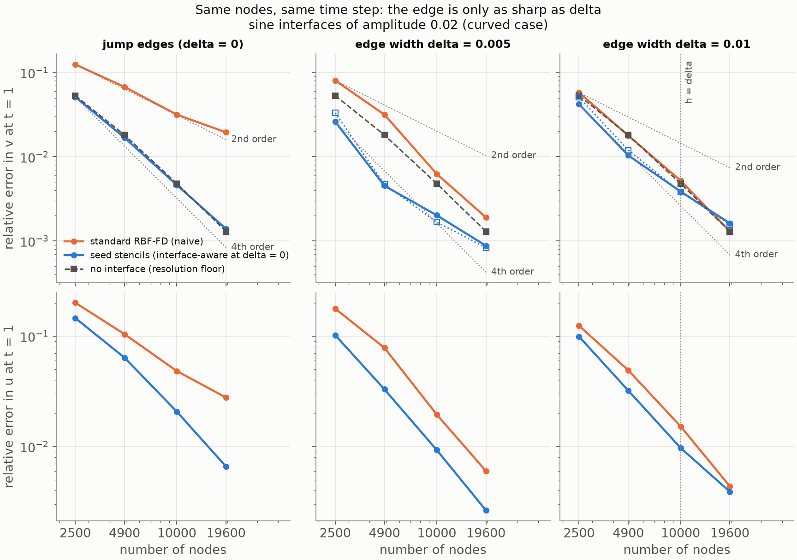

Truncation error of the elastic operator on the reference state at
t = 1, relative l2 over the seeded rows | over the rest (the bulk rows
are the same 30-node degree-4 stencils in both operators):

| δ | n | naive, edge rows | seeds, edge rows | bulk rows | seeds/bulk |
| --- | --- | --- | --- | --- | --- |
| 0.005 | 2500 | 3.9e-2 | 9.0e-3 | 2.5e-3 | 3.6 |
| 0.005 | 4900 | 2.3e-2 | 2.5e-3 | 8.6e-4 | 2.9 |
| 0.005 | 10000 | 1.05e-2 | 6.3e-4 | 2.5e-4 | 2.5 |
| 0.005 | 19600 | 4.7e-3 | 2.0e-4 | 7.2e-5 | 2.8 |
| 0.01 | 2500 | 1.83e-2 | 6.1e-3 | 2.6e-3 | 2.4 |
| 0.01 | 4900 | 8.8e-3 | 1.79e-3 | 9.0e-4 | 2.0 |
| 0.01 | 10000 | 3.1e-3 | 5.0e-4 | 2.5e-4 | 2.0 |
| 0.01 | 19600 | 7.6e-4 | 1.66e-4 | 7.3e-5 | 2.3 |

Rates of the seeds' edge rows: 3.8, 4.1, 3.4 at δ = 0.005 and 3.6, 3.8,
3.3 at δ = 0.01; of the bulk rows 3.2, 3.7, 3.7; of the naive edge rows
1.5, 2.4, 2.4 and 2.2, 3.0, 4.2.

**What the tables say.**

- *The curved jump stencils of Part 2 are at the resolution floor at
  every n*, 5.1e-2, 1.69e-2, 4.6e-3, 1.39e-3 against the floor's 5.3e-2,
  1.81e-2, 4.8e-3, 1.30e-3, at rates 3.3, 3.6, 3.6 (the naive scheme:
  1.8, 2.1, 1.4, 14× worse at 19,600 nodes). That is the measurement
  §5.5 asked for before judging the curved seeds: at nominal normal
  incidence, tilt up to 7.2°, the locally-flat jump construction keeps
  the order it has on a flat interface through 19,600 nodes, against a
  reference of its own kind with a 5% error bar, and the converted-S
  floor that took a third of the order away at 26.6° does not register
  at 7°. Part 2's 3.2–3.7 at t = 0.3 was right; it was measured at too
  few nodes to be sure.
- *Through an edge the nodes do not resolve (δ = 0.005, h/δ from 4 to
  1.4) the curved seeds are at their own floor at every n*: 2.6e-2,
  4.5e-3, 2.0e-3, 8.8e-4 against the seed floor's 3.3e-2, 4.7e-3,
  1.68e-3, 8.3e-4 (0.8×, 0.96×, 1.2×, 1.06×), 3.1×, 7×, 3.1×, 2.2× below
  the naive scheme, which has its knee at h ≈ 2δ (rates 2.8, 4.5, 3.5:
  it resolves the edge from 10,000 nodes on and is still above the
  seeds at h = 1.4δ). In h the seeds are 3.8×, 7.7×, 5.1×, 2.9× below
  naive. Through δ = 0.01 the curved numbers are the flat ones of §5.4
  to two digits from 4900 nodes on (seeds 1.04e-2, 3.9e-3, 1.62e-3
  against 1.1e-2, 3.9e-3, 1.6e-3; naive 1.78e-2, 5.2e-3, 1.30e-3 against
  2.1e-2, 5.7e-3, 1.4e-3), and the seed-when-δ ≤ h rule reads off the
  same column as before: at h = δ (10,000 nodes) the seeds win 1.35×, at
  h = 0.71δ the naive scheme wins 1.25×, exactly the flat crossover.
  Curvature, at amplitude 0.02, changed nothing that these node sets
  can see.
- *The seeds' floor is the seed operator's, and at the fine end it is
  the degree-3 augmentation, not the edge.* The seed floor (the same
  rows through no contrast) is below the naive floor at every n, but by
  less at the fine end: 3.8× at 4900 nodes and 2.9× at 10,000 (4.7e-3
  against 1.81e-2, 1.68e-3 against 4.8e-3 at δ = 0.005), only 1.6× at
  19,600 (8.3e-4 against 1.30e-3), its rates having fallen to 2.1–2.6
  there against the naive floor's 3.7–3.9 (the #61 pass corrected this
  sentence, which read "above it at 19,600", backwards): 19-node degree-3 rows are third order in the first
  derivatives with a small constant, and with rtol = 0 they cover the
  19δ tails on both sides of both edges, 44–72% of the nodes. That is
  the mechanism behind the seeds' 2.4–2.7 rates at the fine end here
  and in §5.4–5.5, a resolution effect of the seeded region's stencils
  and not of the edge. §5.6.1 tests the obvious lever, trimming the
  seeded rows to the stencils that see more than 10⁻³ of the contrast
  (3.8δ instead of 19δ).
- *The scattered field, u, is where the curvature shows, and the seeds
  carry it.* u is zero for the flat pulse and is made here by the
  curved edges (0.12 at most), so its relative error measures the
  scattered field alone: at δ = 0 the jump stencils get it 4.2× better
  than naive at 19,600 nodes (6.6e-3 against 2.8e-2) at rates 2.5, 3.1,
  3.4 against 2.0, 2.2, 1.6; through δ = 0.005 the seeds 2.3× better
  (2.6e-3 against 6.0e-3) at 3.4, 3.5, 3.7; through δ = 0.01 the two
  agree at 19,600 nodes (3.9e-3 against 4.4e-3), where the naive
  scheme resolves the edge. The relative error of a small field is
  larger than v's, and the seeds' u converges faster than their v at
  δ = 0.005 (3.5–3.7 against 2.3–2.5): the v floor at the fine end is
  the seeded rows' resolution of the *incident* pulse (the floor bullet
  above),
  which u, born at the edge, does not carry.
- *Route (a)'s geometry is invisible at these widths.* On the true
  curved solution at t = 1 the seed rows' truncation error is 2.0–3.6×
  the bulk rows' and converges at the bulk rows' rate (3.4–4.1 against
  3.2–3.7), with no flattening at the fine end where κr²/2 is 2.6% of
  δ = 0.005; the naive edge rows are 4–23× the seeds' at δ = 0.005 and
  converge at 1.5–2.4 until the edge is resolved. A degree-3 19-node
  row is expected to sit a factor above a degree-4 30-node row on a
  smooth solution, and the factor is the same at both δ, so nothing of
  it is the curvature.

**Spectrum on 2500 nodes, curved** (`scripts/wave2d_stiff_eigenvalues.py
--n 2500 --amplitude 0.02 --run`, the acceptance run of §5.3 on the
curved geometry; the same γ, Δt = 0.0041, the seeds on their true
normals, the wide pulse to t = 1):

| δ | operator | rebuilt rows | max Re λ, with γ | RK4 max \|R\| | E(1)/E(0) |
| --- | --- | --- | --- | --- | --- |
| jump | naive | 0 | +4.7e-3 | 1.00002 | 0.955 |
| jump | interface-aware | 793 | +4.7e-2 | 1.0002 | 0.971 |
| h/8 | naive | 0 | +4.7e-3 | 1.00002 | 0.956 |
| h/8 | seeds | 982 | +6.0e-2 | 1.0003 | 0.988 |
| h/2 | naive | 0 | +3.8e-3 | 1.00002 | 0.982 |
| h/2 | seeds | 1796 | +8.3e-2 | 1.0003 | 0.999 |
| 2h | naive | 0 | +2.1e-5 | 1.00000 | 0.991 |
| 2h | seeds | 2500 | +1.05e-1 | 1.0004 | 1.016 |

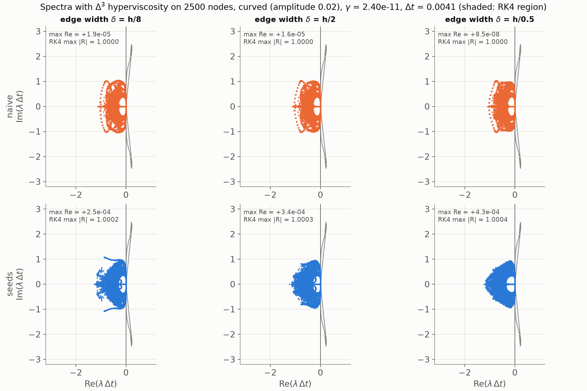

Row for row the flat table of §5.3 (there: seeds +6.3e-2, +7.8e-2,
+9.6e-2 at max |R| 1.0003, 1.0003, 1.0004, energy 0.995, 1.003, 1.012;
jump-aware +4.9e-2 at 1.0002). The rotation of every seed stencil into
its own frame, the tilted normals and the curved rows change the
rightmost eigenvalues by 10% and the RK4 amplification not at all: the
stability answer of #39 carries over to the curved edge unchanged, with
the 30-node Δ³ footprint on the seed rows. The energy ratios above one
at 2h (1.6% growth over t = 1) are what max |R| = 1.0004 allows and the
same as flat; the resolved edge is the naive scheme's case anyway.

**The clip** (`scripts/wave2d_demo.py --amplitude 0.02 --edge-width
0.005`, `outputs/wave2d_naive_vs_aware_curved_w0.005.mp4`, 251 frames
to t = 0.5, not committed): the Part 2 curved clip with the edges
smoothed to δ = 0.005 = h/2 on 10,000 nodes, the naive operator against
the seed operator, both against the product-grid solution evaluated at
the nodes frame by frame (`run_fourier_2d(snapshot_transform=...)`,
1024 × 2048, 19 minutes for the 251 frames). The clip's pulse is the
demo's (sharpness 23 from y = 0.75, so it reaches the upper edge by
t = 0.1). Relative error in v along the run, naive / seeds: 4.1e-3 /
2.2e-3 at t = 0.1 (the resolution floor, before the edge), 7.0e-3 /
2.9e-3 at 0.2, 9.4e-3 / 4.9e-3 at 0.3, 1.82e-2 / 7.0e-3 at 0.4, 1.36e-2
/ 4.7e-3 at 0.5. The snapshot grid
(`outputs/wave2d_naive_vs_aware_curved_w0.005.png`, t = 0.15, 0.30,
0.45) is the picture of the issue: at t = 0.15 the naive error is a
dark line that follows the sine of the upper edge, darkest where the
curve is steepest, and the seeds' map has no line at all, only the
faint speckle of the resolution error above the band.

**The still** (`docs/figures/wave2d_stiff_snapshot_curved.png`, 10,000
nodes, δ = 0.005 = h/2, the sweep's pulse): the reference's |v| from
the product grid, its |u_y − v_x| (the S waves the curved edges make
out of the incident P pulse; at t = 0.25 they sit on the upper edge
with the period of the sine, strongest where the curve is steepest),
and the two error maps in v on one colour scale, at t = 0.25 and t = 1.
Errors in v and u: naive 0.37%, 1.6% at t = 0.25 and 0.63%, 2.0% at
t = 1; seeds 0.04%, 0.5% and 0.20%, 0.93%. At t = 0.25 the naive map
is the picture of the problem: a streak that follows the sine of the
upper edge, darkest at x ≈ 0.7 where the pulse has just arrived at the
trough, with the transmitted pulse's error below it; the seeds' map
has no streak, only the resolution speckle above the band, ten times
lower in norm. By t = 1 both maps are the propagated pulse's own
resolution error and the seeds' is a third of the naive one, which is
the tables' 3.1×.

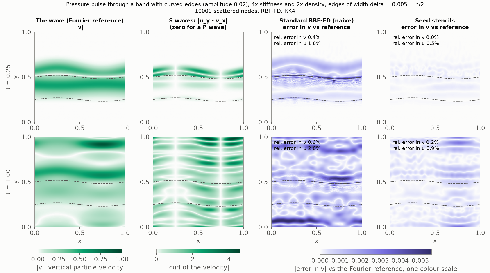

#### 5.6.1 Two follow-ups: δ = 0.0025, and trimming the seeded rows

**δ = 0.0025** (`--widths 0.0025`, h/δ from 8 to 2.9, the flat sweep's
sharpest column; reference 2048 × 4096, 12,874 s, the driver's default
n_x = n_y/2 at this n_y; seeded rows 982, 1608, 2748, 4918, the flat
counts). The case the geometric estimate at the top of this section
singled out: κr²/2 is 40%, 20%, 10%, 5% of δ at the four n.

| δ = 0.0025 | operator | v at 2500 … 19600 | rates | h at 19600 | u at 19600 |
| --- | --- | --- | --- | --- | --- |
| curved | naive | 9.2e-2, 4.6e-2, 2.4e-2, 1.19e-2 | 2.1, 1.9, 2.1 | 1.16e-2 | 2.0e-2 |
| curved | seeds | 2.9e-2, 8.1e-3, 2.9e-3, 9.5e-4 | 3.8, 2.9, 3.3 | 8.0e-4 | 4.0e-3 |
| curved | seed floor | 2.7e-2, 6.7e-3, 1.93e-3, 7.1e-4 | 4.2, 3.5, 3.0 | | |
| flat (§5.4) | seeds | 3.0e-2, 7.7e-3, 2.1e-3, 6.4e-4 | 4.1, 3.7, 3.5 | 6.7e-4 | |
| flat (§5.4) | naive | 8.9e-2, 4.8e-2, 2.7e-2, 1.3e-2 | 1.9, 1.6, 2.2 | 1.2e-2 | |
| | floor | 5.3e-2, 1.81e-2, 4.8e-3, 1.30e-3 | 3.2, 3.7, 3.9 | | |

Truncation on the reference state, seeds' edge rows 1.08e-2, 3.6e-3,
1.07e-3, 3.3e-4 (rates 3.2, 3.6, 3.4) against bulk rows 2.5e-3, 8.3e-4,
2.4e-4, 7.0e-5: ratios 4.3, 4.4, 4.5, 4.8; the naive edge rows 5.9e-2,
4.8e-2, 3.6e-2, 2.2e-2 (0.6, 0.9, 1.5), 5–66× the seeds'.

Three things. First, the headline: through an edge the nodes never
resolve, on curved interfaces, the seeds are 3.2×, 5.7×, 8.2×, 12.5×
below the naive scheme in v (14× in h, 5× in u at 19,600), at rates
3.3–3.8 against the naive 1.9–2.1, and at 19,600 nodes their 9.5e-4 is
below the naive scheme's resolution floor of 1.30e-3 with no edge at
all: the §5.4 result on the geometry it was meant for. Second, this is
where route (a)'s geometry first shows. The curved seeds are 1.0×,
1.05×, 1.4×, 1.5× the flat seeds at the four n, they sit at 1.05×,
1.2×, 1.5×, 1.34× their own floor where at δ = 0.005 they sat at
0.8–1.2×, and the seed rows' truncation ratio to the bulk rows *rises*
with n (4.3 → 4.8) where at δ = 0.005 it fell (3.6 → 2.8): a term that
shrinks as h² against one that shrinks as h^3.5. Taking the excess over
the seed floor in quadrature, the geometric contribution at 19,600
nodes is about 6·10⁻⁴, half the naive floor and level with the seed
floor; it would lead at the next node set. Third, the estimate at the
top of the section was the right size: 5% of δ in the material at
the far nodes costs the seeds 50% of their error at 19,600 nodes, and
40% of δ at 2500 nodes costs nothing because the resolution error is
30× larger there.

**Trimmed seeds** (`--seed-rtol 1e-3`, δ = 0.005): seed only the rows
whose 19-node stencil sees more than 10⁻³ of the contrast, which is
the tanh tails to 3.8δ instead of 19δ: 601, 977, 1585, 2746 rows (24%
down to 14% of the nodes) instead of 1320, 2452, 4631, 8553. Everything
else as above (the seed floor is undefined under a trim: a 10⁻⁶
contrast seeds no row).

| δ = 0.005 | operator | v at 2500 … 19600 | rates | h at 19600 | u at 19600 |
| --- | --- | --- | --- | --- | --- |
| tails to 19δ | seeds | 2.6e-2, 4.5e-3, 2.0e-3, 8.8e-4 | 5.2, 2.3, 2.5 | 6.1e-4 | 2.6e-3 |
| tails to 3.8δ | seeds, trimmed | 3.2e-2, 1.00e-2, 3.2e-3, 9.4e-4 | 3.4, 3.2, 3.6 | 8.6e-4 | 3.9e-3 |
| | naive | 8.1e-2, 3.2e-2, 6.3e-3, 1.90e-3 | 2.8, 4.5, 3.5 | 1.79e-3 | 6.0e-3 |
| | floor | 5.3e-2, 1.81e-2, 4.8e-3, 1.30e-3 | 3.2, 3.7, 3.9 | | |

The trim does what the floor bullet predicted for the *rate*: 3.4,
3.2, 3.6 all the way, no fine-end decay, and the trimmed seeds' edge
rows keep 3.4–4.0 in the truncation probe (1.15e-2, 3.7e-3, 9.3e-4,
2.9e-4 on the rows nearest the edge, 5–34× below the naive rows there).
It does not lower the *error* on these node sets: at 19,600 nodes the
two are equal in v (9.4e-4 against 8.8e-4, both below the naive floor's
1.30e-3), and at every coarser n the untrimmed seeds are 1.2–2.2× better
in v and 1.5× better in u throughout, because the 19-node degree-3 rows
have the smaller error constant there (the seed floor sits below the
naive floor at 4900 and 10,000 nodes) and the wide seeded region gets
that constant on half the domain. So the fine-end rate of the untrimmed
seeds is confirmed to be the seeded region's own resolution and not the
edge, the trim is the lever that restores the order beyond 19,600 nodes
(extrapolating the two rates, the trimmed seeds lead by 40% at 40,000
nodes), and where to put the seeded region's boundary between 3.8δ and
19δ is a tuning question for larger node sets, outside this issue.
`outputs/wave2d_stiff_a0.02_r0.001.png` is the figure.

#### 5.6.2 The route (b) decision, and acceptance

**Decision on route (b).** Not needed on these node sets, on the
evidence above: through δ = 0.005 and 0.01 the route (a) seeds sit at
the seed operator's own floor at every n, their rows' truncation error
on the true curved solution converges at the bulk rows' rate, through δ = 0.0025 the geometry
first shows, as 1.4–1.5× the flat seeds' error at 10,000 and 19,600
nodes, a contribution level with the seed floor and half the naive
floor (§5.6.1),
and the curved sweep reproduces the flat one. The floor route (a) does
impose is the geometric one estimated at the top of this section,
κr²/2 against δ, and it is below the resolution floor of these node
sets at every width the sweep ran. What would make (b) necessary is a
curvature radius comparable to the stencil, or a δ so small that κr²/2δ
is order one at a resolution the node set can still afford, and neither
is the Part 2 geometry. If it is ever needed, the cheaper first step is
not the per-stencil boundary-value problem but the curvilinear
evaluation of the same seeds: keep the ODE marches, evaluate each seed
at the node's true (arclength, normal distance) instead of its tangent
coordinates, and scale the tangential jets at the anchor by
1/(1 − κy_e); that makes the material exact at every node and leaves
only the operator's curvature terms as the error, at no march cost.
It was not built because nothing here asked for it.

**Acceptance.** (1) Route (a) convergence at amplitude 0.02 with the
error floor stated and compared with the curved-jump floor: the tables
above; the seeds' floor is the seed operator's own (measured), the
curved jump path's is the resolution floor (measured), and route (a)'s
geometric floor is below both. (2) Spectrum at n = 2500 with the
standard γ, curved: the flat spectrum. (3) The decision, above, with
the truncation probe as the evidence. (4) The clip, under `outputs/`,
not committed. Two things this issue did not do: the oblique train on
the curved geometry (the product-grid reference takes any initial
state, so it is a driver flag away, but §5.5 already showed what the
converted-S floor does at 26.6°), and the seeded-width tuning of
§5.6.1. Runtime: the references took 45 min to build, plus 3.6 h for
the 2048 × 4096 grid of δ = 0.0025, and are cached; the 24 curved seed
operators about an hour on 6–12 workers; the sweep 12 min from the
caches, the spectra 23 min, the clip 21 min.

### 5.7 The standing alternative on the scattered nodes (#69, `--modes widen1 widen2 cell cell2 bandlimit`, 2026-09-20)

The 2-D half of section 2.1: the naive RBF-FD operator of section 5.2 on a
changed medium, against the true medium's reference, on the flat geometry
through δ = 0.0025 and 0.01 (the #40 references and node sets) and the
curved one through δ = 0.0025, 0.005 and 0.01 (the #42 product-grid
references). Five treatments of the coefficients the naive operator samples
(`wave2d/treatments.py: TreatedMedium2D`; `scripts/wave2d_stiff.py`, the
comparator modes; results `paper/data/wave2d_stiff_cmp.json` and
`wave2d_stiff_cmp_a0.02.json`):

- *widened, h / 2h* (T0 of #69): the same tanh profile with
  `edge_width = max(δ, mh)`, the naive operator built on it (a resolved
  edge is left alone, so the run then equals the naive one);
- *cell mean, h / 2h* (T2): the wave moduli K = λ + 2μ and μ averaged
  harmonically and the density arithmetically over a square of side h or
  2h about each node, isotropy kept (λ = K − 2μ of the averages): the
  Moczo et al. (2002) line and the 2-D reading of the compliance-and-density
  rule of section 2.1. On scattered nodes no node sits at a fixed offset
  from the edge, so the one-cell mean acts everywhere (the alignment
  degeneracy of the 1-D grid does not arise);
- *band-limited* (T2): the same three fields through the product of two
  windowed sincs, the separable low-pass of Koene et al. §3.3 (cutoff
  1.1π/h along each axis, Hanning window of half-width 2.5h).

The averages are composite Gauss–Legendre product rules with sub-squares no
wider than 1.5δ, 6·10⁻⁸ relative against adaptive quadrature at δ = h/8
(`tests/test_wave2d_treatments.py`); the treated medium sets the time step
(the band-limited one overshoots the true speeds by Gibbs), the pulse and
the reference are the true medium's. Runtime from the caches: 6.5 min flat,
27 min curved, the curved band-limited evaluation the largest part. As in
section 2.1 the treatments are applied at their prescribed width at every
n. The anisotropic Schoenberg–Muir medium (T3), which Koene et al. find
best in elastic media, needs an anisotropic five-field operator the port
does not have and was not built.

Errors in v at t = 1 (the last column: the largest spurious |u| at 19,600
nodes for the flat pulse, the relative error in u for the curved one):

Flat (`--widths 0.0025 0.01`):

| δ | operator | n = 2500 | 4900 | 10,000 | 19,600 | rates | u at 19,600 |
| --- | --- | --- | --- | --- | --- | --- | --- |
| 0.0025 | naive (sampled) | 8.9e-02 | 4.8e-02 | 2.7e-02 | 1.3e-02 | 1.9, 1.6, 2.2 | 3.4e-03 |
| 0.0025 | widened, h | 4.4e-01 | 3.0e-01 | 1.9e-01 | 1.2e-01 | 1.2, 1.2, 1.4 | 4.6e-04 |
| 0.0025 | widened, 2h | 9.1e-01 | 6.5e-01 | 4.3e-01 | 2.9e-01 | 1.0, 1.2, 1.2 | 7.1e-05 |
| 0.0025 | cell mean, h | 9.3e-02 | 4.2e-02 | 1.2e-02 | 3.6e-03 | 2.4, 3.4, 3.6 | 1.9e-03 |
| 0.0025 | cell mean, 2h | 1.2e-01 | 6.1e-02 | 2.9e-02 | 1.4e-02 | 2.0, 2.1, 2.2 | 5.6e-04 |
| 0.0025 | band-limited | 1.0e-01 | 4.9e-02 | 1.8e-02 | 7.6e-03 | 2.2, 2.7, 2.6 | 1.6e-03 |
| 0.0025 | seeds (§5.4 / §5.6) | 3.0e-02 | 7.7e-03 | 2.1e-03 | 6.4e-04 | 4.1, 3.7, 3.5 | 5.1e-05 |
| 0.01 | naive (sampled) | 6.2e-02 | 2.1e-02 | 5.7e-03 | 1.4e-03 | 3.1, 3.7, 4.2 | 8.5e-05 |
| 0.01 | widened, h | 3.0e-01 | 1.2e-01 | 5.7e-03 | 1.4e-03 | 2.6, 8.7, 4.2 | 8.5e-05 |
| 0.01 | widened, 2h | 8.3e-01 | 5.4e-01 | 2.8e-01 | 1.1e-01 | 1.3, 1.8, 2.7 | 7.1e-05 |
| 0.01 | cell mean, h | 5.9e-02 | 1.9e-02 | 6.5e-03 | 3.3e-03 | 3.3, 3.1, 2.0 | 5.8e-05 |
| 0.01 | cell mean, 2h | 1.1e-01 | 5.7e-02 | 2.8e-02 | 1.5e-02 | 2.1, 2.0, 1.9 | 6.2e-05 |
| 0.01 | band-limited | 7.5e-02 | 2.6e-02 | 7.8e-03 | 2.5e-03 | 3.1, 3.4, 3.3 | 5.8e-05 |
| 0.01 | seeds (§5.4 / §5.6) | 3.0e-02 | 1.1e-02 | 3.9e-03 | 1.6e-03 | 3.1, 2.8, 2.7 | 1.1e-04 |
| floor | naive, uniform | 5.2e-02 | 1.8e-02 | 4.8e-03 | 1.3e-03 | 3.1, 3.7, 3.9 | 3.0e-05 |

Curved, amplitude 0.02 (`--amplitude 0.02 --widths 0.0025 0.005 0.01`):

| δ | operator | n = 2500 | 4900 | 10,000 | 19,600 | rates | u at 19,600 |
| --- | --- | --- | --- | --- | --- | --- | --- |
| 0.0025 | naive (sampled) | 9.2e-02 | 4.6e-02 | 2.4e-02 | 1.2e-02 | 2.1, 1.9, 2.1 | 2.0e-02 |
| 0.0025 | widened, h | 4.5e-01 | 2.9e-01 | 1.8e-01 | 1.1e-01 | 1.3, 1.3, 1.4 | 1.4e-01 |
| 0.0025 | widened, 2h | 9.3e-01 | 6.5e-01 | 4.3e-01 | 2.8e-01 | 1.0, 1.2, 1.2 | 3.3e-01 |
| 0.0025 | cell mean, h | 9.0e-02 | 3.8e-02 | 1.1e-02 | 3.4e-03 | 2.6, 3.4, 3.6 | 9.9e-03 |
| 0.0025 | cell mean, 2h | 1.2e-01 | 6.0e-02 | 2.7e-02 | 1.3e-02 | 2.1, 2.2, 2.2 | 2.0e-02 |
| 0.0025 | band-limited | 9.7e-02 | 4.5e-02 | 1.6e-02 | 6.9e-03 | 2.3, 2.8, 2.6 | 1.2e-02 |
| 0.0025 | seeds (§5.4 / §5.6) | 2.9e-02 | 8.0e-03 | 2.9e-03 | 9.5e-04 | 3.8, 2.9, 3.3 | 4.0e-03 |
| 0.005 | naive (sampled) | 8.1e-02 | 3.2e-02 | 6.3e-03 | 1.9e-03 | 2.8, 4.5, 3.5 | 6.0e-03 |
| 0.005 | widened, h | 4.0e-01 | 2.4e-01 | 1.2e-01 | 5.4e-02 | 1.6, 1.8, 2.5 | 6.7e-02 |
| 0.005 | widened, 2h | 9.0e-01 | 6.2e-01 | 3.8e-01 | 2.3e-01 | 1.1, 1.4, 1.5 | 2.6e-01 |
| 0.005 | cell mean, h | 6.7e-02 | 2.0e-02 | 5.7e-03 | 2.6e-03 | 3.6, 3.6, 2.3 | 6.6e-03 |
| 0.005 | cell mean, 2h | 1.1e-01 | 5.3e-02 | 2.4e-02 | 1.2e-02 | 2.2, 2.2, 2.0 | 1.7e-02 |
| 0.005 | band-limited | 8.6e-02 | 3.2e-02 | 9.9e-03 | 3.5e-03 | 2.9, 3.3, 3.1 | 6.9e-03 |
| 0.005 | seeds (§5.4 / §5.6) | 2.6e-02 | 4.5e-03 | 2.0e-03 | 8.8e-04 | 5.2, 2.3, 2.5 | 2.6e-03 |
| 0.01 | naive (sampled) | 5.8e-02 | 1.8e-02 | 5.2e-03 | 1.3e-03 | 3.5, 3.4, 4.1 | 4.4e-03 |
| 0.01 | widened, h | 3.0e-01 | 1.2e-01 | 5.2e-03 | 1.3e-03 | 2.7, 8.9, 4.1 | 4.4e-03 |
| 0.01 | widened, 2h | 8.4e-01 | 5.4e-01 | 2.8e-01 | 1.1e-01 | 1.3, 1.8, 2.6 | 1.2e-01 |
| 0.01 | cell mean, h | 5.4e-02 | 1.8e-02 | 6.6e-03 | 3.1e-03 | 3.3, 2.8, 2.2 | 5.7e-03 |
| 0.01 | cell mean, 2h | 1.1e-01 | 5.3e-02 | 2.6e-02 | 1.3e-02 | 2.2, 2.0, 2.0 | 1.6e-02 |
| 0.01 | band-limited | 6.8e-02 | 2.2e-02 | 6.8e-03 | 2.2e-03 | 3.3, 3.3, 3.3 | 4.8e-03 |
| 0.01 | seeds (§5.4 / §5.6) | 4.2e-02 | 1.0e-02 | 3.9e-03 | 1.6e-03 | 4.2, 2.8, 2.6 | 3.9e-03 |
| floor | naive, uniform | 5.3e-02 | 1.8e-02 | 4.8e-03 | 1.3e-03 | 3.2, 3.7, 3.9 | 2.6e-05 |

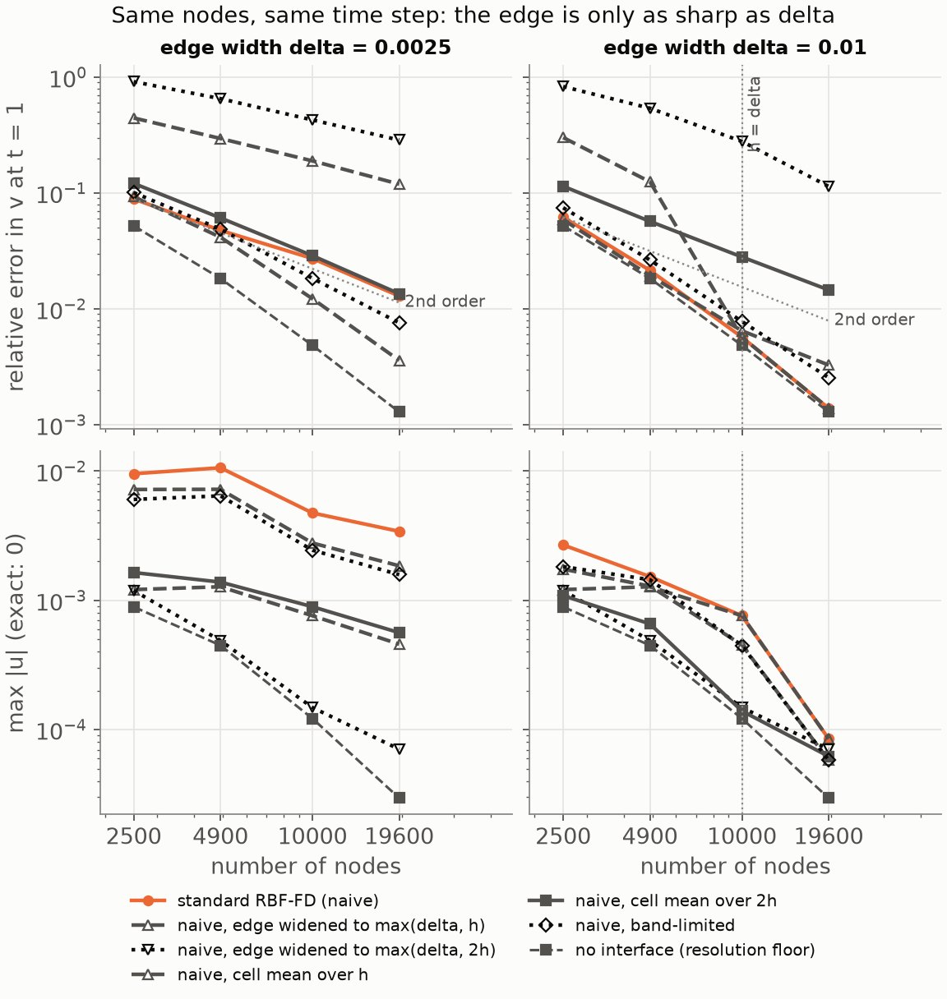

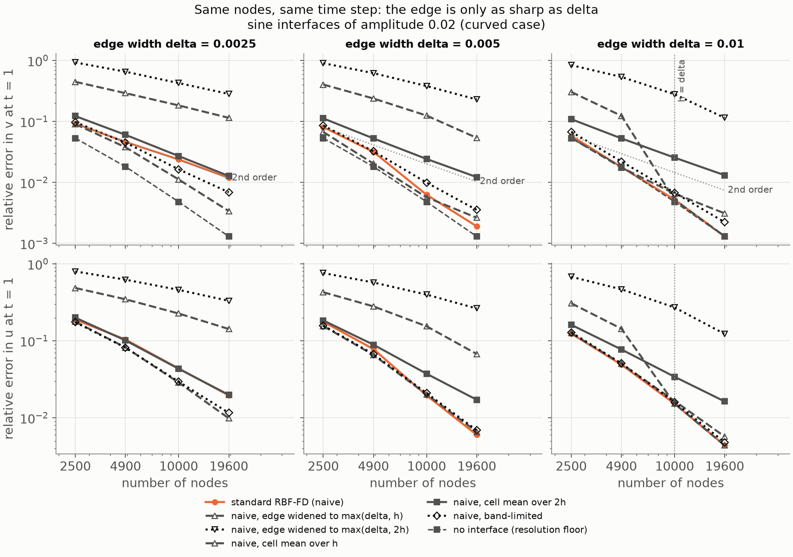

**Through an edge no node set resolves (δ = 0.0025, h = 8δ down to 2.9δ)**
the one-cell mean is the best treatment on both geometries: level with
sampling at 2500 nodes (0.96× and 1.02×), 1.15–1.2× below it at 4900,
2.1–2.2× at 10,000 and 3.5–3.6× at 19,600, with rates 3.4 and 3.6 over the
last two doublings (its second-order regime starts only once h approaches
δ, which this sweep does not reach); it sits 1.7–2.8× above the resolution
floor where sampling sits 1.7–10× above it. The seeds are 3.1–5.9× below
the one-cell mean at every n on either geometry (flat 3.1, 5.4, 5.9, 5.6;
curved 3.2, 4.7, 3.9, 3.6), at their own floor. The band-limited
coefficients are level with or slightly above sampling on the two coarse
sets and 1.5–1.7× below it on the two fine ones (rates 2.6–2.8); the
two-cell mean, the best treatment in 1-D, is 1.05–1.4× *above* sampling at
every n here, second order throughout (2.0–2.2). In spurious u (flat) the
one-cell mean cuts sampling's 1.3–1.8×, the seeds 5.5–67×; the two-cell
mean cuts it 6× at 19,600 nodes while its v is the worse one, the
smoother medium exciting the stencils less and the changed medium costing
more.

**Where the knee sits inside the sweep** the treatments cross above
sampling as in 1-D, earlier for the wider ones: through δ = 0.01 (h = 2δ
to 0.7δ) the one-cell mean is 1.05–1.1× below sampling while h ≥ 1.4δ,
then 1.13× above at h = δ and 2.4× at h = 0.7δ (rates falling to 2.0), the
band-limited coefficients 1.2–1.9× above at every n, the two-cell mean
1.8–10×; through the curved δ = 0.005 (h = 4δ to 1.4δ) the one-cell mean is
1.2×, 1.55× and 1.1× below sampling and then 1.4× above it at h = 1.4δ,
so its crossover lies between h = 2δ and 1.4δ, before the seeds' at
h ≈ δ (section 5.4). The rule for the treatments is therefore the seeds'
rule with a wider margin: average over one cell while h ≳ 2δ, sample
otherwise.

**The widened edge** is worse than sampling wherever it acts, by 5–9.7×
for one cell and 10–24× for two through δ = 0.0025, by up to 28× and 120×
through the curved δ = 0.005 at 10,000–19,600 nodes, and equal to sampling
once mh ≤ δ; its rates are the changed medium's (1.0–1.4 through
δ = 0.0025). That is the medium change alone: the exact solutions through
edges of width 0.02 and 0.04 differ from the true δ = 0.01 one by 27% and
82% in v at t = 1 (the cached spectral references for δ = 0.01, 0.02 and
0.04 compared on the 2500-node set, `reference_at`; not in the results
cache). A medium changed over a cell or two costs far more here than in
1-D (1.4× and 2.7× at a jump there): the plane pulse crosses the band
twice by t = 1 and converts at each of its four edge crossings, and every
crossing sees the changed edge. The spurious u of the widened edge is 6–8×
below sampling's, for the same reason as the two-cell mean's.

**Scope, and what it adds to section 2.1.** One operator (30-node degree-4
RBF-FD with Δ³ hyperviscosity), one contrast, one pulse, ≤ 19,600 nodes,
our isotropic reading of the treatments on scattered nodes; the sources
run them on staggered Cartesian grids. On these node sets no coefficient
treatment reaches the seeds' order or their floor; the best of them, the
one-cell mean, is 3.1–5.9× above the seeds through the sharp edge and
crosses above sampling before the seeds do; the ranking of the treatments
differs from 1-D (the two-cell mean, best there, is worst of the three
here), which is the changed medium's cost on this problem rather than
anything about the stencils. Both statements are measurements on this
problem, not a comparison of methods in general.
